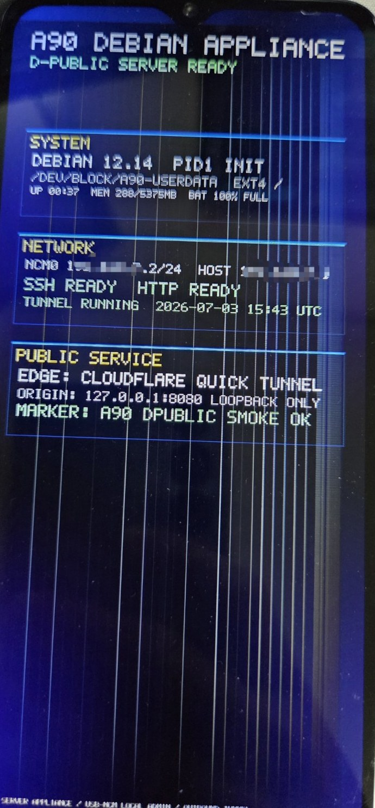
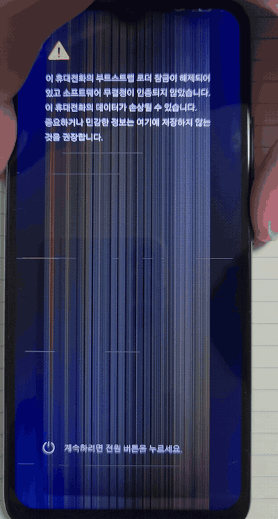
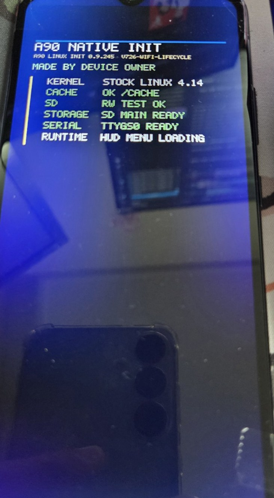
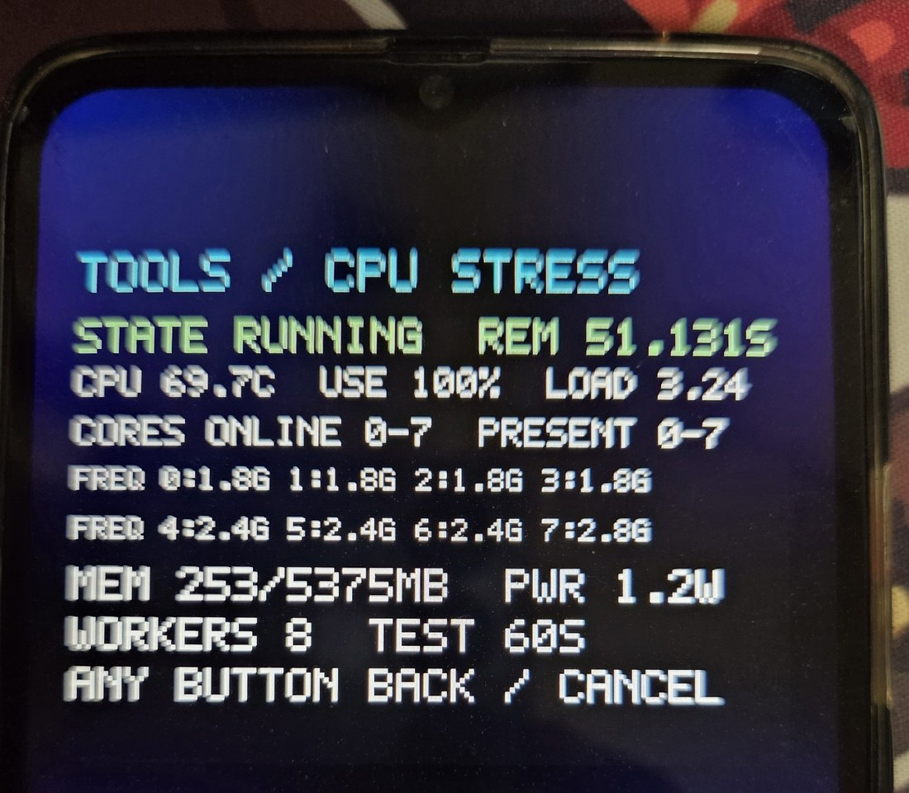
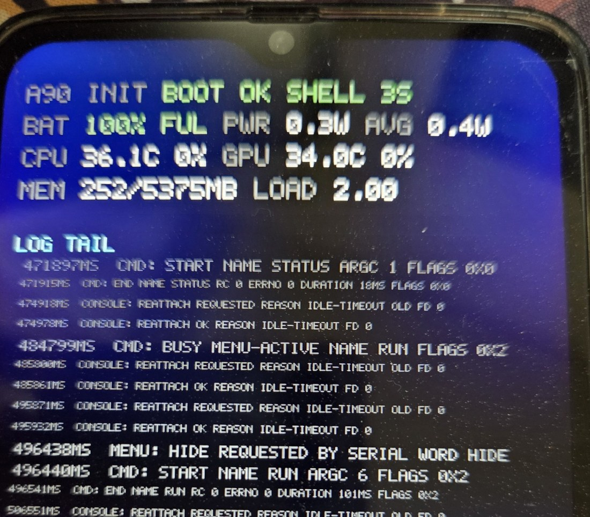
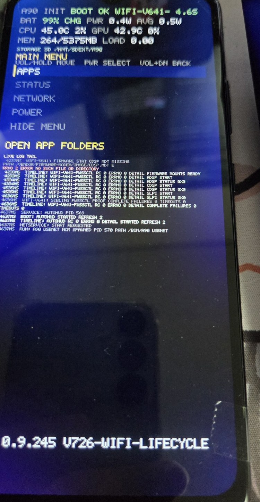
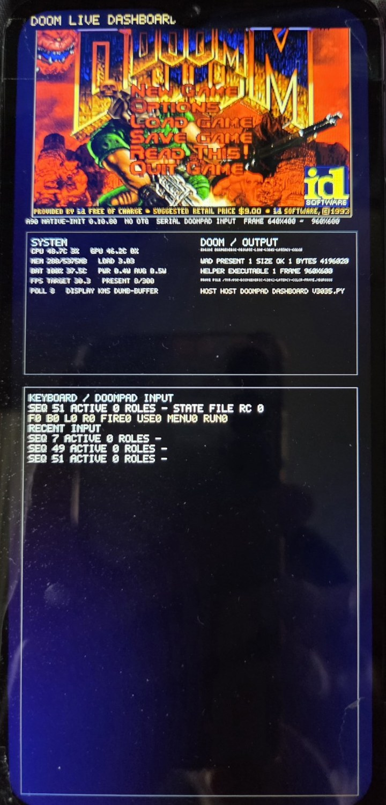
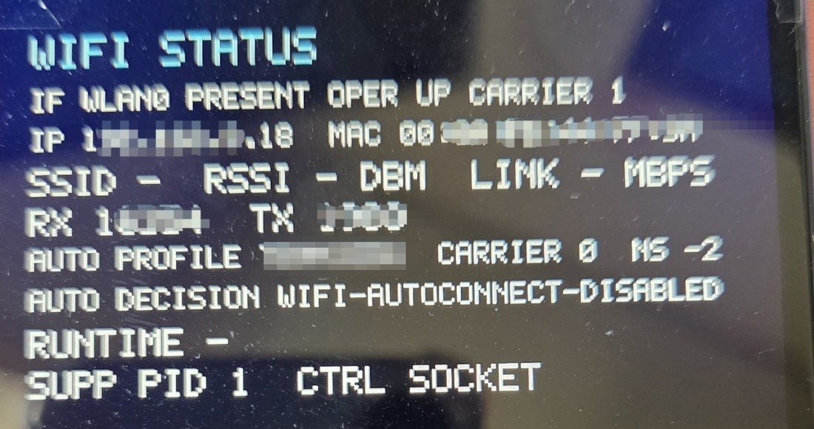

# A90 시각 증거

운영자 소유 Samsung Galaxy A90 5G(`SM-A908N`)가 이 프로젝트의 네이티브 PID 1을,
그리고 한 번의 실행에서는 폰 자체의 벤더 커널 위에서 Debian을 PID 1으로 구동하는
모습을 촬영한 사진입니다.

아래 자료는 모두 실제 A90에서 기록한 것입니다 — 사진과 부팅 시퀀스 하나, 화면 클립
하나. 캡션은 프레임에서 눈으로 확인되는 것과, 링크된 실행 증거가 뒷받침하는 더 강한
주장을 구분합니다. 기기가 스스로 보고한
수치는 그렇다고 표기했습니다. 각 프레임은 서로 다른 실행이며, 하나의 연속된 시퀀스로
제시하지 않습니다.

일부 링크된 리포트는 `docs/archive/` 아래에 있습니다. 저장소 자체의 archive 규칙에
따라 이들은 역사적 기록일 뿐 현재 권위를 갖지 않으며, 여기서는 live proof가 아니라
계보(lineage)로 인용합니다.

A90의 디스플레이 패널은 낙하로 물리적으로 파손된 상태입니다. 여러 프레임에 보이는
세로 줄무늬는 렌더링 결함이 아니라 패널 손상이며, 헤드리스 운용에는 영향이 없습니다.

[English](A90_VISUAL_EVIDENCE.md) · **한국어**

---

## PID 1으로 동작하는 Debian

**보이는 것** — Debian 12.14, `/usr/sbin/init`이 PID 1, `/dev/block/a90-userdata`의
ext4 루트, 키 전용 Dropbear SSH와 루프백 HTTP 서비스. 5,375 MB 중 288 MB 사용,
가동 37분, 배터리 만충.

**기술적 맥락** — 삼성 벤더 커널 위에서 `/usr/sbin/init`을 PID 1으로 두는 switch-root
핸드오프입니다. 동작 중인 Android 프레임워크 아래의 chroot가 아니며, 가상 머신도
아닙니다. 네이티브 init이 벤더 커널과 하드웨어 브링업을 수행한 뒤 루트를 넘겼습니다.

**증거 경계** — SSH는 로컬 USB-NCM 링크(`192.168.7.2:2222`)에서 접근 가능했고 터널을
통한 것이 아닙니다. 외부 노출은 계정 없는 아웃바운드 Cloudflare quick Tunnel로 접근된
루프백 전용 HTTP smoke 서비스(`127.0.0.1:8080`)에 한정되며, 실행 기록은
`public_exposure=outbound-tunnel-only`입니다. 이 프레임은 한 번의 실행이지 지속 운영
중인 서비스가 아닙니다.

**관련 증거** —
[`SERVER_DISTRO_DPUBLIC_LIVE_PUBLISH_2026-07-04.md`](../reports/SERVER_DISTRO_DPUBLIC_LIVE_PUBLISH_2026-07-04.md),
[`SERVER_DISTRO_DPUBLIC_BOOT_VISUAL_HUD_2026-07-04.md`](../reports/SERVER_DISTRO_DPUBLIC_BOOT_VISUAL_HUD_2026-07-04.md)

---

## 네이티브 init 부팅 시퀀스

**보이는 것** — 기기에서 촬영한 콜드 부팅: 부트로더 언락 경고, 삼성 스플래시, 그리고
네이티브 init 인수. 점검 항목이 순서대로 해결됩니다 — `SD PROBE MMCBLK0P1` → `RW TEST OK`,
`STORAGE CACHE FALLBACK` → `SD MAIN READY`, `SERIAL USB ACM STARTING` → `TTYGS0 READY`,
그리고 `RUNTIME HUD MENU LOADING`으로 종료. 빌드 `0.12.008 / H41-BADAPPLE-VIDEO-DEMO-V2`.

**기술적 맥락** — 언락 경고와 삼성 스플래시는 스톡 부트 체인이 그리는 화면이므로, 이는
재개된 세션이 아니라 실제 콜드 부팅입니다. 네이티브 init은 그 화면들이 방금 올린 벤더
커널 위에서, 그 이후에 실행되는 부분만 대체합니다.

**증거 경계** — 한 번의 부팅에서 7초를 발췌해 초당 8프레임으로 재샘플링하고 용량을 위해
디노이즈했습니다. 이 빌드가 자체 콘솔에 보고하는 브링업 순서를 보여줄 뿐 타이밍 정확도를
입증하지 않으며, 이후의 런타임 스택은 화면에 없습니다. 아래 정지 사진과는 다른 실행이자
다른 빌드입니다.

---

## 스톡 벤더 커널 위의 네이티브 init

**보이는 것** — 네이티브 init 자체의 부팅 화면: `KERNEL STOCK LINUX 4.14`, cache 및 SD
읽기/쓰기 점검, `SERIAL TTYGS0 READY`, HUD 메뉴 로딩.

**기술적 맥락** — 커널 바이너리 자체는 삼성 스톡 4.14 벤더 커널 그대로이고, 부트
램디스크와 userspace가 커스텀이며 정적 `/init`이 PID 1을 차지합니다. 이렇게 해서
mainline 포팅으로 다시 구현하는 대신 벤더 커널이 가진 기기별 하드웨어 지원을
보존합니다.

**증거 경계** — 이것은 네이티브 수퍼바이저이지 Debian이 아닙니다. 진입점을 보여줄 뿐
그 위의 런타임 스택을 보여주지 않습니다.

**역사적 식별자 주석** — 이 사진은 승격된 V726 베이스라인보다 앞서며
`0.9.245 / V726-WIFI-LIFECYCLE`을 표시합니다. 이후 승격된 V726 베이스라인은
`0.9.246`으로 문서화되어 있습니다. 이 프레임은 권위 있는 V726 아티팩트 식별자가 아니라
역사적 스냅샷으로 보존합니다.

---

## 60초 CPU 스트레스 스냅샷

**보이는 것** — 워커 8개로 8코어를 모두 100% 점유한 60초 네이티브 CPU 스트레스 실행.
상태 화면이 보고한 클러스터 클럭은 1.8 GHz(코어 0-3), 2.4 GHz(코어 4-6),
2.84 GHz(코어 7), CPU 69.7 °C, load 3.24, 5,375 MB 중 253 MB, 약 1.2 W입니다.

**기술적 맥락** — 워크로드, 온도·클럭 판독, 전력 수치 모두 네이티브 런타임 자체의
도구가 산출한 값이며 Android 서비스는 동작하지 않습니다.

**증거 경계** — 한 번의 실행에서 뽑은 단일 프레임입니다. 그 순간의 보고값을 보여줄 뿐
테스트 전체에 걸친 지속적 클럭 거동을 그 자체로 입증하지는 않습니다. 전력 수치는
기기 보고값이며 외부 계측기로 측정한 값이 아닙니다. 링크된 정식 실행은 10초 테스트를
사용했고, 이 사진은 이후의 60초 스냅샷으로 그 실행이 아닙니다.

**관련 증거** —
[`NATIVE_INIT_V62_CPUSTRESS_2026-04-26.md`](../archive/legacy/reports/NATIVE_INIT_V62_CPUSTRESS_2026-04-26.md)
(archived)

---

## 유휴 상태 수퍼바이저와 시리얼 제어

**보이는 것** — 네이티브 PID 1 유휴 상태: 보고값 0.3 W(평균 0.4 W), CPU 36.1 °C,
GPU 34.0 °C, 5,375 MB 중 252 MB, 셸까지 부팅 3초, 그리고 명령·콘솔 이벤트의 실시간
로그 꼬리.

**기술적 맥락** — 수퍼바이저는 USB 시리얼 콘솔로 명령을 받습니다.
`MENU: HIDE REQUESTED BY SERIAL WORD HIDE` 줄은 호스트가 보낸 명령이 적용된 것이고,
`CMD: START` / `CMD: END ... RC 0` 쌍은 수퍼바이저 자체의 명령 회계입니다.

**증거 경계** — 한 세션의 유휴 수치이며 기기 보고값입니다. 이 프레임에 대응하는 동일
서수의 정식 실행은 주장하지 않습니다.

---

## DSP 펌웨어 시퀀스와 USB 네트워킹

**보이는 것** — 부팅 4.6초 후: ADSP, CDSP, SLPI 리모트프로세서가 상태 `0x0`으로 기동,
`SIBLING FWSSCTL PROOF COMPLETE FAILURES 0 TIMEOUTS 0`, 이어서
`RUN: A90 USBNET NCM SPAWNED PID 570`.

**기술적 맥락** — 이 A90 / SM8150 스택에서 WLAN 경로는 인터페이스가 사용 가능해지기
전에 벤더 펌웨어 서브시스템이 먼저 올라와야 합니다. 그 시퀀스를 네이티브 init에서
구동하는 것은 이 프로젝트가 벤더 커널 방식으로 보존하는 기기별 하드웨어 브링업 작업
중 하나입니다.

**증거 경계** — 이 프레임은 DSP/펌웨어 선행 시퀀스와 NCM 헬퍼 기동을 보여줍니다.
Wi-Fi association, 처리량, 링크 안정성, 지속 운영을 그 자체로 입증하지는 않습니다.
프레임에는 `CDSP MDT MISSING` 상태도 보이는데, 시퀀스가 이를 복구해 직후 CDSP가 상태
`0x0`을 보고합니다.

**관련 증거**(계보) —
[`NATIVE_INIT_V657_SERVICE74_V106_REPLAY_LIVE_2026-05-23.md`](../archive/legacy/reports/NATIVE_INIT_V657_SERVICE74_V106_REPLAY_LIVE_2026-05-23.md),
[`NATIVE_INIT_V726_WIFI_LIFECYCLE_BASELINE_PROMOTION_2026-06-07.md`](../archive/legacy/reports/NATIVE_INIT_V726_WIFI_LIFECYCLE_BASELINE_PROMOTION_2026-06-07.md)
(둘 다 archived)

---

## 네이티브 런타임 위의 DOOM

**보이는 것** — 네이티브 런타임에서 라이브 대시보드와 함께 실행되는 DOOM:
네이티브 init `0.10.85`, 640×400을 960×600으로 스케일, 30.3 FPS 타깃, 호스트에서
구동하는 시리얼 "doompad" 입력, 그리고 통상적인 시스템 판독부.

**기술적 맥락** — Android userspace 제거 후 네이티브 디스플레이·입력 런타임을 통해
렌더링되며, 호스트가 시리얼 링크로 입력을 구동합니다.

**증거 경계** — 이것은 **GPU 가속 렌더링이 아닙니다.** 이 프로젝트에서 GPU 가속은
지원되지도 증명되지도 않았습니다. 디스플레이·입력 경로를 처음부터 끝까지 구동하는
소프트웨어 렌더링 워크로드이며, 그래픽 성능을 보여주기 때문이 아니라 그 경로들을
end-to-end로 보여주기 때문에 포함했습니다.

**관련 증거** —
[`NATIVE_INIT_V3054_DOOMGENERIC_AUDIO_CORUN_LIVE_2026-06-22.md`](../reports/NATIVE_INIT_V3054_DOOMGENERIC_AUDIO_CORUN_LIVE_2026-06-22.md)
— 설치된 init `0.10.85`(`v3053-doomgeneric-audio-corun`), DOOM 연속 루프 PASS,
네이티브 스피커 co-run PASS, 최종 health PASS.

---

## 입력 스택과 메뉴 조작

[▶ `a90-input-stack-demo.mp4`](../images/a90/a90-input-stack-demo.mp4) — 10초, 1.3 MB

**보이는 것** — 물리 볼륨·전원 키로 구동하는 메뉴 조작. 선택이 APPS → POWER → DEMO로
이동하고 하단 패널이 `TOOLS AND VIEWERS` → `REBOOT OPTIONS` → `PLAYER HUD DEMOS`로
바뀌며, uptime 카운터가 4.02초에서 10.93초로 진행합니다.

**기술적 맥락** — 버튼 이벤트를 스톡 벤더 커널 위에서 동작하는 커스텀 입력·UI 계층이
디코딩해 표시합니다. 콘솔 출력이 흘러가는 것이 아니라 하드웨어 키에 반응하는 대화형
상태 기계입니다.

**증거 경계** — 이 클립은 대화형 입력 처리와 메뉴 상태만 보여줍니다. 메뉴 뒤에서 돌아가는
워크로드는 없으며 서비스 가용성에 대해서는 아무것도 입증하지 않습니다. 위 부팅 시퀀스와
같은 녹화의 이어지는 구간입니다.

---

## 네이티브 Wi-Fi 소유

**보이는 것** — `wlan0` 존재, 동작 중, carrier up, 연결된 프로파일, 그리고 PID 1이
소유한 supplicant 제어 소켓.

**기술적 맥락** — 이것은 위의 Debian PID-1 실행이 아니라 이후의 네이티브 소유 WLAN
경로에 속합니다. 전체 switch-root에서는 `wlan0`이 보이는 상태로 남는 반면 벤더 WLAN
control plane이 내려가는 것이 별도로 관측되었고, 네이티브 PID 1을 살려두는 방식이 그
control plane을 보존했으며 Debian은 USB/NCM 위에서 chroot된 서비스 소비자로
동작했습니다.

**증거 경계** — 이 프레임에서 SSID와 주소·링크 속도 필드는 가려져 있습니다. 연결
상태는 보이지만 처리량은 보이지 않습니다.

**관련 증거** —
[`NATIVE_INIT_V2177_WIFI_HOLD_RECONNECT_LIVE_VALIDATION_2026-06-09.md`](../archive/legacy/reports/NATIVE_INIT_V2177_WIFI_HOLD_RECONNECT_LIVE_VALIDATION_2026-06-09.md)
(archived),
[`SERVER_DISTRO_WIFI_STA_UPSTREAM_WSTA19_NATIVE_OWNED_CHROOT_WIFI_PASS_2026-07-04.md`](../reports/SERVER_DISTRO_WIFI_STA_UPSTREAM_WSTA19_NATIVE_OWNED_CHROOT_WIFI_PASS_2026-07-04.md),
[`A90_NATIVE_WIFI_OWNERSHIP_PERMANENCE_EVIDENCE_H0_2026-08-15.md`](../reports/A90_NATIVE_WIFI_OWNERSHIP_PERMANENCE_EVIDENCE_H0_2026-08-15.md)

---

## 이 사진들이 보여주지 않는 것

이 사진은 전부 **A90**의 것이며, A90은 더 넓은 런타임 스택을 갖춘 유일한 타겟입니다.

**서로 다른 실행입니다.** 이 페이지의 어떤 두 프레임도 하나의 연속된 세션으로 제시되지
않으며, 어느 것도 단일 end-to-end 시연으로 읽혀서는 안 됩니다.

**다른 타겟은 단계가 다릅니다.** S22+(`SM-S906N`, GKI 커널 5.10)는 별도의
호스트 관측 가능한 네이티브 PID-1 결과를 갖고 있으며, 두 번의 실행 사이에 증명의
종류가 바뀌었습니다. 앞선 P3.25는 도달을 증명했습니다 — 정확한 candidate가
`04e8:6861` / `cdc_acm`으로 열거되고 정확히 49바이트 배너가 유지됐습니다. 이후의
P3.26은 그것을 한정된 양방향 제어 교환으로 확장했습니다 — 고정된 ACM 채널을 통한
host-to-device 및 device-to-host 트래픽, 실행에 바인딩된 PID 1 `PONG`, 그리고 정적
BusyBox `ash`의 `SHELL-OK` 응답이며, `pid1_bidirectional_proof`와
`busybox_shell_roundtrip_proof`가 모두 true이고 trailing 바이트는 0입니다. 두 실행 모두
요구된 롤백과 정상 rooted Android 복귀로 닫혔습니다. BusyBox 자식은 고정된 응답 후
종료하므로, 이는 일반적인 대화형 shell이 아니라 고정된 교환입니다.
S20+(`SM-G986N`)는 결정론적 PID-1 candidate는 있으나 아직 live PID-1 증명이 없습니다.
두 타겟 모두 A90의 넓은 런타임 스택을 갖고 있지 않으며, 권한·아티팩트·증거는 타겟 간에
전이되지 않습니다.

**사진 속 Debian 실행은 최종 아키텍처가 아닙니다.** 실제 PID 1 / switch-root
핸드오프이지만, 이 프로젝트가 목표로 선택한 격리 수준보다는 약합니다. 의도된
네임스페이스 격리 후속 — 별도의 PID, mount, IPC, UTS, network 네임스페이스 안에서
Debian이 PID 1이 되고, `pivot_root`와 검토된 veth 네트워크 경계를 갖는 구조 — 는 아직
end-to-end로 증명되지 않았습니다. 스톡 A90 커널은 `CONFIG_VETH=n`이라 선택된 veth
기반 경계가 막혀 있고, 설계는 공유 network 네임스페이스나 chroot, userspace 프록시를
대체 수단으로 명시적으로 인정하지 않습니다. 그 유닛은 하향 조정된 것이 아니라 정지
상태입니다.

**화면의 수치는 기기 보고값입니다.** 전력, 온도, 클럭 수치는 기기 자체 도구에서 나온
값이며 외부 계측과 대조하지 않았습니다.

**GPU 가속은 지원되지도 증명되지도 않았으며**, 이 페이지의 어떤 내용도 그 증거로
읽혀서는 안 됩니다.
