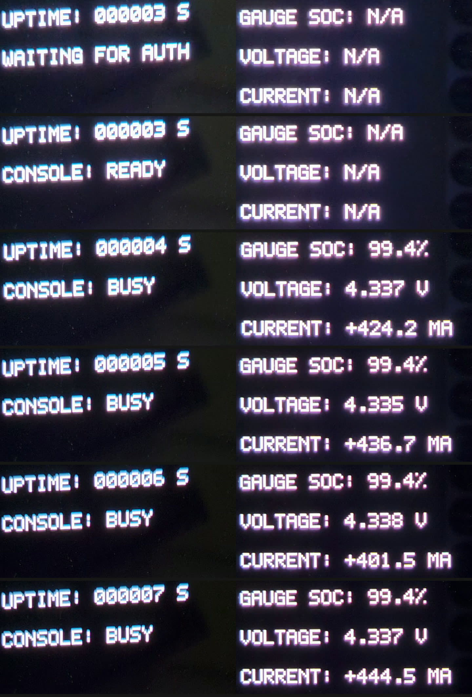
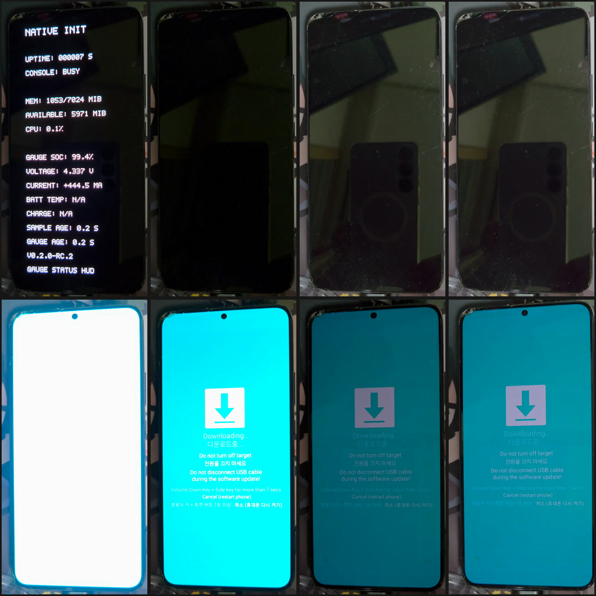

# S22+ 부팅 HUD 시각 증거

운영자 소유 삼성 Galaxy S22+ 5G(`SM-S906N`, FYG8)가 PID 1로 동작하는 자체 정적
`/init`으로 부팅해 패널에 자기 상태 텍스트를 직접 그리는 물리 패널 기록입니다.
Android 프레임워크, SurfaceFlinger, Zygote는 이 화면 어디에도 관여하지 않습니다.

**이 페이지는 여러 입회 런을 모읍니다.** 여기 있는 모든 자산은 물리 패널을 향해 놓은
카메라입니다. 그중 어느 것도 pixel readback이 아니며, 어느 것도 기계적으로 인증되지
않았습니다. 그 공통 바닥을 넘어서면 **각 런의 결속과 증거 경계는 서로 독립적입니다.**
한 런의 녹화가 화면에 담고 있는 것을 다른 런의 녹화는 담고 있지 않고, 한 녹화가
잡아내지 못한 것을 다른 녹화는 보여줄 수 있습니다. 아래 각 절은 자기 범위, 자기
기계 기록 대조, 자기 한계를 따로 적으며, 그중 어느 것도 런 사이를 이동하지 않습니다.

| 런 | Candidate | 녹화일 | 그 녹화가 더하는 것 |
| --- | --- | --- | --- |
| [P376](#p376--첫-네이티브-부팅-hud) | v0.1.0 부팅 HUD | 2026-09-09 | 첫 네이티브 프레임, 그리고 자체 주기로 올라가는 uptime 카운터 |
| [P384](#p384--라이브-게이지-hud와-download-전환) | v0.2.0-rc.2 | 2026-09-10 | HUD 상태를 거치며 값이 채워지고 변하는 게이지 항목, 그리고 프레임에 아무것도 들어오지 않는 네이티브→Download 전환 |

S22+ 타겟 전반의 개요가 아닙니다. P353-P361 디스플레이 시리즈의
write-combine/cached 버퍼 비교는 별도 페이지인
[S22+ 디스플레이 시각 증거](S22PLUS_DISPLAY_VISUAL_EVIDENCE.ko.md)에 있고, 커널
재빌드·네이티브 PID 1·USB 결과는 [`S22PLUS.ko.md`](S22PLUS.ko.md)에 있습니다.

**한국어** · [English](S22PLUS_BOOT_HUD_VISUAL_EVIDENCE.md)

---

# P376 — 첫 네이티브 부팅 HUD

2026-09-09 기록. 네이티브 콘솔 갈래의 화면 쪽 절반에 해당합니다. P375가 PID 1에
인증된 root 콘솔을 부여했고, P376이 그 옆에 별도의 텍스트 HUD child를 더했습니다.

P376은 한 번의 입회하 boot-only 전송이었고, 정확한 Magisk 롤백과 검증된 정상 rooted
FYG8 복귀로 끝났습니다. 런은 닫혔으며 candidate도 관측도 재실행할 수 없습니다.

**아래 P376 이미지는 모두 하나의 연속 카메라 녹화에서 나왔고**, **P376 패널 위의
어떤 것도 실행 중인 이미지를 식별하지 않습니다.** PID 1이 HUD에 보내는 상태
스냅샷에는 런 식별자가 들어 있지만 이 렌더러가 그것을 그리지 않으므로, 클립 혼자서는
이 부팅을 P376 candidate에 결속시킬 수 없습니다.

## 한 테이크에 담긴 부팅 체인

**전체 클립** — [▶ `05-boot-to-native-hud.mp4`](../images/s22plus-native-runtime/05-boot-to-native-hud.mp4)

**보이는 것** — 31.1초짜리 연속 핸드헬드 녹화의 마지막 22.5초입니다. 부트로더 잠금
해제 경고 화면, 그다음 설치된 소프트웨어가 삼성 공식 소프트웨어가 아니라고 알리는
빨간 배너 아래의 Samsung Galaxy 스플래시, 그다음 스플래시를 대체한 검은 배경의 흰색
비트맵 텍스트 다섯 줄이 나오고, 그 `UPTIME` 값이 녹화가 끝날 때까지 초당 한 번씩
올라갑니다.

**한 테이크라는 점이 중요한 이유** — 벤더 부팅 체인이 패널을 네이티브 init에
넘기는 장면이, 뒤따르는 카운터와 같은 컷 안에 있습니다. 패널이 화면 밖으로 나간 적이
없고 녹화가 잘린 적도 없으므로, 세 화면의 순서는 자산을 어떻게 조립했는지가 아니라
녹화 자체의 성질입니다.

**녹화에서 측정한 값** — 경고 화면은 t≈9.8초까지 유지되고, 스플래시는 t≈9.8초부터
t≈20.0초까지, 첫 네이티브 프레임은 t≈20.0초에 나타나며 남은 11.1초 동안 패널은
네이티브 출력을 표시합니다.

## 네이티브 init이 실행되기 전에 스톡 체인이 하는 말

**보이는 것** — 스톡 부트로더의 잠금 해제 경고, 그다음 상단을 가로지르는 빨간
배너가 올라간 Samsung Galaxy 부팅 스플래시입니다. 배너는 이 휴대전화에 현재 삼성
공식 소프트웨어가 설치되어 있지 않고, 기능이나 보안에 문제가 있을 수 있으며,
소프트웨어 업데이트가 설치되지 않는다고 한국어로 알립니다.

**이 프레임을 실은 이유** — 이 프로젝트의 코드가 하나도 실행되기 전에, 곧 부팅될
이미지가 삼성의 것이 아니라고 스톡 체인이 스스로 밝히는 진술입니다. 출처를 가리키는
신호이지 인증은 아닙니다. *어떤* 비공식 이미지인지는 말하지 않고, 비공식 이미지가
설치되어 있다는 사실만 성립시킵니다.

## 첫 네이티브 프레임

**보이는 것** — 검은 배경의 흰색 비트맵 텍스트 다섯 줄입니다. `NATIVE INIT`,
`PID1: RUNNING`, `UPTIME: 000003 S`, `CONSOLE: READY`, `STATUS AT LAST UPDATE`.
패널의 나머지는 검은색입니다. `STATUS AT LAST UPDATE`는 현재 렌더러에서 라벨일
뿐이고 그 아래에 대응하는 값이나 상세 줄을 그리지 않으므로, 아래쪽 빈 영역은 갱신이
빠진 것이 아니라 예상된 상태입니다.

**기술적 맥락** — HUD는 PID 1의 별도 child이며, 런에 결속된 `SOCK_SEQPACKET`
채널로 고정된 논블로킹 상태 스냅샷을 받습니다. 콘솔의 유일한 소유자는 여전히
PID 1이고, HUD는 건네받은 것을 그립니다. 따라서 `CONSOLE: READY`는 그 스냅샷 시점에
PID 1이 **스스로 보고한** 콘솔 상태이지, 콘솔에 대한 독립적인 측정이 아닙니다.

**증거의 경계** — 패널을 찍은 사진은 readback이 아닙니다. 이 프레임은 이런 모양의
텍스트가 화면에 있었다는 것을 보여줍니다. 렌더러가 *그리는* 바이트가 정확하다는
것은 여기가 아니라 런 자체의 H0 증거에서 호스트 쪽으로 성립합니다.

## 연속된 12개 상태

**보이는 것** — 같은 녹화에서 `UPTIME`과 `CONSOLE` 줄을 초당 한 번씩 잘라 순서대로
쌓은 것입니다. `000003`부터 `000014`까지 연속된 정수 12개이며, 건너뛴 값도 중복된
값도 없습니다. `CONSOLE`은 첫 줄에서 `READY`, 나머지 11줄에서 `BUSY`입니다.

**녹화에서 측정한 값** — 보이는 구간 전체를 2 fps로 표본화하면 표시된 각 값이 정확히
연속 두 표본에 나타납니다. 녹화 시간 11.0초 동안 11회 증가입니다. 패널의 카운터와
녹화 자체의 시계가 표본화 해상도 범위에서 일치합니다. 이 측정은 클립 안에서 닫힙니다.
클립 바깥의 어떤 것도 필요하지 않습니다.

**이것이 무엇이고 무엇이 아닌지** — 패널이 커밋 전에 미리 그려진 한 프레임을
유지하는 것이 아니라 자체 주기에 따라 값이 바뀌는 첫 S22+ 자산입니다. 시스템의
liveness 결과는 아닙니다. 카운터 하나가 11초 동안 올라간 것을 보여줄 뿐이고, 그 밖에
무엇이 돌고 있었는지, 녹화가 끝난 뒤에 무슨 일이 있었는지에 대해서는 아무것도 말하지
않습니다.

**기술적 맥락** — 눈에 보이는 각 갱신은 재도색이 아닙니다. P376은 프레임마다 새로운
non-imported GEM 버퍼를 할당해 첫 scanout 매핑 전에 한 번 그립니다. 원자적 커밋은 한
번에 하나만 진행 중이고, 이전 버퍼를 회수하기 전에 정확한 `FLIP_COMPLETE` 이벤트가
요구되며, 프레임버퍼는 최대 두 개만 보유합니다. 따라서 디스플레이 페이지의 한계는
그대로 유효합니다. 기존 버퍼를 제자리에서 다시 그리는 일은 여전히 없고, compositor도
없습니다.

## P376 클립이 기계 기록과 만나는 지점

런의 기계 증거와 이 녹화는 서로 다른 종류의 증거이며, 어느 쪽도 다른 쪽을 인증하지
않습니다.

**기계가 보존한 것** — 초기 HUD 증거는 일치한 프레임 3개, 시퀀스 1부터 3까지,
uptime 3,802에서 5,815 ms를 보존하며 그중 `BUSY` 콘솔 스냅샷이 2개입니다. 이후 plan
명령이 10초 대기 뒤에도 프레임이 계속 들어옴을 확인하고 `HUD_STILL_UPDATING`을
냈으며, 마지막으로 보존된 프레임은 uptime 21,941 ms의 시퀀스 19입니다. 런 보고서는
일치한 flip 이벤트가 물리 픽셀을 증명하지 않는다는 점, 그리고 중간 프레임 보존이나
연속적인 liveness를 주장하지 않는다는 점을 분명히 적고 있습니다.

**녹화가 그 구간에서 보여주는 것** — 표시된 값 3, 4, 5이며 3에서는 `READY`, 4와
5에서는 `BUSY`입니다. 렌더러는 초 단위 정수를 그대로 찍으므로 보존된 uptime
3,802 ms는 `000003`으로 표시됩니다. 녹화는 표시값 14에서 끝나며, 이는 기계가
마지막으로 보존한 21.9초 프레임보다 한참 앞섭니다.

**그 일치가 갖는 값어치** — 실패할 수도 있었지만 실패하지 않은 대조 확인입니다.
어느 방향으로도 증명은 아닙니다. 카메라는 저널을 인증할 수 없고 저널도 카메라를
인증할 수 없습니다. 서로 모순되지 않은 두 개의 독립적인 기록으로 읽어야 합니다.

**운영자 본인의 답변은 별도로 기록되어 있습니다.** 런 도중 운영자에게 물리 화면에
`NATIVE INIT` 텍스트와 증가하는 `UPTIME`이 보이는지 물었고, 보인다는 답을 받았습니다.
그 응답은 비공개 런 디렉터리에 `machine_pixel_proof: false`인 운영자 보고 관측으로
분류되어 보존되어 있습니다. 이 녹화는 그 답변의 근거가 된 자료입니다. 봉인된 런
기록에 병합되지 않았고 어떤 기계 판정도 바꾸지 않습니다.

**시간 결속은 정황적입니다.** 클립의 컨테이너 타임스탬프는 런의 라이브 세션 구간
안에 들어가지만, 그 값은 녹화한 기기가 쓴 것이고 인증되지 않았으며 자기들끼리도
일치하지 않습니다. 컨테이너와 스트림 생성 시각이 약 4분 차이가 나는데, 이는 전송
과정에서 컨테이너가 다시 씌워졌을 때 나타나는 모습입니다. 클립 안에는 서명되거나
커널이 부여한 시각이 하나도 없습니다.

## P376 녹화가 보여주지 않는 것

**그 런의 나머지는 이 컷에 없습니다.** CONTROL 수락, Download 엔드포인트, 정확한
롤백, 최종 건강 검증은 각각 자기 증거를 가지고 있으며 그중 어느 것도 여기에 보이지
않습니다. 관측자의 ACK-only `software_download_arrival=UNPROVED`와 보충 스톡
`p376_proof_class=NO_PROOF_OBSERVER`는 그대로입니다. 콘솔과 HUD 자격 검증에
성공했다고 해서 그 둘이 승격되지는 않습니다.

---

# P384 — 라이브 게이지 HUD와 Download 전환

2026-09-10 기록으로, P376에서 하루 뒤이자 candidate 여덟 개 뒤입니다. 그 사이 HUD는
시스템 상태 항목(v0.1.1)을 얻었고, 이어서 게이지 텔레메트리가 candidate 다섯 개
만에 확정되었습니다(v0.1.2). 런 자체도 더 이상 boot-only가
아닙니다. P384는 입회하 네이티브 왕복으로, 네이티브 이미지를 설치하고, 네이티브
런타임 안에서 Download로 복귀하고, 같은 이미지를 한 번 더 복원한 뒤 Android로
정리합니다.

P384의 원본 실행은 `PASS_F1_V2_P384_ROOT_CONSOLE_AND_ROLLED_BACK`, CLOSED/19로
완료되었고, N 설치 1회, 예외적 same-N 복원 1회, 정확한 Android 정리 1회가
끝났습니다. 소비되었고 재실행할 수 없습니다. 기기는 정상 Android 상태이며 이
트랜잭션은 실행 중인 네이티브 baseline을 남기지 않습니다.

**P376 HUD와 달리 이 렌더러는 candidate 라벨 `V0.2.0-RC.2`를 화면에 표시합니다.**
이는 시각적 신원을 크게 좁히지만, 카메라에 보이는 라벨은 여전히 스스로 보고한
표시일 뿐 암호학적 산출물 인증이 아닙니다.

## 온전한 한 테이크

**전체 클립** — [▶ `06-p384-native-to-download.mp4`](../images/s22plus-native-runtime/06-p384-native-to-download.mp4)

**보이는 것** — 23.5초, 연속 한 컷으로 스톡 부트로더 잠금 해제 경고부터 Download
모드까지입니다. 경고 화면, Samsung Galaxy 스플래시, 거기에 합류하는 빨간 비공식
소프트웨어 배너, `V0.2.0-RC.2` 라벨이 붙은 `NATIVE INIT` 게이지 상태 HUD, 꺼진 패널,
그리고 `Downloading…` / `Do not turn off target`을 표시하는 Download 화면입니다.

**녹화에서 측정한 값** — 23.51초 동안 디코드된 705프레임이며 50 ms를 넘는 표시
타임스탬프 간격이 없습니다. 따라서 테이크는 끊기지 않았고 잘리지 않았습니다. 경고
화면은 t≈2.2초까지 유지되고, 스플래시는 t≈2.2초부터, 빨간 배너는 t≈7.8초에
합류합니다. 첫 네이티브 프레임은 t≈12.42초, 마지막 네이티브 프레임은 t≈17.35초이며,
패널은 t≈17.40초부터 t≈20.95초까지 꺼져 있고, Download 모드 텍스트는 t≈21.7초부터
테이크가 끝날 때까지 읽힙니다.

**여기서 한 테이크가 중요한 이유** — P376에서와 같은 이유에 하나가 더 붙습니다.
네이티브 HUD, 어두운 구간, Download 화면이 모두 한 컷 안에 있고, 그 컷 동안 기기는
움직이지 않으며 장면에 아무것도 추가되지 않습니다. 순서뿐 아니라 **그 사이에 물리적
행위가 없었다는 점**도 조립이 아니라 녹화 자체의 성질입니다.

## 값이 채워지는 게이지 항목

**보이는 것** — 표시된 HUD 상태 여섯 개를 순서대로 놓은 것이며, 각 행은 같은
프레임에서 뽑은 `UPTIME`/콘솔 줄과 `GAUGE SOC`/`VOLTAGE`/`CURRENT` 줄을 나란히
붙였습니다. 앞의 두 행은 게이지 항목이 전부 `N/A`이고, 뒤의 네 행은 값이 채워져
있습니다.

**이 녹화는 표시된 게이지 항목이 값이 채워지고 연속된 HUD 상태에 걸쳐 변하는 것을
독립적으로 보여줍니다.** 그 줄에 값을 올리기까지 candidate 다섯 개가 걸렸습니다.
v0.1.2-rc.1과 rc.2는 둘 다 게이지 항목이 패널에서 전부 `N/A`인 채로 닫혔고, rc.2가
추가한 진단이 그 원인을 버스 읽기 이전에 드라이버를 거절하는 device-tree root model
allowlist로 국소화했습니다. rc.3과 rc.4는 값을 표시했지만 각각 콘솔 출력 손실과 호스트
저널 크기 초과로 NO_PROOF로 닫혔습니다. 게이지 증거를 남기고 닫힌 것은 rc.5가
처음입니다.

**녹화에서 측정한 값** — HUD가 처음 그린 상태는 t≈12.42초의
`UPTIME: 000003 S` / `WAITING FOR AUTH`이며 게이지 항목은 전부 `N/A`입니다.
t≈12.55초에 `CONSOLE: READY`로 바뀌고 여전히 `N/A`입니다. t≈13.42초에 한 번의
결합된 갱신으로 `UPTIME`이 `000004`로, 콘솔 줄이 `BUSY`로, `MEM`이 `1026/7002`에서
`1052/7024 MIB`로, `CPU`가 `N/A`에서 `1.8%`로, 그리고 모든 게이지 항목이 `N/A`에서
값으로 바뀝니다. 이후 값이 채워진 상태 네 개가 각각 약 1초씩 이어집니다.

| 표시 시작 | `GAUGE SOC` | `VOLTAGE` | `CURRENT` |
| ---: | ---: | ---: | ---: |
| t≈13.42초 | 99.4% | 4.337 V | +424.2 mA |
| t≈14.5초 | 99.4% | 4.335 V | +436.7 mA |
| t≈15.4초 | 99.4% | 4.338 V | +401.5 mA |
| t≈16.5초 | 99.4% | 4.337 V | +444.5 mA |

값이 채워진 모든 프레임에서 `SAMPLE AGE`와 `GAUGE AGE`는 `0.2 S`를 표시하고,
`BATT TEMP`와 `CHARGE`는 계속 `N/A`입니다. 뒤의 두 항목은 전류 방향에서 유도하지
않으며 주장하지도 않습니다.

**이것이 무엇이고 무엇이 아닌지** — 네이티브 부팅 중에 패널이 자체 주기에 따라 변하는
배터리 게이지 값을 표시했다는 것을 보여줍니다. 배터리에 대한 측정은 아닙니다. 표시된
값의 정확도, 그리고 그 값이 특정 인증 샘플에 대응한다는 것은 여기서 성립하지
않습니다. 게이지 SOC는 fuel-gauge 판독값이며 Android의 배터리 정책 퍼센트가
아닙니다.

## 네이티브 HUD에서 Download로, 프레임에 아무것도 들어오지 않은 채

**보이는 것** — 같은 테이크에서 뽑은 전체 프레임 여덟 개를 순서대로, 자르지 않고
놓은 것입니다. 네이티브 HUD, 꺼진 패널 세 프레임, 밝아지는 전환, 그리고 Download 모드
세 프레임입니다.

**연속 녹화 동안 기기는 네이티브 HUD에서 Download 모드로 전환하며, 그 사이 눈에 보이는
물리적 접촉이나 프레임에 들어오는 물체가 없습니다.** 휴대전화는 이 테이크의 705개
프레임 전부에서 같은 자리에 놓여 있고, 테이크 전체를 5 fps로 훑어도 손, 손가락,
케이블 움직임, 그 밖의 물체가 어느 지점에서도 나타나지 않습니다. "계속하려면 전원
버튼을 누르세요"라고 적힌 첫 경고 화면조차 손이 닿지 않은 채 t≈2.2초에 넘어갑니다.

**이것은 녹화된 전환 구간에서 눈에 보이는 버튼 누름을 시각적으로 배제합니다.
software-causal attribution을 성립시키지는 않습니다.** P384 기록 자체가 물리적
개입을 부재 증명이 아니라 `UNOBSERVED`로 표시하며, 이 녹화도 같은 종류의 관측
증거입니다. 스틸보다 강하지만 여전히 인과 증명은 아닙니다. 이 기기에서 버튼으로
Download 모드에 들어가려면 키 조합을 눌러 유지해야 하는데, 그런 동작은 보이지
않습니다.

**녹화에서 측정한 값** — 패널의 평균 휘도는 HUD가 떠 있는 동안 안정적으로 유지되다가
t≈17.35초와 t≈17.40초 사이에 급격히 떨어지고, 카메라 자체의 노출이 적응하는 동안
3.55초간 낮게 유지되며, t≈20.95초에 밝은 화면으로 뛰어올라 Download 모드로
정착합니다. 어두운 구간에서 서서히 밝아지는 것은 패널이 아니라 카메라입니다.

## P384 클립이 기계 기록과 만나는 지점

**기계가 보존한 것** — 두 번의 네이티브 arrival 각각이 유효 프레임 5개, 신선한 게이지
샘플 3개, 신선한 메모리/CPU 샘플 3개, 일치한 flip 관측을 담은 optional HUD 로그를
남겼습니다. 어느 로그도 물리 픽셀, 끊기지 않은 liveness, 인증 이전의 디스플레이
타이밍을 증명하지 않습니다. 별도로 검증된 return 기록은 각각의 원래 30초 CONTROL
윈도 안에서 정확한 Download 도착을 증명하며, 윈도 종료 간격은 해당 CONTROL intent
이후 7.381595초와 8.245343초입니다. CONTROL ACK는 수락일 뿐이고, software-causal
attribution은 UNPROVED로 남습니다.

**녹화가 그 구간에서 보여주는 것** — 게이지 항목이 채워지고 변하는 HUD, 그리고
Download로의 전환입니다. 녹화의 값이 채워진 게이지 상태 네 개와 로그의 신선한 게이지
샘플 세 개는 서로 다른 것을 센 서로 다른 수치이며(표시된 상태 대 보존된 샘플), 여기서
대응시키지 않습니다.

**녹화는 arrival 하나를 온전히 담지 않습니다.** 네이티브 구간은 `UPTIME: 000003 S`부터
`000007`까지 약 5초입니다. 각 arrival의 관측은 그보다 훨씬 길어 각각 27.493317초와
15.654757초였습니다.

**이 클립은 P384 라벨이 붙은 네이티브 HUD와 그에 이어지는 Download를 기록합니다. 이것이
첫 번째 네이티브 arrival인지 복원된 arrival인지는 독립적으로 성립시키지 않습니다.**
두 arrival 모두 같은 N 이미지로 부팅하므로 같은 스톡 체인을 보여줄 것이고, 카메라
시계로는 둘을 가릴 수 없습니다.

**시간 결속은 정황적입니다.** 테이크는 런의 라이브 세션 구간인 11:50:28.633772Z부터
11:52:48.608832Z 사이에 들어가지만, 컨테이너 타임스탬프는 녹화한 기기가 쓴 것이고
인증되지 않았으며 자기들끼리도 일치하지 않습니다. 컨테이너와 스트림 생성 시각이 약
1분 차이 납니다. 두 결속 중 더 강한 쪽은 화면의 `V0.2.0-RC.2` 라벨이며, 그것도 여전히
스스로 보고한 표시입니다.

## P384 녹화가 보여주지 않는 것

**왕복의 복귀 구간은 이 컷에 없습니다.** 테이크는 Download 모드에서 끝납니다. 복원
전송, 두 번째 네이티브 arrival, 정확한 Android 정리, 최종 건강 검증은 각각 자기 증거를
가지고 있으며 그중 어느 것도 여기에 보이지 않습니다.

**보충 스톡 캐리어 증거는 그대로입니다.** `P320_STOCK_WITNESS_BASE_SHAPE_FAILURE` /
`NO_PROOF_OBSERVER`로 남아 있으며, 이 녹화도 런 자체의 콘솔 결과도 그것을 승격하지
않습니다.

---

# 자산 처리

스틸은 휴대전화 주변의 무관한 방·배경만 제거하도록 잘랐고, 런마다 동일한 고정 크롭을
사용했습니다. 어떤 패널 내부도 보정·마스킹·노이즈 제거를 하지 않았고 색이나 노출도
조정하지 않았습니다. 두 클립 모두 이 페이지에서 재생하기 위해 HEVC에서 H.264로
트랜스코드하고 크기를 줄였으며, 녹화 기기의 컨테이너 메타데이터를 제거했습니다. 둘 다
잘라내지 않았고 각각 온전한 한 테이크입니다. 어느 쪽에서도 화면 내용, 프레임 순서,
눈에 보이는 사건 순서는 바뀌지 않았습니다. 두 원본 모두 오디오 스트림이나 위치
메타데이터를 담고 있지 않으며, 원본은 각자의 비공개 런 디렉터리에 바이트 단위 그대로
보존되어 있습니다.

P376의 인라인 GIF는 4 fps로 크기와 프레임을 다시 잡은 표현용 사본입니다. 두 화면
전환이 모두 안에 들어오도록 시작점을 정적인 경고 화면 안쪽 t≈8.6초로 당겼습니다.
**표시 갱신 사이의 간격은 어느 것도 제거하지 않았습니다.** 12행 필름스트립도 같은
클립에서 순서대로 1초 간격으로 잘랐습니다.

P384에는 GIF가 없습니다. 전체 클립이 23.5초이고 그 자체가 핵심 증거입니다. 두
필름스트립은 그 클립에서 뽑았습니다. 게이지 필름스트립의 6행은 각각 별개의 표시된 HUD
상태이며, 각 행은 한 프레임에서 뽑은 두 개의 크롭을 붙인 것으로, 그 사이의 변하지 않는
`MEM`/`AVAILABLE`/`CPU` 블록은 가독성을 위해 생략했습니다. 전환 필름스트립의 8개
프레임은 기기 주변 장면이 보이도록 자르지 않은 전체 프레임입니다.

이 페이지가 인용하는 모든 측정값은 해당 런의 전체 길이 H.264 클립에서 나왔으며, 그
클립은 각 런의 절에 그대로 링크되어 있습니다.

스틸에서 보이는 두 가지는 패널 내용이 아닙니다. 화면 아래쪽의 어두운 사각형은 S22+의
광택 패널에 비친 녹화 기기이고, 왼쪽 위 모서리의 깨진 부분은 기기의 물리적
마모입니다.

클립은 운영자 본인의 별도 단말로 녹화했습니다. 그 단말은 이 프로젝트의 타겟이
아니며 결속 타겟 레지스트리 어디에도 없습니다. 시험 대상 기기가 아니라 카메라입니다.

---

# 이 페이지의 어떤 자산도 보여주지 않는 것

**이 페이지의 어떤 프레임도 readback이 아닙니다.** 모든 이미지는 화면을 향해 놓은
카메라입니다. 각 런의 바이트 단위 증거는 호스트 쪽에 있으며 그 런의 보고서에 있습니다.

**이것은 독립 실행되는 부팅 UI가 아닙니다.** HUD는 인증된 네이티브 콘솔 준비가 끝난
뒤에 시작합니다. 이 이미지들로 부팅하면 언제나 나오는 비인증 화면이 아닙니다.

**이것은 디스플레이 런타임이 아닙니다.** 존재하는 것은 고정된 텍스트 레이아웃을
구동하는, 프레임 단위의 할당·도색·커밋·회수 주기입니다. compositor도, 입력도,
제자리 재도색도 없고, 일반적이거나 장시간 지속되는 디스플레이 동작에 대한 증명도
없습니다.

**여기 있는 어떤 것도 다른 타겟으로 이전되지 않습니다.** 두 런 어느 쪽에서도 A90과
S20+로 나간 명령은 없으며, 결과·산출물·권한은 기기 사이를 이동하지 않습니다.

**여기 있는 어떤 것도 권한을 만들지 않습니다.** 두 런 모두 소비되었고 닫혔습니다. 이
페이지의 어떤 자산도 기기 grant, 네이티브 lease, 재실행, 상주 네이티브 baseline을
부여하지 않습니다.

---

# 관련 증거

- [`S22PLUS_FYG8_NATIVE_ROUNDTRIP_FOLLOWUP_V2_H0_2026-09-10.md`](../reports/S22PLUS_FYG8_NATIVE_ROUNDTRIP_FOLLOWUP_V2_H0_2026-09-10.md)
- [`S22PLUS_FYG8_LOCAL_DISPLAY_ADOPTION_H0_2026-09-10.md`](../reports/S22PLUS_FYG8_LOCAL_DISPLAY_ADOPTION_H0_2026-09-10.md)
- [`S22PLUS_FYG8_P376_BOOT_HUD_H0_2026-09-09.md`](../reports/S22PLUS_FYG8_P376_BOOT_HUD_H0_2026-09-09.md)
- [`S22PLUS_FYG8_P375_ROOT_CONSOLE_H0_2026-09-09.md`](../reports/S22PLUS_FYG8_P375_ROOT_CONSOLE_H0_2026-09-09.md)
- [부팅 HUD 능력 계약](../operations/S22PLUS_FYG8_BOOT_HUD_V1.md)
- [Root 콘솔 능력 계약](../operations/S22PLUS_FYG8_ROOT_CONSOLE_V1.md)
- [S22+ 타겟 계약](../operations/targets/S22PLUS_FYG8_TARGET_CONTRACT.md)
