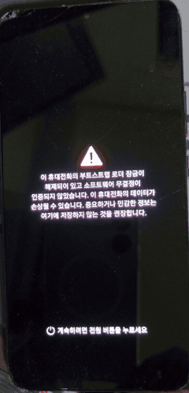
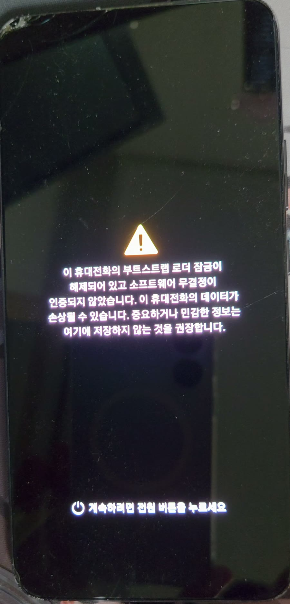
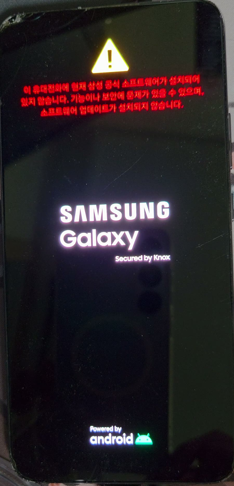
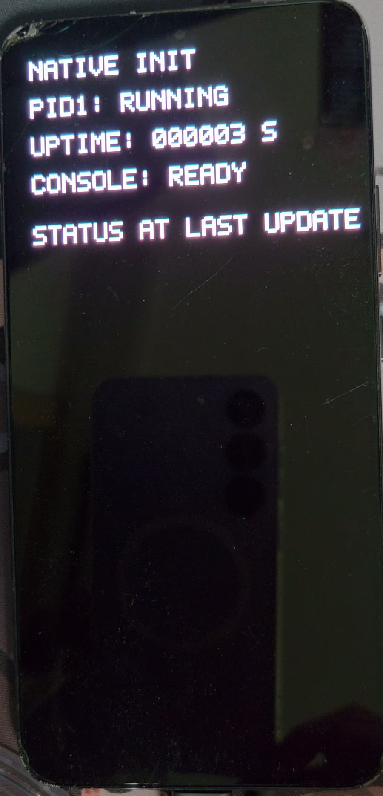
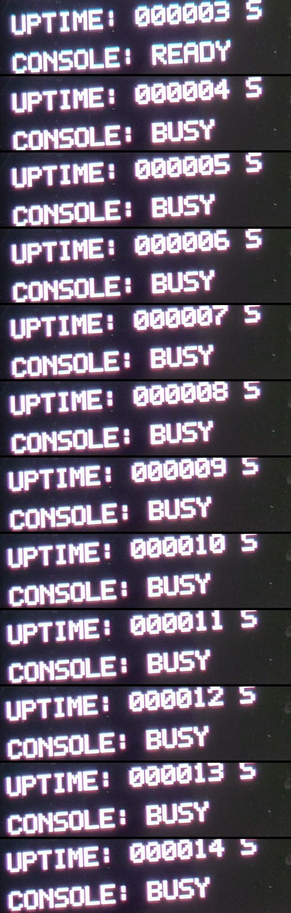

# S22+ boot HUD visual evidence

One continuous recording of the operator-owned Samsung Galaxy S22+ 5G
(`SM-S906N`, FYG8) booting a custom static `/init` as PID 1 and painting its own
status text on the panel, with no Android framework, SurfaceFlinger or Zygote in
the picture.

This page covers **one run**: P376, recorded 2026-09-09. It is the on-screen half
of the native console line — P375 gave PID 1 an authenticated root console, and
P376 added a separate text HUD child beside it. It is not an overview of the
S22+ target. The write-combine/cached buffer comparison from the P353-P361
display series is a separate page,
[S22+ display visual evidence](S22PLUS_DISPLAY_VISUAL_EVIDENCE.md); the kernel
rebuild, native PID 1 and USB results live in [`S22PLUS.md`](S22PLUS.md).

**Every device image on this page comes from a single camera recording of a
physical panel. None of it is a pixel readback, and none of it is
machine-authenticated** — the clip carries no run identifier and cannot, on its
own, bind this boot to the P376 candidate. What it adds to the run's machine
record, and what it cannot add, is set out in
[Where this clip meets the machine record](#where-this-clip-meets-the-machine-record).

P376 was a single attended boot-only transfer that ended in an exact Magisk
rollback and a verified healthy rooted FYG8 return. It is closed, and neither the
candidate nor the observation is replayable.

---

## The boot chain in one take

**Full clip** — [▶ `05-boot-to-native-hud.mp4`](../images/s22plus-native-runtime/05-boot-to-native-hud.mp4)

**What it shows** — the last 22.5 seconds of a 31.1-second continuous handheld
recording: the unlocked-bootloader warning screen, then the Samsung Galaxy
splash under a red banner stating that the installed software is not official
Samsung software, then the splash replaced by five lines of white bitmap text on
black whose `UPTIME` value advances once a second until the recording stops.

**Why the single take matters** — the vendor boot chain handing the panel over
to native init is inside the same unbroken shot as the counter that follows it.
The panel is never out of frame and the recording is never cut, so the ordering
of the three screens is a property of the recording itself rather than of how
the assets were assembled.

**Measured from the recording** — the warning screen holds until t≈9.8 s; the
splash runs from t≈9.8 s to t≈20.0 s; the first native frame appears at
t≈20.0 s and the panel shows native output for the remaining 11.1 s.

---

## What the stock chain says before native init runs

**What they show** — the stock unlocked-bootloader warning, then the Samsung
Galaxy boot splash with a red banner across the top reading, in Korean, that
official Samsung software is not currently installed on this phone, that
function or security may be affected, and that software updates will not be
installed.

**Why they are on the page** — this is the stock chain's own statement, made
before any code from this project runs, that the image about to boot is not
Samsung's. It is a provenance signal, not an authentication: it establishes that
*an* unofficial image is installed, and says nothing about *which* one.

---

## The first native frame

**What it shows** — five lines of white bitmap text on black: `NATIVE INIT`,
`PID1: RUNNING`, `UPTIME: 000003 S`, `CONSOLE: READY`, and `STATUS AT LAST
UPDATE`. The rest of the panel is black. `STATUS AT LAST UPDATE` is only a
label in the current renderer — no associated value or detail line is painted
beneath it — so the blank area below it is expected, not a missing update.

**Technical context** — the HUD is a separate child of PID 1 that receives fixed
nonblocking state snapshots over a run-bound `SOCK_SEQPACKET` channel. PID 1
remains the sole console owner; the HUD renders what it is handed. `CONSOLE:
READY` is therefore PID 1's own reported console state at the moment of that
snapshot, not an independent measurement of the console.

**Evidence boundary** — a photograph of a panel is not a readback. This frame
shows that text of this shape was on the screen; the byte-exactness of what the
renderer *paints* is established host-side in the run's own H0 evidence, not
here.

---

## Twelve consecutive states

**What it shows** — the `UPTIME` and `CONSOLE` lines, cropped from the same
recording once per second and stacked in order: twelve consecutive integer
values, `000003` through `000014`, with no skipped and no repeated value.
`CONSOLE` reads `READY` on the first and `BUSY` on the remaining eleven.

**Measured from the recording** — sampled at 2 fps across the visible window,
every displayed value appears in exactly two consecutive samples: eleven
increments across 11.0 s of recorded time. The counter on the panel and the
recording's own clock agree to the sampling resolution. This measurement is
self-contained — it needs nothing outside the clip.

**What that is, and is not** — this is the first S22+ asset in which the panel
changes on its own schedule rather than holding a frame that was painted before
the commit. It is not a liveness result for the system: it shows one counter
advancing for eleven seconds, and says nothing about what else was running, or
about anything after the recording stopped.

**Technical context** — each visible update is not a repaint. P376 allocates a
fresh, non-imported GEM buffer per frame and paints it once before its first
scanout mapping; one atomic commit is in flight at a time; an exact
`FLIP_COMPLETE` event is required before the previous buffer is retired, and at
most two framebuffers are held. The display page's limit therefore still stands:
there is still no in-place redraw of an existing buffer, and no compositor.

---

## Where this clip meets the machine record

The run's machine evidence and this recording are different classes of evidence,
and neither authenticates the other.

**What the machine retained** — the initial HUD proof retains three matched
frames, sequence 1 through 3, uptime 3,802 to 5,815 ms, with two `BUSY` console
snapshots. A later plan command confirmed further frames after a ten-second wait
and emitted `HUD_STILL_UPDATING`; its last retained frame is sequence 19 at
uptime 21,941 ms. The run report states plainly that a matched flip event does
not prove physical pixels, and that intermediate frame retention and continuous
liveness are not claimed.

**What the recording shows in that visible range** — displayed values 3, 4 and
5, with `READY` on 3 and `BUSY` on 4 and 5. The renderer formats whole seconds,
so a retained uptime of 3,802 ms is displayed as `000003`. The recording ends
at displayed value 14, well before the machine's last retained frame at
21.9 s.

**What that agreement is worth** — it is a check that could have failed and did
not. It is not proof in either direction. The camera cannot authenticate the
journal, and the journal cannot authenticate the camera; read the two as
independent records that did not contradict each other.

**The operator's own answer is recorded separately.** During the run the operator
was asked whether `NATIVE INIT` text and an increasing `UPTIME` were visible on
the physical screen, and answered that they were. That response is retained in
the private run directory, classified as an operator-reported observation with
`machine_pixel_proof: false`. This recording is the material behind that answer.
It was not merged into the sealed run record and changes no machine verdict.

**The time binding is circumstantial.** The clip's container timestamps fall
inside the run's live-session window, but they are written by the recording
handset, they are not authenticated, and they are not self-consistent — the
container and stream creation times differ by about four minutes, which is what
re-containering on transfer looks like. Nothing in the clip carries a signed or
kernel-assigned time.

---

## Asset handling

The stills were cropped only to remove unrelated room and background content
around the phone, all using the same fixed crop. Nothing inside the panel was retouched, masked, denoised, or
colour- or exposure-adjusted. The clip was transcoded from HEVC to H.264 for
playback here, scaled down, and stripped of the recording handset's container
metadata; it was not cut, and it is the complete take. No device-screen content,
frame order or visible event sequence was altered.

The inline GIF is a presentation copy, resized and resampled to 4 fps. Its start
is trimmed into the static warning screen at t≈8.6 s so that both screen
transitions remain inside it; **no interval between display updates is removed**.
Every measurement quoted on this page is derived from the full-length H.264
clip, which stays linked beside the inline media. The filmstrip is cropped from
that same clip and its twelve rows are one second apart, in order.

Two things visible in the stills are not panel content. The dark rectangle low on
the screen is the recording handset reflected in the S22+'s glossy panel, and
the chipped area at the top-left corner is physical wear on the device.

The clip was recorded on the operator's own separate handset, which is not a
target of this project and appears nowhere in the binding target registry. It is
the camera, not a device under test.

---

## What this page does not show

**No frame here is a readback.** Every image on this page is a camera pointed at
a screen. The byte-exact evidence for this run is host-side and lives in the run
report.

**Nothing here identifies the running image.** The state snapshots PID 1 sends
the HUD carry a run identifier, but the renderer never paints it, so nothing on
the panel binds this boot to the P376 candidate. Its agreement with the run's
retained frames is consistency, not identification.

**This is not a standalone boot UI.** The HUD starts after authenticated native
console preparation. It is not an unauthenticated screen that any boot of this
image would produce.

**This is not a display runtime.** What exists is a per-frame allocate, paint,
commit and retire cycle driving a fixed text layout. There is no compositor, no
input, no in-place redraw, and no proof of general or long-running display
operation.

**The rest of the run is not in this shot.** CONTROL acceptance, the Download
endpoint, the exact rollback and the final health verification each have their
own separate evidence and none of it is visible here. The observer's ACK-only
`software_download_arrival=UNPROVED` and the supplemental stock
`p376_proof_class=NO_PROOF_OBSERVER` are unchanged; a successful console and HUD
qualification does not promote either.

**Nothing here transfers to another target.** The A90 and S20+ received no
command from this run, and results, artifacts and authority never move between
devices.

---

## Related evidence

- [`S22PLUS_FYG8_P376_BOOT_HUD_H0_2026-09-09.md`](../reports/S22PLUS_FYG8_P376_BOOT_HUD_H0_2026-09-09.md)
- [`S22PLUS_FYG8_P375_ROOT_CONSOLE_H0_2026-09-09.md`](../reports/S22PLUS_FYG8_P375_ROOT_CONSOLE_H0_2026-09-09.md)
- [Boot HUD capability contract](../operations/S22PLUS_FYG8_BOOT_HUD_V1.md)
- [Root console capability contract](../operations/S22PLUS_FYG8_ROOT_CONSOLE_V1.md)
- [S22+ target contract](../operations/targets/S22PLUS_FYG8_TARGET_CONTRACT.md)
