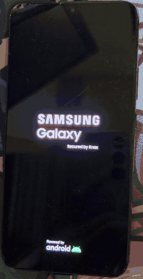
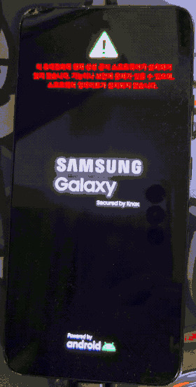
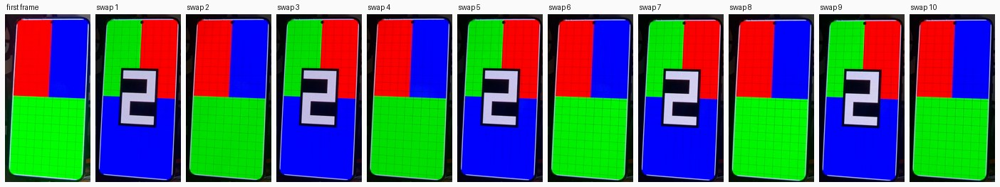

# S22+ 디스플레이 시각 증거

운영자 소유 삼성 Galaxy S22+ 5G(`SM-S906N`, FYG8)가 PID 1로 동작하는 자체 정적
`/init`에서 직접 자기 패널을 구동하는 사진과 클립입니다. Android 프레임워크,
SurfaceFlinger, Zygote는 이 화면 어디에도 관여하지 않습니다.

이 페이지는 **한 갈래의 작업만** 다룹니다. 2026-09-06과 2026-09-07에 기록된
디스플레이 브링업 런 P353부터 P361까지입니다. S22+ 타겟 전반의 개요가 아니며,
커널 재빌드·네이티브 PID 1·USB 결과는 [`S22PLUS.md`](S22PLUS.md)에 있고, A90의
넓은 런타임 스택은 [자체 시각 증거 페이지](A90_VISUAL_EVIDENCE.ko.md)에 있습니다.

프레임은 런 번호순이 아니라 각 프레임이 무엇을 성립시키는지에 따라 배열했습니다.
각 캡션은 프레임에서 눈에 보이는 것과, 링크된 런 보고서가 성립시키는 더 강한 주장을
구분합니다. **맨 위에 명시적으로 표시한 호스트 오라클을 제외하면, 이 페이지의 모든
프레임은 물리 패널을 찍은 사진 또는 클립이며 그중 어느 것도 pixel readback이
아닙니다.** 그리고 이 페이지의 어떤 런도 출력이 왜 달라졌는지를 증명하지 않습니다.

아래 각 런은 한 번의 입회하 boot-only 전송이었고, 정확한 Magisk 롤백과 검증된 정상
rooted FYG8 복귀로 끝났습니다. 어느 것도 재실행할 수 없으며 모두 닫혔습니다. 그중 네
런(P355, P356, P358, P361)에서는 원래 실행이 관측 후 롤백 의사 표명 전에 측정된 USB
엔드포인트 증거로 정지했고, 사전 승인된 same-journal 복구가 대신 롤백과 건강 검사를
완료했습니다. **그 정지의 물리적 원인은 여전히 미증명입니다.** 네 런 모두에서
candidate나 관측이 재실행된 적은 없습니다.

**한국어** · [English](S22PLUS_DISPLAY_VISUAL_EVIDENCE.md)

---

## 전체 시리즈 한눈에 보기

| 런 | 픽셀 출처 | 관측 결과 | 이 페이지의 자산 |
| --- | --- | --- | --- |
| P353 | WC 버퍼, XRGB8888 패턴 | 패턴 보임, **깨짐** | 사진 |
| P354 | 동일 + 명시적 noise 비활성화 | **깨짐 그대로** | 사진 |
| P355 | 하드웨어 `color_fill`, 버퍼 fetch 없음 | **깨끗한** 마젠타 | 사진 |
| P356 | WC 버퍼, 단색 마젠타 | **깨짐** | 사진 (+ Android 대조) |
| P357 | WC 버퍼, 불투명 ABGR8888 | **깨짐** | *없음* |
| P358 | **CACHED** 버퍼, 불투명 ABGR8888 | **깨끗한** 마젠타 | *없음* |
| P359 | CACHED 버퍼, RGB/그리드/테두리 | **깨끗함** | 사진 |
| P360 | CACHED, 두 프레임, 1회 교체 | **깨끗함**, 전환 관측됨 | 클립 |
| P361 | CACHED, 두 프레임, 10회 교체 | **깨끗함**, 교대 관측됨 | 클립 |

이 비교에서 가장 중요한 두 런인 P357과 P358이, 하필 이미지가 없는 두 런입니다.
이 사실은 해당 위치에서 다시 언급합니다.

---

## 프레임이 어떻게 보였어야 하는가

**보이는 것** — 의도한 P359/P360/P361의 첫 프레임을 호스트에서 렌더링한 것입니다.
좌상단 빨강과 우상단 파랑 블록, 하단 초록 블록, 규칙적인 그리드, 그리고 흰색 외곽
테두리입니다. 이것은 1/4 축소 미리보기 렌더(270x585)이며, 기기의 실제 프레임은
1080x2340에 pitch 4352바이트입니다.

**기술적 맥락** — 이것은 기기 캡처가 아닙니다. 바이트 동일한 정적 AArch64 렌더러를
user-mode QEMU에서 실행해 그 출력을 독립 픽셀 오라클과 비교했으며, P360/P361 프레임
쌍의 경우 20,367,360바이트 전부가 일치했습니다. 즉 렌더러가 *쓰는* 픽셀은 기기가
관여하기 전에 이미 올바름이 확인돼 있습니다.

**증거 경계** — 이것은 무엇이 그려졌는지를 성립시킬 뿐, 무엇이 스캔아웃됐는지를
성립시키지 않습니다. 이 이미지와 아래 패널 사진들 사이의 모든 차이는 그리기 이후
어딘가에서 발생한 것입니다.

---

## 하류 디스플레이 경로는 깨끗할 수 있다

**보이는 것** — 눈에 띄는 깨짐 없이 고르게 채워진 전면 마젠타입니다(P355).

**기술적 맥락** — 이 프레임은 벤더 드라이버 자체의 `color_fill` 플레인 속성
(`0x80ff00ff`)이 만들어낸 것으로, **보이는 픽셀을 일반 프레임버퍼 fetch 경로가 아니라
하드웨어 solid-fill 경로에서 가져옵니다**. 버퍼는 여전히 할당돼 P353 패턴으로 그려진
상태였고 그 픽셀은 화면에 도달하지 않았지만, FB/GEM/SMMU 준비는 여전히 수행됐을 수
있습니다. 실패한 런들과 동일한 30HS 모드, primary 라우팅, noise 비활성화가 유지됐습니다.

**왜 먼저 나오는가** — 가장 값싼 대안 설명을 먼저 닫기 때문입니다. 패널, 모드, 플레인
라우팅, 커밋 경로는 이 기기에서 깨끗한 전체 화면 이미지를 만들어낼 수 있습니다.

**증거 경계** — `color_fill`은 순수한 메모리 속성 토글이 아닙니다. 이를 활성화하면
source geometry와 scaler/decimation도 함께 재정의되고 내부적으로 ABGR8888이 선택되므로,
여기서의 깨끗한 결과는 탐색 범위를 일반 buffer-fetch/format/scaler 경로로 좁힐 뿐
캐시 결함을 증명하지는 않습니다.

**관련 증거** —
[`S22PLUS_FYG8_P355_HARDWARE_SOLID_FILL_PREPARATION_2026-09-07.md`](../reports/S22PLUS_FYG8_P355_HARDWARE_SOLID_FILL_PREPARATION_2026-09-07.md)

---

## 같은 패널에서의 Android

**보이는 것** — 같은 물리 패널에 표시된 스톡 Android 부팅 통신사 로고이며, 네이티브
런들에서 보이던 두드러진 가로 깨짐이 없습니다.

**증거 경계** — 이것은 훨씬 단순한 다른 화면을 다른 시점에 찍은 대조 사진입니다.
네이티브 버퍼/디스플레이 구성을 Android의 것과 비교하는 작업을 뒷받침하지만, 내용이
일치하는 비교가 아니며 그 자체로는 어떤 인과도 증명하지 않습니다.

**관련 증거** —
[`S22PLUS_FYG8_P356_FRAMEBUFFER_MAGENTA_PREPARATION_2026-09-07.md`](../reports/S22PLUS_FYG8_P356_FRAMEBUFFER_MAGENTA_PREPARATION_2026-09-07.md)

---

## write-combine 버퍼가 실제로 화면에 올린 것

**보이는 것** — 의도한 패턴이 부팅 로고를 대체하며 분명히 나타나 있고, 동시에 의도하지
않은 가로 반점과 하단 영역 전반의 상당한 깨짐이 함께 있습니다(P353).

**기술적 맥락** — XRGB8888 write-combine 버퍼 하나, pitch 4352바이트, 10,183,680바이트,
블로킹 `ALLOW_MODESET` 커밋 1회, 재그리기 없음, 재시도 없음입니다. 그리기 코드에는
균일 채움과 단색 영역만 있고 노이즈 생성기는 없습니다. 소비된 렌더러를 이후 QEMU에서
재실행했을 때 **그려진 10,183,680바이트 전부가 행 패딩을 포함해 독립 사각형 오라클과
일치했습니다**. 따라서 깨짐은 그리기 이후 단계에서 발생합니다.

**증거 경계** — "첫 네이티브 프레임이 패널에 도달했다"는 좁은 주장은 뒷받침됩니다.
깨끗한 출력은 달성되지 않았고, 그 메커니즘은 미증명입니다.

**관련 증거** —
[`S22PLUS_FYG8_P353_STATIC_FIRST_FRAME_PREPARATION_2026-09-07.md`](../reports/S22PLUS_FYG8_P353_STATIC_FIRST_FRAME_PREPARATION_2026-09-07.md),
[`S22PLUS_FYG8_P353_IMAGE_CORRUPTION_H0_2026-09-07.md`](../reports/S22PLUS_FYG8_P353_IMAGE_CORRUPTION_H0_2026-09-07.md)

### 명시적 noise 비활성화 이후에도 재현됨

P354는 동일한 candidate를 `noise_layer_v1=0`을 명시적으로 설정해 별도의 새 전송으로
다시 실행했습니다. 같은 패턴, 같은 반점, 같은 하단 깨짐입니다. 이 프레임의 가치는 새로운
실패 양상이 아니라, 개입을 하나 가했음에도 두 독립 런에 걸쳐 같은 실패가 재현됐다는
사실입니다. 이 결과는 해당 속성이 런타임에 실제로 적용됐음을 성립시키지 않으며 모든
noise 관련 원인을 배제하지도 않습니다. 디스패치 이후 실행 텔레메트리가 없기 때문입니다.
따라서 이 변경을 *해결책*에서 배제할 뿐, 그 메커니즘을 *원인*에서 배제하지는 않습니다.
[P354 보고서](../reports/S22PLUS_FYG8_P354_NOISE_DISABLE_H0_2026-09-07.md)

---

**보이는 것** — 가로 방향의 어두운 끊김이 지나가고 하단 영역에 심한 깨짐이 있는
마젠타 화면입니다(P356).

**기술적 맥락** — P355의 하드웨어 fill이 깨끗하게 그려냈던 것과 같은 단색을, 이번에는
*일반 write-combine 버퍼를 통해* 그린 것입니다. 내용 복잡도는 변수에서 제거됩니다.
**write-combine 실패에 복잡한 내용은 필요하지 않습니다.** 단색 하나로도 깨지기
때문입니다. 이것은 buffer-fetch 경로 일반에 대한 혐의가 아닙니다. 아래쪽의 cached
버퍼들은 같은 경로를 지나면서도 깨끗합니다.

**증거 경계** — 이 시점에서 캐시, 포맷, 매핑, scaler, 타이밍 원인은 모두 열려 있습니다.

**관련 증거** —
[`S22PLUS_FYG8_P356_FRAMEBUFFER_MAGENTA_PREPARATION_2026-09-07.md`](../reports/S22PLUS_FYG8_P356_FRAMEBUFFER_MAGENTA_PREPARATION_2026-09-07.md)

---

## 결정적인 비교에는 사진이 없다

이 시리즈에서 가장 많은 정보를 주는 단계는 **P357 → P358**이며, 두 런 모두 이미지를
남기지 않았습니다. 둘 다 각자의 런 저널에 기록된 운영자 진술이고, 이 페이지는 그렇지
않은 척하지 않습니다.

P357은 P356의 write-combine GEM 할당, pitch, 크기, map offset, 30HS 타이밍을 유지한 채
픽셀을 완전 불투명 ABGR8888로 바꿨습니다. 그래도 깨졌습니다. 줄무늬가 있는 마젠타였습니다.
그다음 P358이 **요청 변수 하나**를 바꿨습니다. GEM 할당 플래그를 `MSM_BO_WC`에서
`MSM_BO_CACHED`로 바꾸고, 불투명 ABGR8888 포맷·기하·pitch·타이밍·내용은 모두 고정했습니다.
운영자는 완전히 깨끗한 마젠타를 보고했으며, 이는 시리즈에서 처음 나온 깨끗한 일반 버퍼
출력입니다.

그 플래그 하나의 차이 위에 P358 이후의 모든 것이 세워져 있고, 아래쪽의 깨끗한 프레임들이
cached 버퍼인 이유도 그것입니다.

**증거 경계** — 이 플래그는 메모리 속성만 바꾸지 않습니다. cached 분기는 write-combine의
이른 DMA map과 `EXTBUF` 할당도 건너뛰므로, 최소한 두 가지가 함께 움직입니다.
**cache coherency는 mmap/DMA-map 타이밍과 분리되지 않았으며, 이 페이지의 어떤 런도
그것을 분리하지 못합니다.**

**관련 증거** —
[`S22PLUS_FYG8_P357_ABGR_FRAMEBUFFER_PREPARATION_2026-09-07.md`](../reports/S22PLUS_FYG8_P357_ABGR_FRAMEBUFFER_PREPARATION_2026-09-07.md),
[`S22PLUS_FYG8_P358_CACHED_FRAMEBUFFER_PREPARATION_2026-09-07.md`](../reports/S22PLUS_FYG8_P358_CACHED_FRAMEBUFFER_PREPARATION_2026-09-07.md),
[`S22PLUS_FYG8_POST_P357_BUFFER_FETCH_ANALYSIS_2026-09-07.md`](../reports/S22PLUS_FYG8_POST_P357_BUFFER_FETCH_ANALYSIS_2026-09-07.md)

---

## cached 버퍼 위의 패턴 프레임

**보이는 것** — 이 페이지 맨 위의 패턴이 실제 패널에 나타난 모습입니다. 좌상단 빨강과
우상단 파랑 블록, 하단 초록 블록, 규칙적인 그리드, 끊기지 않은 흰색 외곽 테두리입니다.
반점도, 띠도, 하단 깨짐도 없습니다(P359).

**기술적 맥락** — 단색이 아니라 실제 구조를 담은 cached ABGR8888 버퍼입니다. 이 페이지
맨 위의 호스트 렌더 오라클과 비교해 보십시오. 확인할 특징은 영역 위치, 그리드의
규칙성, 테두리이며, 이들은 그대로 살아남습니다.

**증거 경계** — 이것은 운영자가 관측하고 촬영한, 카메라 해상도의 프레임입니다. 미세한
픽셀 충실도, 정확한 색 값, 행 패딩은 사진으로 성립시킬 수 **없습니다**. 오라클 비교가
다루는 것은 그려진 바이트이지 스캔아웃된 바이트가 아닙니다.

**관련 증거** —
[`S22PLUS_FYG8_P359_CACHED_PATTERN_PREPARATION_2026-09-07.md`](../reports/S22PLUS_FYG8_P359_CACHED_PATTERN_PREPARATION_2026-09-07.md)

---

## 한 프레임, 그리고 다음 프레임

**전체 클립** — [▶ `07-p360-two-frame-transition.mp4`](../images/s22plus-display/07-p360-two-frame-transition.mp4)

**보이는 것** — 끊김 없는 14초 손각대 녹화입니다. 부트로더 잠금 해제 경고가 있는 삼성
스플래시, 그것을 대체하는 첫 네이티브 프레임, 그리고 약 5초 뒤 색 영역이 뒤바뀌고 검은
받침판 위에 큰 흰색 숫자 `2`가 놓인 두 번째 프레임이 클립 끝까지 유지됩니다(P360).

**기술적 맥락** — 두 버퍼 모두 첫 블로킹 `ALLOW_MODESET` 커밋 전에 할당되고 완전히
그려졌습니다. 두 번째 커밋은 **선택된 primary `FB_ID`만** 바꿨습니다. 재그리기, 재사용,
정리, 폴백, 재시도는 일어나지 않습니다. 클립 앞머리의 스플래시는 군더더기가 아닙니다.
벤더 부트 체인이 패널을 네이티브 init에 넘기는 과정이 한 테이크에 끊기지 않고 담긴
것입니다.

**녹화에서 측정한 값** — 프레임 차분 분석에서 첫 프레임은 t≈5.14초, 전환은 t≈10.26초로
나오며, 그 간격은 설계된 5초 지연에 대해 **약 5.12초**입니다.

**증거 경계** — 이 클립의 두 가지 특징은 기기 결함으로 읽어서는 안 됩니다. 대략 t5.2초
부터 t7초까지 색이 날아간 것은 카메라 자동 노출이 어두운 스플래시에서 적응해 나가는
현상과 부합합니다. 전환 지점의 블렌딩된 프레임 한 장은 30fps 카메라가 패널 갱신을 걸쳐
적분한 결과와 부합하며, 한 프레임만으로는 그것과 실제 부분 갱신을 구분할 수 없으므로
이 클립은 티어링에 대해 어느 쪽으로도 결론짓지 못합니다. 이 녹화는 P360이 닫힌 뒤에
도착했습니다. 런을 보강할 뿐 기계 판정을 바꾸지 않습니다.

**관련 증거** —
[`S22PLUS_FYG8_P360_TWO_FRAME_PREPARATION_2026-09-07.md`](../reports/S22PLUS_FYG8_P360_TWO_FRAME_PREPARATION_2026-09-07.md)

---

## 연속 10회 교체

**전체 클립** — [▶ `08-p361-ten-swaps.mp4`](../images/s22plus-display/08-p361-ten-swaps.mp4)

**보이는 것** — 첫 프레임이 나타난 뒤, 유지된 두 프레임이 약 1초 간격으로 10회 교대하고,
화면이 다시 첫 프레임으로 정착해 그대로 유지됩니다(P361).

**기술적 맥락** — 총 11회의 블로킹 atomic 커밋입니다. 최초 제출 1회, 그다음 1초 sleep과
선택된 `FB_ID`만 바꾸는 커밋으로 이루어진 반복 10회입니다. 두 버퍼와 그 FB ID, mode blob은
내내 유지됩니다. **픽셀은 결코 다시 그려지거나 새 내용으로 재사용되지 않으므로**, 화면에서
교대하는 것은 그리기가 아니라 프레임 선택입니다.

**녹화에서 센 값** — 23.6초 클립 전체에 임계값을 넘는 화면 변화가 정확히 11개 있습니다.
첫 프레임의 등장과 그 뒤의 교대 10회입니다. 정착한 화면들은 정확히 두 부류로 갈리며 엄격히
교대하고, 누락·초과·정지·순서 이상이 없습니다. 마지막으로 유지된 화면은 **첫** 프레임으로,
설계된 "교대하다가 첫 프레임으로 종료"와 일치합니다. 카메라 프레임 해상도에서 교대 사이
9개 간격은 모두 1.0~1.07초 범위에 들어오고 평균은 약 1.03초이며, 마지막 프레임은 남은
4.3초 동안 변화 없이 유지됩니다. 공개된 클립을 다시 측정해도 같은 10회 교대와 같은 평균이
재현됩니다.

정착 화면 11개를 순서대로 놓은 것입니다. 첫 프레임, 그리고 10회 교체 각각의 이후
상태입니다. 엄격한 교대, 누락되거나 중복된 단계가 없다는 점, 마지막에 첫 프레임으로
돌아온다는 점을 눈으로 확인할 수 있습니다. 이것은 계수와 순서 확인을 위해 정착 상태를
표본으로 뽑은 것이며, 시간에 비례하는 표현이 아닙니다.

**이 런이 다른 이유** — 이 페이지의 앞선 모든 프레임은 운영자의 육안 진술에 기대고 있습니다.
여기서는 관측이 셀 수 있는 것이 됩니다. 이 런 자체의 witness 기록은
`exact_swap_count_independently_confirmed`를 false로 남겼고, 이 클립은 눈에 보이는 10회
교대를 독립적으로 보강합니다. 런의 기록은 닫힌 상태 그대로이며, 보강은 그 안이 아니라
곁에 놓입니다.

**증거 경계** — 카메라는 약 30fps의 가변 프레임 레이트로 기록하므로 각 전환의 위치는
프레임 하나(약 33ms) 안에서만 특정됩니다. 따라서 **이 녹화로는 커밋 지연을 밀리초 단위로
확정할 수 없습니다.** 그것은 카메라가 아니라 기기 측 계측이 필요한 일입니다. 평균 간격이
1초 sleep을 초과하는 수십 밀리초는 반복당 커밋과 루프 오버헤드로서 타당한 크기 규모이며,
그 이상은 아닙니다. 이 클립이 보여주는 것은 반복되는 디스플레이 갱신이며, PID 1
heartbeat가 **아니고** 런도 그렇게 주장하지 않습니다.

**관련 증거** —
[`S22PLUS_FYG8_P361_REPEATED_FRAME_PREPARATION_2026-09-07.md`](../reports/S22PLUS_FYG8_P361_REPEATED_FRAME_PREPARATION_2026-09-07.md)

---

## 자산 처리

사진은 휴대폰 주변의 무관한 방·배경을 제거하기 위해 크롭만 했습니다. 패널 안쪽은 리터칭,
색·노출 보정, 마스킹을 하지 않았습니다. 두 클립은 이곳에서 재생되도록 HEVC에서 H.264로
트랜스코딩하고 축소했으며, 녹화에 사용한 단말의 컨테이너 메타데이터를 제거했습니다. 어느
쪽도 잘라내지 않았고 둘 다 완전한 테이크입니다. 기기 화면 내용, 프레임 순서, 눈에 보이는
사건 순서는 변경되지 않았습니다. 다만 재인코딩은 프레임 타임스탬프를 리샘플링하므로, P361의
간격을 밀리초가 아니라 카메라 프레임 해상도로 인용합니다. 공개된 클립에서도 같은 10회
교대와 같은 평균이 재현됩니다. 정화된 자산은 공개 전에 다시 검사했습니다.

인라인 GIF는 표시용 사본으로, 축소하고 5fps로 재표본화한 것입니다. P361의 앞부분 부팅
대기 구간은 **인라인 GIF에서만** 제외했으며, **반복되는 화면 전환 사이의 간격은 어느
것도 제거하지 않았습니다.** P360 GIF는 전체 테이크입니다. 사건 횟수와 시간 측정값은
인라인 자료와 함께 링크된, 정화된 전체 길이 H.264 클립에서 산출한 것입니다.

클립은 운영자 본인의 별도 단말로 촬영했습니다. 그 단말은 이 프로젝트의 타겟이 아니며 구속력
있는 타겟 레지스트리 어디에도 없습니다. 시험 대상 기기가 아니라 카메라입니다. Android 대조
프레임은 통신사 부팅 브랜딩을 그대로 두었습니다. 그것은 이 단말이 어느 통신사 펌웨어로
동작하는지를 기록하며, 동시에 그 프레임을 익명의 흰 사각형이 아니라 Android 자체의 부팅
화면으로 식별하게 해주는 요소입니다.

---

## 이 페이지가 보여주지 않는 것

**여기 어떤 기기 프레임도 readback이 아닙니다.** 모든 패널 이미지와 클립은 화면을 향한
카메라입니다. 이 시리즈에서 바이트 단위로 정확한 증거는 렌더러가 *그리는* 것에 대한
호스트 측 오라클 비교뿐입니다.

**원인은 성립되지 않았습니다.** 이 시리즈는 write-combine 버퍼가 깨짐을, cached 버퍼가
깨끗한 출력을 재현성 있게 만들어낸다는 것을 보여줍니다. *왜* 그런지는 보여주지 않으며,
둘을 가르는 그 플래그 하나가 캐시 속성과 이른 DMA-map 경로를 함께 움직입니다.

**결정적 단계에는 그림이 없습니다.** P357과 P358에는 사진이 없습니다. 이 페이지의 깨끗한
프레임들은 독자가 런 보고서에서 직접 가져와야 하는 비교로부터 의미를 물려받습니다.

**이들은 서로 다른 런입니다.** 이 페이지의 어떤 두 자산도 하나의 연속된 세션이 아니며, 각
candidate는 정확히 한 번씩 전송됐습니다. 모두 소비됐고 영구히 재실행할 수 없으며, 각각
정확한 Magisk 롤백과 검증된 정상 rooted FYG8 복귀로 닫혔습니다.

**이것은 디스플레이 런타임이 아닙니다.** 존재하는 것은 미리 그려둔 버퍼 사이를 선택할 수
있는 정적 프레임 경로입니다. **최초 버퍼가 준비된 이후의 제자리 재그리기나 컴포지터 주도
재페인트는 없으며**, 컴포지터도, 입력도, 일반적이거나 장시간 지속되는 디스플레이 동작에
대한 증명도 없습니다.

**여기 어떤 것도 다른 타겟으로 이전되지 않습니다.** A90과 S20+는 이 런들로부터 어떤 명령도
받지 않았으며, 결과·아티팩트·권한은 기기 사이를 결코 이동하지 않습니다.
