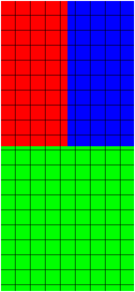
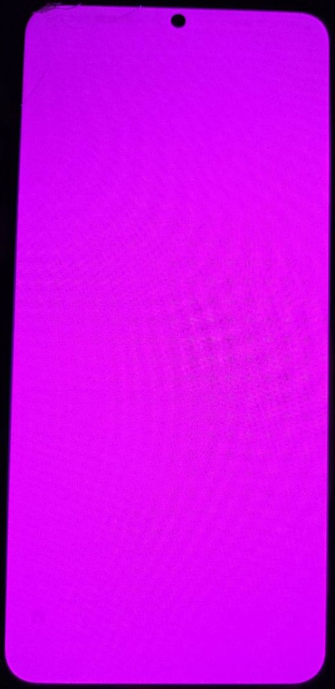
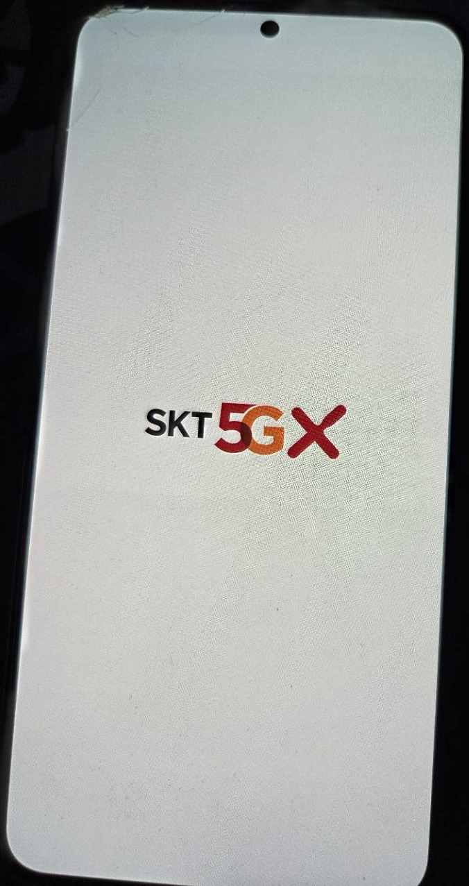
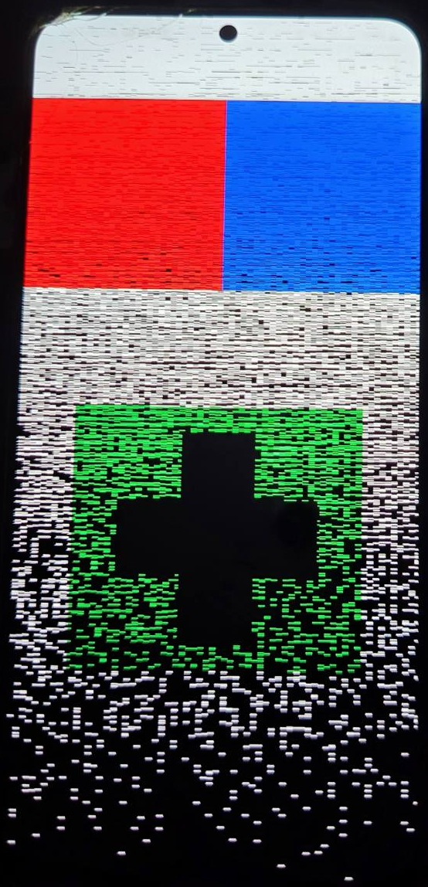
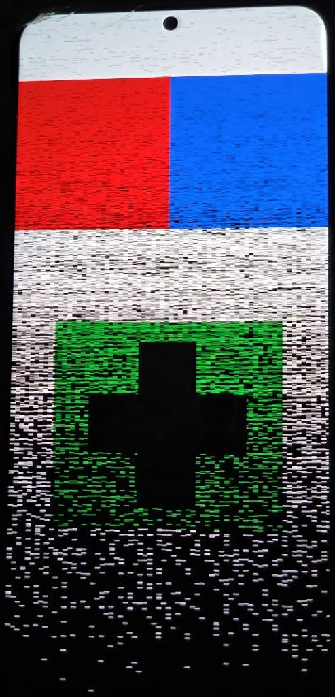
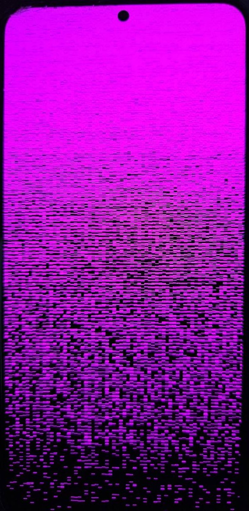
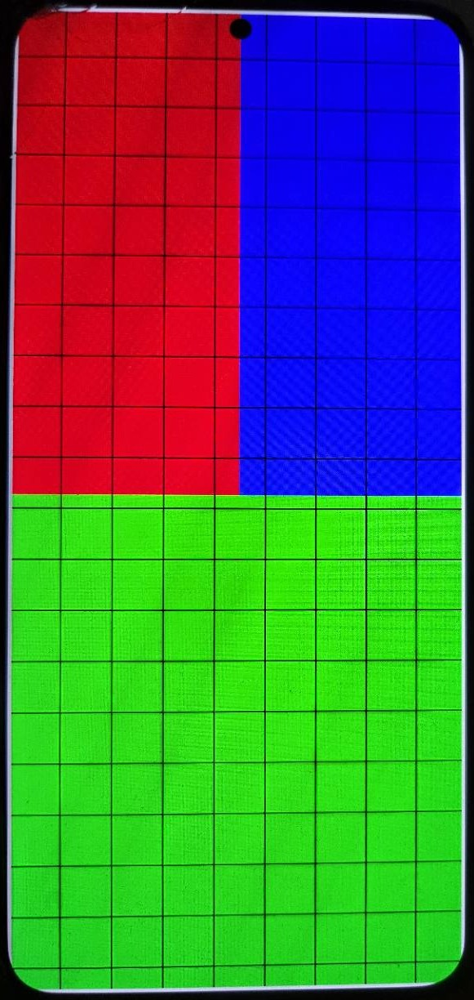

# S22+ display visual evidence

Photographs and clips of the operator-owned Samsung Galaxy S22+ 5G
(`SM-S906N`, FYG8) driving its own panel from a custom static `/init` running
as PID 1, with no Android framework, SurfaceFlinger or Zygote in the picture.

This page covers **one line of work only**: the display bring-up runs P353
through P361, recorded 2026-09-06 and 2026-09-07. It is not an overview of the
S22+ target — the kernel rebuild, native PID 1 and USB results live in
[`S22PLUS.md`](S22PLUS.md), and the A90's broader runtime stack is on its own
[visual evidence page](A90_VISUAL_EVIDENCE.md).

The frames are ordered by what they establish, not by run number. Each caption
separates what is visible in the frame from the stronger claim its linked run
report establishes. **Except for the explicitly labelled host oracle at the top,
every frame on this page is a camera photograph or clip of a physical panel, and
none of them is a pixel readback** — and no run on this page proves why the
output changed.

Each run below was a single attended boot-only transfer that ended in an exact
Magisk rollback and a verified healthy rooted FYG8 return. None is replayable,
and every one of them is closed. In four of them — P355, P356, P358 and P361 —
the original execute stopped on measured USB endpoint evidence after the
observation and before rollback intent, and a preauthorized same-journal
recovery completed the rollback and the health checks instead. **The physical
cause of those stops is still unproved.** No candidate or observation was
replayed in any of them.

---

## The whole series at a glance

| Run | Pixel source | Observed | Asset here |
| --- | --- | --- | --- |
| P353 | WC buffer, XRGB8888 pattern | pattern visible, **corrupt** | photo |
| P354 | same + explicit noise disable | **unchanged corruption** | photo |
| P355 | hardware `color_fill`, no buffer fetch | **clean** magenta | photo |
| P356 | WC buffer, constant magenta | **corrupt** | photo (+ Android control) |
| P357 | WC buffer, opaque ABGR8888 | **corrupt** | *none* |
| P358 | **CACHED** buffer, opaque ABGR8888 | **clean** magenta | *none* |
| P359 | CACHED buffer, RGB/grid/border | **clean** | photo |
| P360 | CACHED, two frames, one swap | **clean**, transition seen | clip |
| P361 | CACHED, two frames, ten swaps | **clean**, alternation seen | clip |

The two runs that matter most to the comparison, P357 and P358, are the two
with no image. That is stated again where it belongs, below.

---

## What the frame was supposed to look like

**What it shows** — the intended P359/P360/P361 first frame, rendered on the
host: red and blue upper blocks, a green lower block, a regular grid and a white
perimeter border. This is a quarter-scale preview render (270x585); the device
frame itself is 1080x2340 with a 4352-byte pitch.

**Technical context** — this is not a device capture. The byte-identical static
AArch64 renderer was run under user-mode QEMU and its output compared against an
independent pixel oracle; for the P360/P361 frame pair all 20,367,360 bytes
matched. So the pixels the renderer *writes* are known to be correct before any
device is involved.

**Evidence boundary** — this establishes what was painted, not what was
scanned out. Every difference between this image and the panel photographs
below is introduced somewhere after the paint.

---

## The downstream display path can be clean

**What it shows** — a full, even magenta field with no visible breakup (P355).

**Technical context** — this frame is produced by the vendor driver's own
`color_fill` plane property (`0x80ff00ff`), which **sources the visible pixels
from the hardware solid-fill path rather than the ordinary framebuffer-fetch
path**. The buffer was still allocated and painted with the P353 pattern and
none of those pixels reached the screen, though FB/GEM/SMMU preparation may
still have run. The same 30HS mode, primary routing and noise disable as the
failing runs were retained.

**Why it comes first** — it closes the cheapest alternative explanation. The
panel, the mode, the plane routing and the commit path can all produce a clean
full-screen image on this device.

**Evidence boundary** — `color_fill` is not purely a memory-attribute toggle.
Enabling it also overrides source geometry and scaler/decimation and selects
ABGR8888 internally, so a clean result here narrows the search to the ordinary
buffer-fetch/format/scaler path without proving a cache fault.

**Related evidence** —
[`S22PLUS_FYG8_P355_HARDWARE_SOLID_FILL_PREPARATION_2026-09-07.md`](../reports/S22PLUS_FYG8_P355_HARDWARE_SOLID_FILL_PREPARATION_2026-09-07.md)

---

## The same panel under Android

**What it shows** — the stock Android boot carrier logo on the same physical
panel, without the conspicuous horizontal breakup seen in the native runs.

**Evidence boundary** — this is a control photograph of a different, much
simpler screen, taken at a different moment. It supports comparing the native
buffer/display setup against Android's; it is not a matched-content comparison
and proves nothing causal on its own.

**Related evidence** —
[`S22PLUS_FYG8_P356_FRAMEBUFFER_MAGENTA_PREPARATION_2026-09-07.md`](../reports/S22PLUS_FYG8_P356_FRAMEBUFFER_MAGENTA_PREPARATION_2026-09-07.md)

---

## What the write-combine buffer actually put on screen

**What it shows** — the intended pattern is unmistakably there, replacing the
boot logo, together with unintended horizontal speckles and substantial
corruption across the lower area (P353).

**Technical context** — one XRGB8888 write-combine buffer, 4352-byte pitch,
10,183,680 bytes, one blocking `ALLOW_MODESET` commit, no redraw and no retry.
The paint code contains only uniform fills and solid regions; there is no noise
generator in it. The consumed renderer was afterwards replayed under QEMU and
**all 10,183,680 painted bytes matched an independent rectangle oracle, row
padding included**. The corruption is therefore downstream of the paint.

**Evidence boundary** — the narrow claim "the first native frame reached the
panel" is supported. Clean output was not achieved, and the mechanism is
unproved.

**Related evidence** —
[`S22PLUS_FYG8_P353_STATIC_FIRST_FRAME_PREPARATION_2026-09-07.md`](../reports/S22PLUS_FYG8_P353_STATIC_FIRST_FRAME_PREPARATION_2026-09-07.md),
[`S22PLUS_FYG8_P353_IMAGE_CORRUPTION_H0_2026-09-07.md`](../reports/S22PLUS_FYG8_P353_IMAGE_CORRUPTION_H0_2026-09-07.md)

### Reproduced after an explicit noise disable

P354 re-ran the identical candidate as a separate fresh transfer with
`noise_layer_v1=0` set explicitly: the same pattern, the same speckles, the same
lower-area corruption. The value of this frame is not a new failure mode but the
fact that one intervention was applied and the failure still reproduced across
two independent runs. It does not establish that the property took effect at
runtime and does not exclude every noise-related cause — post-dispatch execution
telemetry is absent — so it rules the change out as a *remedy*, not the
mechanism out as a *cause*.
[P354 report](../reports/S22PLUS_FYG8_P354_NOISE_DISABLE_H0_2026-09-07.md)

---

**What it shows** — a magenta field crossed by horizontal dark breaks, with
severe corruption in the lower area (P356).

**Technical context** — the same constant colour that P355's hardware fill drew
cleanly, this time drawn *through an ordinary write-combine buffer*. Content
complexity is eliminated as a variable: **complex content is not required for
the write-combine failure**, because a single constant colour corrupts too. This
is not a charge against the buffer-fetch path in general — the cached buffers
further down travel it and stay clean.

**Evidence boundary** — cache, format, mapping, scaler and timing causes all
remain open at this point in the series.

**Related evidence** —
[`S22PLUS_FYG8_P356_FRAMEBUFFER_MAGENTA_PREPARATION_2026-09-07.md`](../reports/S22PLUS_FYG8_P356_FRAMEBUFFER_MAGENTA_PREPARATION_2026-09-07.md)

---

## The decisive comparison has no photograph

The single most informative step in this series is **P357 → P358**, and neither
run produced an image. Both are operator statements recorded in their run
journals, and this page will not pretend otherwise.

P357 kept P356's write-combine GEM allocation, pitch, size, map offset and 30HS
timing, and made the pixels fully opaque ABGR8888. It was still corrupt —
magenta with stripes. P358 then changed **one requested variable**: the GEM allocation flag,
`MSM_BO_WC` to `MSM_BO_CACHED`, with the opaque ABGR8888 format, geometry,
pitch, timing and content all held constant. The operator reported full clean
magenta — the first clean ordinary-buffer output in the series.

That one-flag difference is what everything after P358 is built on, and it is
why the clean frames further down are on a cached buffer.

**Evidence boundary** — the flag does not change only the memory attribute. The
cached branch also skips the write-combine early DMA map and `EXTBUF`
assignment, so at least two things move together. **Cache coherency has not
been isolated from mmap/DMA-map timing, and no run on this page does so.**

**Related evidence** —
[`S22PLUS_FYG8_P357_ABGR_FRAMEBUFFER_PREPARATION_2026-09-07.md`](../reports/S22PLUS_FYG8_P357_ABGR_FRAMEBUFFER_PREPARATION_2026-09-07.md),
[`S22PLUS_FYG8_P358_CACHED_FRAMEBUFFER_PREPARATION_2026-09-07.md`](../reports/S22PLUS_FYG8_P358_CACHED_FRAMEBUFFER_PREPARATION_2026-09-07.md),
[`S22PLUS_FYG8_POST_P357_BUFFER_FETCH_ANALYSIS_2026-09-07.md`](../reports/S22PLUS_FYG8_POST_P357_BUFFER_FETCH_ANALYSIS_2026-09-07.md)

---

## A patterned frame on a cached buffer

**What it shows** — the pattern from the top of this page on the actual panel:
red and blue upper blocks, green lower block, a regular grid and an unbroken
white perimeter. No speckles, no banding, no lower-area breakup (P359).

**Technical context** — a cached ABGR8888 buffer carrying real structure rather
than a constant colour. Compare it against the host-rendered oracle at the top
of this page: the region positions, the grid regularity and the border are the
features to check, and they survive.

**Evidence boundary** — this is an operator-observed and photographed frame at
camera resolution. Fine-grained pixel fidelity, exact colour values and row
padding are **not** established by a photograph; the oracle comparison covers
the painted bytes, not the scanned-out ones.

**Related evidence** —
[`S22PLUS_FYG8_P359_CACHED_PATTERN_PREPARATION_2026-09-07.md`](../reports/S22PLUS_FYG8_P359_CACHED_PATTERN_PREPARATION_2026-09-07.md)

---

## One frame, then another

**Clip** — [▶ `07-p360-two-frame-transition.mp4`](../images/s22plus-display/07-p360-two-frame-transition.mp4)

**What it shows** — a continuous 14-second handheld recording: the Samsung
splash with its unlocked-bootloader warning, then the first native frame
replacing it, then — about five seconds later — a second frame with permuted
colour regions and a large white numeral `2` on a black backing plate, held to
the end of the clip (P360).

**Technical context** — both buffers were allocated and fully painted before
the first blocking `ALLOW_MODESET` commit. The second commit changed **only the
selected primary `FB_ID`**; no repaint, reuse, cleanup, fallback or retry
occurs. The splash at the head of the clip is not filler: it is the vendor boot
chain handing the panel over to native init in one unbroken take.

**Measured from the recording** — frame-difference analysis puts the first
frame at t≈5.14 s and the transition at t≈10.26 s, an interval of **≈5.12 s**
against a designed five-second delay.

**Evidence boundary** — two features of this clip should not be read as device
faults. The washed-out colours from roughly t5.2 s to t7 s are consistent with
the camera's auto-exposure adapting away from the dark splash. The single
blended frame at the transition is consistent with a 30 fps camera integrating
across a panel update, and one frame cannot distinguish that from a genuine
partial update, so this clip settles nothing either way about tearing. The recording
arrived after P360 had closed; it corroborates the run and does not change its
machine verdict.

**Related evidence** —
[`S22PLUS_FYG8_P360_TWO_FRAME_PREPARATION_2026-09-07.md`](../reports/S22PLUS_FYG8_P360_TWO_FRAME_PREPARATION_2026-09-07.md)

---

## Ten swaps in a row

**Clip** — [▶ `08-p361-ten-swaps.mp4`](../images/s22plus-display/08-p361-ten-swaps.mp4)

**What it shows** — the first frame appears, then the two retained frames
alternate ten times at roughly one second apart, and the display settles back on
the first frame and holds it (P361).

**Technical context** — eleven blocking atomic commits in total: one initial
submission, then ten iterations of a one-second sleep followed by a commit that
changes only the selected `FB_ID`. The two buffers, their FB IDs and the mode
blob are held throughout; **the pixels are never repainted or reused for new
content**, so what alternates on screen is frame selection, not drawing.

**Counted from the recording** — the whole 23.6-second clip contains exactly
eleven above-threshold screen changes: the first frame appearing, then ten
alternations. The settled screens fall into exactly two classes that strictly
alternate, with no missed, extra, frozen or out-of-order step, and the final
held screen is the **first** frame — matching the designed "alternate, end on
the first". At camera-frame resolution the nine intervals between swaps all
fall in the range 1.0-1.07 s, averaging ≈1.03 s, and the last frame is held
unchanged for the remaining 4.3 s. Re-measuring the published clip reproduces
the same ten alternations and the same average.

**Why this run is different** — every earlier frame on this page rests on an
operator's naked-eye statement. Here the observation is countable: the run's own
witness record left `exact_swap_count_independently_confirmed` false, and this
clip independently corroborates the ten visible alternations. The run's record
stands as it closed; the corroboration sits beside it, not inside it.

**Evidence boundary** — the camera records at a variable rate of about 30 fps,
so each transition is located only to within one frame (~33 ms), and
**this recording cannot pin commit latency to milliseconds** — that needs device-side
instrumentation, not a camera. The few tens of milliseconds by which the mean
interval exceeds the one-second sleep are the right order of magnitude for
per-iteration commit and loop overhead, and no more than that. The clip shows a repeated display update; it is
**not** a PID 1 heartbeat and the run does not claim one.

**Related evidence** —
[`S22PLUS_FYG8_P361_REPEATED_FRAME_PREPARATION_2026-09-07.md`](../reports/S22PLUS_FYG8_P361_REPEATED_FRAME_PREPARATION_2026-09-07.md)

---

## Asset handling

The photographs were cropped only to remove unrelated room and background
content around the phone. Nothing inside the panel was retouched, colour- or
exposure-adjusted, or masked. The two clips were transcoded from HEVC to H.264
for playback here, scaled down, and stripped of the recording handset's
container metadata; neither was cut, and both are complete takes. No
device-screen content, frame order or visible event sequence was altered.
Re-encoding does resample frame timestamps, which is why the P361 intervals are
quoted at camera-frame resolution rather than to the millisecond — the published
clip reproduces the same ten alternations and the same average. The sanitized
assets were rechecked before publication.

The clips were recorded on the operator's own separate handset, which is not a
target of this project and appears nowhere in the binding target registry. It is
the camera, not a device under test. The Android control frame keeps its carrier
boot branding: that records which carrier's firmware the handset runs, and it is
what makes the frame recognisable as Android's own boot screen rather than an
anonymous white rectangle.

---

## What this page does not show

**No device frame here is a readback.** Every panel image and clip is a camera
pointed at a screen. The only byte-exact evidence in this series is the host-side oracle
comparison of what the renderer *paints*.

**The cause is not established.** The series shows write-combine buffers
producing corruption and cached buffers producing clean output, reproducibly.
It does not show *why*, and the one flag that separates them moves the cache
attribute and the early DMA-map path together.

**The decisive step is unillustrated.** P357 and P358 have no photographs. The
clean frames on this page inherit their meaning from a comparison the reader has
to take from the run reports.

**These are separate runs.** No two assets here are one continuous session, and
each candidate was transferred exactly once. All of them are consumed and
permanently non-replayable; each closed with an exact Magisk rollback and a
verified healthy rooted FYG8 return.

**This is not a display runtime.** What exists is a static frame path that can
select between prepainted buffers. There is **no in-place redraw or
compositor-driven repaint after the initial buffers are prepared**, no
compositor, no input, and no proof of general or long-running display
operation.

**Nothing here transfers to another target.** The A90 and S20+ received no
command from any of these runs, and results, artifacts and authority never move
between devices.
