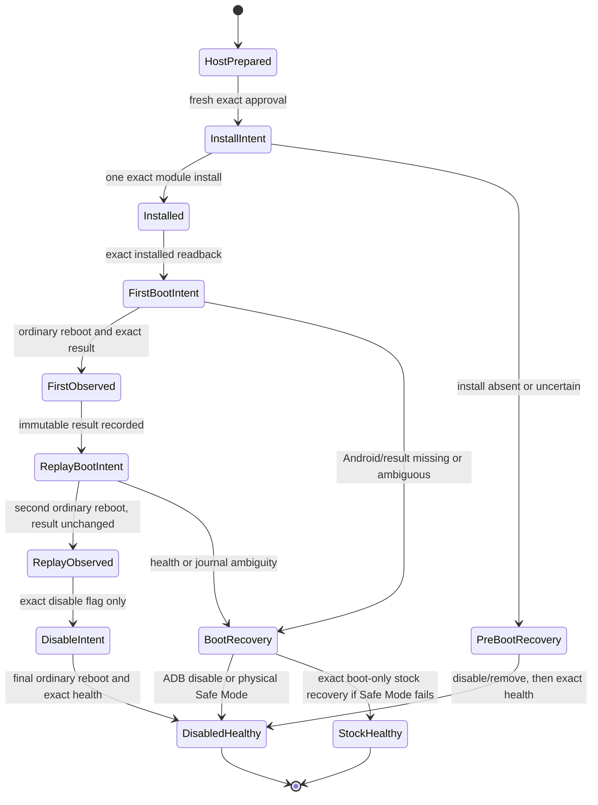

# S20+ G986N Native Canary Root-Data Transaction Draft

Date: 2026-08-15

Selected target: operator-owned Samsung Galaxy S20+ 5G only,
`SM-G986N` / `y2q` / `y2qksx` / `G986NKSS8IYC2`

Tier: H0 policy and state-machine draft

Status: **DRAFT - NOT BINDING - NOT ACTIVE - NO DEVICE AUTHORITY**

Provisional gate name: `S20PLUS_NATIVE_CANARY_ROOT_DATA_V1`

## Purpose and boundary

This draft describes the smallest future transaction that could install and
observe the N1 data-only Magisk canary selected in
`S20PLUS_G986N_NATIVE_INIT_PHASED_DESIGN_2026-08-15.md`. It deliberately does
not amend `AGENTS.md`, the binding S20+ target contract, or an active runner.
It authorizes no `adb`, `su`, root-data write, module install, reboot, Safe
Mode action, factory reset, or Odin transfer.

The transaction would prove only that one fixed repository-built static
AArch64 binary ran once from Magisk `late_start` after normal Android boot. It
would not prove early init, init-rc injection, namespace isolation, PID 1,
native USB, networking, SSH, display, or a native root filesystem.

The gate exists to block the hazard class **arbitrary persistent root-data
configuration**. It may admit only:

- the exact target tuple above;
- Magisk `30.7` / code `30700` in the already-proved resident-root state;
- module ID `s20plus_native_canary`;
- one exact four-member ZIP built by
  `build_s20plus_g986n_native_canary_n1.py`;
- one exact root-owned state directory,
  `/data/adb/s20plus-native-init/n1`;
- one install, the bounded observation sequence, and the predeclared recovery
  branches below; and
- no generic root command, interactive shell, arbitrary path, arbitrary
  module, package, property, service, mount, device, network, or block-write
  surface.

This is a temporary candidate gate, not a permanent repository boundary. Its
scope ends only in one terminal healthy state with the module proved consumed
and disabled, or with exact healthy stock boot after the predeclared recovery.
It expires before use on any target-build, Magisk-version, module-ID,
ZIP/binary, state-schema, tool/argv, health-model, installed-module inventory,
or recovery-path change, and after any unexplained live incident.

## Fixed H0 artifact contract

The module ZIP must contain exactly these four regular entries in this order:

```text
module.prop                         0644
skip_mount                         0644
service.sh                         0750
bin/s20plus_native_canary          0750
```

No explicit directory entry, duplicate, symlink, hardlink, special node,
traversal, encryption, compression variance, timestamp variance, archive or
entry comment, extra field, trailing byte, or extra member is allowed. The
whole ZIP must equal the deterministic canonical byte stream, not merely yield
the expected extracted files. The module has no `post-fs-data.sh`, `customize.sh`,
`action.sh`, `uninstall.sh`, `system/`, `system.prop`, `sepolicy.rule`,
`zygisk/`, updater, network fetch, or packaged shell.

The binary is a stripped static ELF64 AArch64 executable. It has no
`PT_INTERP`, `DT_NEEDED`, undefined symbol, writable-executable `LOAD`, child,
thread, generic exec, network, mount, namespace, ioctl, device-node, property,
service-control, reboot, kernel-module, ptrace, or block-device operation.

The ZIP and executable are private build outputs. Only their bounded
identities and the H0 verdict may enter tracked reports. A build result is not
an install manifest, approval, or live authority.

## Prepared private binding

Before any live effect, a future reviewed runner would create one private
no-clobber run and one exact `binding.txt`. Its closed ordered grammar is:

```text
schema=s20plus_native_canary_n1_binding_v1
target_model=SM-G986N
target_device=y2q
target_product=y2qksx
target_incremental=G986NKSS8IYC2
module_zip_sha256=<64 lowercase hex>
module_zip_size=<positive bounded decimal>
binary_sha256=<64 lowercase hex>
binary_size=<positive bounded decimal>
run_nonce=<32 lowercase hex>
pre_boot_id_sha256=<64 lowercase hex>
```

The run nonce is public and carries no authority. Serial, raw USB topology,
raw boot ID, command output, and device logs remain private evidence. The
binding is written before module activation, is mode `0600`, root-owned,
regular, direct, and single-link, and is never replaced.

The canary opens the fixed state directory without following its final path,
requires mode `0700`, and accepts only the initial one-file state. It checks
the exact binding grammar, its own executable SHA-256 and size through
`/proc/self/exe`, and a changed hash of the trimmed boot ID. It then:

1. creates and flushes `intent.json` with `O_CREAT|O_EXCL`; once its directory
   entry exists, any write, flush, or close failure preserves that name and
   consumes the run rather than permitting replay;
2. observes only fixed process, SELinux, capability, clock, executable,
   boot-ID-hash, and namespace scalars;
3. writes and flushes a fixed pending regular file;
4. publishes `result.json` by a same-directory no-clobber hardlink and flushes
   the directory; and
5. removes the pending name, flushes once more, and exits.

An existing exact `intent.json` plus `result.json` returns consumed without
changing either file. Intent without result, result without intent, a malformed
completed result, an extra name, wrong mode/owner/link count, symlink,
hardlink, special node, stale binding, or pending file is terminal ambiguity:
the canary performs no retry and a future runner retains its guard.

## Proposed state machine

The machine below is a design target, not executable code:



### H0 preparation

Preparation may repeat because it has no device effect. It must prove:

- current builder source and pinned tool identities;
- two byte-identical native builds and two byte-identical ZIP builds;
- the static ELF and exact ZIP audits;
- the exact known resident boot and stock boot-only artifacts remain present,
  direct, regular, and size/hash verified as H0 inputs; no standalone stock-
  recovery capability currently exists, so a future preparation cannot claim
  that branch until it is separately defined, reviewed, and activated;
- no active shared device guard and no unresolved S20+ run;
- a fresh private run directory, binding, intended stage path, and complete
  action/recovery manifest; and
- an approval digest that covers the exact target, artifacts, module ID,
  state schema, action order, recovery artifacts, and runner closure.

Preparation creates no module directory, root state, stage file, install
intent, reboot intent, or approval by itself.

### Fresh live preflight

A future activation would need one attended approval for the whole prepared
transaction. Immediately before the first effect, the runner must prove one
exact Android target and stable serial/topology/boot identity, healthy boot
completion, enforcing SELinux, working Magisk root, Magisk `30.7`/`30700`, the
expected resident boot, no pre-existing module ID, no pre-existing N1 state,
no unexpected installed module, adequate storage, and the physical Download
recovery path.

The root and Magisk checks must be closed fixed probes. They must not expose a
caller-supplied command string. ADB or `su` transport failure, malformed
output, target drift, another endpoint, unexpected module, existing state, or
artifact drift closes effect-free preparation and sends no install or reboot.

### One install

The future runner must durably record install intent before the first
root-data effect. It may stage only the exact ZIP to one exact normal shared-
storage path, verify its device-side hash and size, and invoke only the pinned
Magisk install-module operation for that path. It must then verify the exact
installed module inventory and file identities and create the exact state
binding no-clobber.

The ordering of state creation and installation must be implemented as one
reviewed recovery-aware sequence: no reboot may occur until both are exact.
Once install intent exists, install is never blindly replayed. A missing,
partial, or uncertain module is handled only by the predeclared disable/remove
recovery and exact readback. Generic recursive deletion is not an allowed
normalizer.

### First observation and replay proof

After an exact installed readback, the runner writes one reboot intent and
requests one ordinary Android reboot. The expected USB disconnect and
re-enumeration are part of this same attended transaction and require no new
magic token. The runner then requires the exact target, a changed boot-ID
hash, healthy Android, enforcing SELinux, persistent Magisk root, exact module
state, and exactly one immutable intent/result pair.

The result must bind the prepared binding SHA-256 and nonce; report `uid=0`;
carry the expected fixed target tuple, static executable identity, changed
boot-ID hash, process/SELinux/capability/namespace observations; remain below
8 KiB; and set replay permission false. Raw result and command output remain
private.

One second ordinary reboot is allowed only after that completed result is
durable. It proves exact Android/root health and byte-identical intent/result
with no new node. It never reruns an incomplete canary: an intent-only state
is ambiguous and parks for recovery.

### Disable and terminal health

After replay proof, the runner creates only the exact module `disable` flag,
verifies it, performs one final ordinary reboot, and proves:

- exact target identity and a new boot ID;
- normal Android boot completion and stable health samples;
- enforcing SELinux and persistent Magisk root;
- the exact module is disabled and its canary did not execute;
- the original intent/result are unchanged and no extra state node exists;
- staged shared-storage input is removed only through an exact fixed-path
  cleanup action owned, guarded, and independently reviewed as part of this
  future transaction; and
- both install and reboot replay permissions are false.

Only a durable terminal result may release the shared guard. Module removal
may be a later exact cleanup after this disabled healthy boot; it is not the
first response to an ambiguous state.

Neither routine shared-storage staging nor the resident Magisk F1 capability
currently grants this cleanup authority. The eventual binding transaction
must define the single staged filename, intent/result schemas, no-follow
unlink preconditions, post-unlink absence proof, failure parking, and guard
ownership. Until that capability is reviewed and activated, an inert staged
input remains rather than being removed by an inferred or generic command.

## Recovery branches

Recovery never waits for a second approval once the first live effect occurs.
The approval must bind all three branches in advance.

1. **Android/ADB available.** Create only the exact module `disable` flag,
   verify it, reboot once, and require exact healthy rooted Android with no
   canary effect. After health, exact module removal may be performed and
   verified if it was included in the prepared transaction.
2. **Android unavailable, physical Magisk recovery available.** The attended
   operator uses the official Magisk Safe Mode key sequence to disable
   modules. The runner performs no blind device command while Android identity
   is absent. It resumes only with exact Android identity and health.
3. **Safe Mode fails.** This branch is not currently executable: there is no
   standalone stock-recovery capability or runner in the binding target
   contract. Before this root-data transaction can activate, a separate policy
   change must define, independently review, and activate one exact stock boot-
   only recovery runner. Bootstrap and resident-F1 recovery authority does not
   transfer or imply that new lane. Only then may the root-data runner create a
   durable pre-bound handoff identifying that runner closure, exact stock
   artifact, target, endpoint-transition requirements, and shared guard; the
   recovery runner must validate and consume the handoff before its one
   transfer. Candidate install/reboot is not replayed. Root absence and exact
   healthy stock Android are terminal; complete data loss and factory reset
   are accepted recovery costs because both prior S20+ boot transitions
   required reset.

Any target ambiguity, malformed journal, changed bytes, unknown root-data
effect, failed disable, absent physical recovery, or stock-recovery ambiguity
retains the guard and stops. It never authorizes raw `odin4`, another module,
another boot artifact, another partition, or another target.

## Required runner and hostile test closure before activation

No live decision should be requested until a separate runner implements and
tests all of the following:

- exact target isolation from S22+ and A90 at every pre-effect and post-reboot
  boundary;
- pinned ADB, `su`, Magisk, staging, hashing, and reboot command surfaces with
  bounded stdout/stderr and time;
- a shared durable owner guard, append-only state transitions, strict typed
  schemas, no-follow regular-file reads, no-clobber writes, and fsync ordering;
- wrong target, duplicate/offline/unauthorized endpoint, unhealthy Android,
  root absence, wrong Magisk version, unexpected module, stale state, ZIP
  drift, staged-byte drift, install uncertainty, reconnect ambiguity,
  boot-ID reuse, result ambiguity, result replay, disable failure, Safe Mode
  handoff, and stock-recovery fixtures;
- zero install/reboot command before every failing preflight fixture;
- exactly one install and the bounded reboots in the successful fixture;
- no candidate replay after install intent and no generic command or path
  substitution; and
- an exact guarded staged-input cleanup implemented by this transaction, plus
  a future separately defined, reviewed, and activated stock-recovery runner
  and exact durable handoff into it; neither operation or authority may be
  inferred from the bootstrap, resident F1, or an adjacent routine capability;
  and
- terminal guard release only after a durable disabled-rooted or stock-healthy
  result.

An independent review must cover this draft's eventual binding policy,
runner, schemas, source/builder closure, root command surface, Magisk behavior,
recovery, tests, and higher-precedence boundaries. `PASS_GO` would qualify that
unchanged capability only; it would still not create a run, prepare an
artifact, approve a device action, or imply operator attendance.

## Current disposition

The C canary, deterministic module builder, hostile process-model tests, and
this draft received independent `PASS_GO` as an exact H0 closure. The root-data
transaction remains deliberately dormant and unrepresented by the binding
target contract. The next optional unit is a separate binding policy and exact
runner proposal, including cleanup and stock-recovery definitions, followed by
another independent review. Activation, staging, installation, reboot, and
device observation remain separate future decisions.
