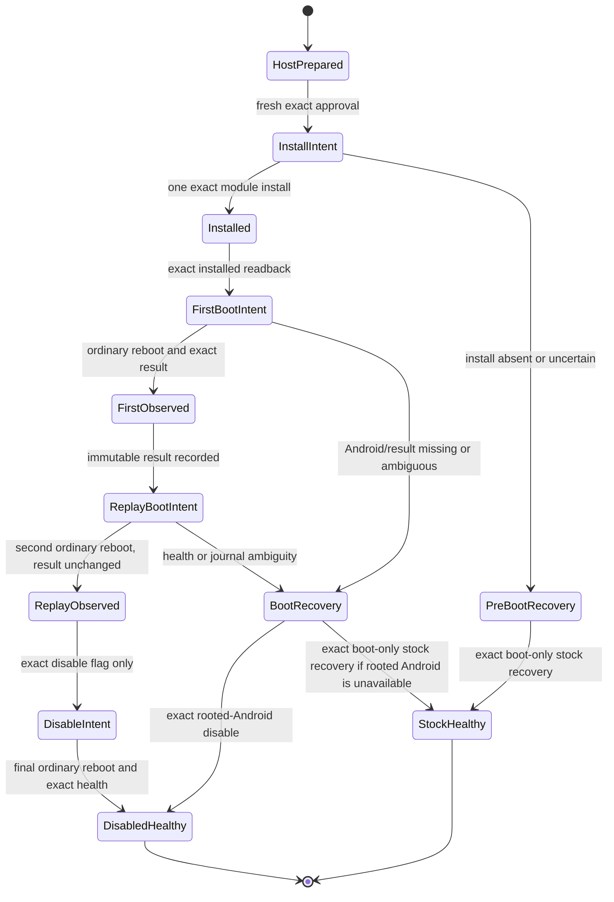

# S20+ G986N Native Canary Root-Data Transaction Draft

Date: 2026-08-15

Selected target: operator-owned Samsung Galaxy S20+ 5G only,
`SM-G986N` / `y2q` / `y2qksx` / `G986NKSS8IYC2`

Tier: H0 historical policy and state-machine design record

Status: **SUPERSEDED BY REVIEWED ACTIVE R1 IMPLEMENTATION - PASS_GO - NOT BINDING - NOT ACTIVE - NO DEVICE AUTHORITY**

Provisional gate name: `S20PLUS_NATIVE_CANARY_ROOT_DATA_V1`

## Purpose and boundary

This document originally described the smallest future transaction that could install and
observe the N1 data-only Magisk canary selected in
`S20PLUS_G986N_NATIVE_INIT_PHASED_DESIGN_2026-08-15.md`. Its design has now
been implemented and mechanically activated as R1 in `AGENTS.md`, the binding
S20+ target contract, and two exact reviewed runners. This historical draft
does not activate those clauses and remains neither binding nor executable. It
authorizes no `adb`, `su`, root-data write, module install, reboot, factory
reset, or Odin transfer.
This branch is not currently executable.

The transaction would prove only that one fixed repository-built static
AArch64 binary ran once from Magisk `late_start` after normal Android boot. It
would not prove early init, init-rc injection, namespace isolation, PID 1,
native USB, networking, SSH, display, or a native root filesystem.

The gate exists to block the hazard class **arbitrary persistent root-data
configuration**. It may admit only:

- the exact target tuple above;
- Magisk `30.7` / code `30700` in the already-proved resident-root state;
- module ID `s20plus_native_canary`;
- one exact four-member ZIP built by
  `build_s20plus_g986n_native_canary_n1.py`;
- one exact root-owned state directory,
  `/data/adb/s20plus-native-init/n1`;
- one install, the bounded observation sequence, and the predeclared recovery
  branches below; and
- no generic root command, interactive shell, arbitrary path, arbitrary
  module, package, property, service, mount, device, network, or block-write
  surface.

This is a temporary candidate gate, not a permanent repository boundary. Its
scope ends only in one terminal healthy state with the module proved consumed
and disabled, with exact healthy stock boot after the predeclared recovery, or
with the distinct non-PASS healthy-root-absent terminal after a consumed but
unproved stock attempt.
It expires before use on any target-build, Magisk-version, module-ID,
ZIP/binary, state-schema, tool/argv, health-model, installed-module inventory,
or recovery-path change, and after any unexplained live incident.

## Fixed H0 artifact contract

The module ZIP must contain exactly these four regular entries in this order:

```text
module.prop                         0644
skip_mount                         0644
service.sh                         0750
bin/s20plus_native_canary          0750
```

No explicit directory entry, duplicate, symlink, hardlink, special node,
traversal, encryption, compression variance, timestamp variance, archive or
entry comment, extra field, trailing byte, or extra member is allowed. The
whole ZIP must equal the deterministic canonical byte stream, not merely yield
the expected extracted files. The module has no `post-fs-data.sh`, `customize.sh`,
`action.sh`, `uninstall.sh`, `system/`, `system.prop`, `sepolicy.rule`,
`zygisk/`, updater, network fetch, or packaged shell.

The binary is a stripped static ELF64 AArch64 executable. It has no
`PT_INTERP`, `DT_NEEDED`, undefined symbol, writable-executable `LOAD`, child,
thread, generic exec, network, mount, namespace, ioctl, device-node, property,
service-control, reboot, kernel-module, ptrace, or block-device operation.

The ZIP and executable are private build outputs. Only their bounded
identities and the H0 verdict may enter tracked reports. A build result is not
an install manifest, approval, or live authority.

## Prepared private binding

Before any live effect, a future reviewed runner would create one private
no-clobber run and one exact `binding.txt`. Its closed ordered grammar is:

```text
schema=s20plus_native_canary_n1_binding_v1
target_model=SM-G986N
target_device=y2q
target_product=y2qksx
target_incremental=G986NKSS8IYC2
module_zip_sha256=<64 lowercase hex>
module_zip_size=<positive bounded decimal>
binary_sha256=<64 lowercase hex>
binary_size=<positive bounded decimal>
run_nonce=<32 lowercase hex>
pre_boot_id_sha256=<64 lowercase hex>
```

The run nonce is public and carries no authority. Serial, raw USB topology,
raw boot ID, command output, and device logs remain private evidence. The
binding is written before module activation, is mode `0600`, root-owned,
regular, direct, and single-link, and is never replaced.

The canary opens the fixed state directory without following its final path,
requires mode `0700`, and accepts only the initial one-file state. It checks
the exact binding grammar, its own executable SHA-256 and size through
`/proc/self/exe`, and a changed hash of the trimmed boot ID. It then:

1. creates and flushes `intent.json` with `O_CREAT|O_EXCL`; once its directory
   entry exists, any write, flush, or close failure preserves that name and
   consumes the run rather than permitting replay;
2. observes only fixed process, SELinux, capability, clock, executable,
   boot-ID-hash, and namespace scalars;
3. writes and flushes a fixed pending regular file;
4. publishes `result.json` by a same-directory no-clobber hardlink and flushes
   the directory; and
5. removes the pending name, flushes once more, and exits.

An existing exact `intent.json` plus `result.json` returns consumed without
changing either file. Intent without result, result without intent, a malformed
completed result, an extra name, wrong mode/owner/link count, symlink,
hardlink, special node, stale binding, or pending file is terminal ambiguity:
the canary performs no retry and a future runner retains its guard.

## Proposed state machine

The machine below is a design target, not executable code:



### H0 preparation

Preparation may repeat because it has no device effect. It must prove:

- current builder source and pinned tool identities;
- two byte-identical native builds and two byte-identical ZIP builds;
- the static ELF and exact ZIP audits;
- the exact known resident boot and stock boot-only artifacts remain present,
  direct, regular, and size/hash verified as H0 inputs; an exact standalone
  stock-recovery owner is reviewed and active, but a fresh preparation cannot
  claim that branch without binding and revalidating its exact active closure;
- no active shared device guard and no unresolved S20+ run;
- an automatically allocated private `run-id`, binding, intended stage path, and complete
  action/recovery manifest; and
- an approval digest that covers the exact target, artifacts, module ID,
  state schema, action order, recovery artifacts, and runner closure.

Preparation creates no module directory, root state, stage file, install
intent, reboot intent, or approval by itself.

### Fresh live preflight

The active implementation still needs one fresh attended approval for each
whole prepared transaction. Immediately before the first effect, the runner
must prove one
exact Android target and stable serial/topology/boot identity, healthy boot
completion, enforcing SELinux, working Magisk root, Magisk `30.7`/`30700`, the
expected resident boot, zero pre-existing modules, an absent `modules_update`
root, no pre-existing N1 state, adequate storage, and the physical Download
recovery path.

The root and Magisk checks must be closed fixed probes. They must not expose a
caller-supplied command string. ADB or `su` transport failure, malformed
output, target drift, another endpoint, unexpected module, existing state, or
artifact drift closes effect-free preparation and sends no install or reboot.

### One install

The runner records a staging intent before the fixed shell-private sequence,
then a distinct install intent immediately before the first root-data effect.
Before that install intent exists, exact-current same-target health/root,
unchanged zero-module/Magisk state, and exact staged cleanup are the only
terminal continuation after staging and record zero
install attempts; an exact prepared-only run may also be declined with zero
device writes. The terminal truthfully records whether that target remains on
the prepared boot or has moved to a later changed boot; drift never falls
through to installation.
It may stage only the exact ZIP and binding in one fixed non-shared
`/data/local/tmp` child claimed as direct shell:shell `0700`. Both members are
direct shell:shell `0600`, link-count-one regular files with exact size/hash;
before the first stage command, the host ZIP is bound as direct mode `0600` and
the runner-created host binding as direct mode `0400`. The only accepted
interrupted ADB-sync modes are the corresponding `0666` and `0444`, plus each
completed normalized `0600` mode;
after the pushes and before install intent the runner freshly rebinds the exact
Android identity/boot and Magisk/helper bytes;
the root command revalidates the exact two-member set and those properties
immediately before invoking the pinned Magisk install-module operation. Normal
apps and shared-storage writers cannot enter or replace this stage. An
abrupt-cut partial stage is bounded and consumed only by exact shell cleanup;
that non-root cleanup remains available after a stock/root-absent return. A
concurrent independently authorized same-shell-UID writer is outside this lane
and is an immediate stop.
The runner must then verify the
exact installed module inventory and file identities and create the exact
state binding no-clobber.

The ordering of state creation and installation must be implemented as one
reviewed recovery-aware sequence: no reboot may occur until both are exact.
Once install intent exists, install is never blindly replayed. Candidate build
inputs are not a recovery prerequisite after that boundary: builder import is
prepare-only, and every rooted/stock recovery CLI must start and reach its
scoped validator when candidate builder/source bytes are absent. A missing,
partial, or uncertain module is never reinstalled or generically removed. The
Android disable branch applies only after promotion on a changed boot;
pre-promotion uncertainty proceeds only to the stock branch. Generic recursive
deletion is not an allowed normalizer.

Before any persistent rooted recovery effect, the recovery branch revalidates
the prepared Magisk version and exact on-device Magisk, BusyBox, and
`util_functions.sh` receipts. A completed stock transfer may enter read-only
health finalization without reopening the now-unneeded stock AP, but stock
dispatch still requires the exact artifact.

### First observation and replay proof

After an exact installed readback, the runner writes one reboot intent and
requests one ordinary Android reboot. The expected USB disconnect and
re-enumeration are part of this same attended transaction and require no new
magic token. The runner then requires the exact target, a changed boot-ID
hash, healthy Android, enforcing SELinux, persistent Magisk root, exact module
state, and exactly one immutable intent/result pair.

The result must bind the prepared binding SHA-256 and nonce; report `uid=0`;
carry the expected fixed target tuple, static executable identity, changed
boot-ID hash, process/SELinux/capability/namespace observations; remain below
8 KiB; and set replay permission false. Raw result and command output remain
private.

One second ordinary reboot is allowed only after that completed result is
durable. It proves exact Android/root health and byte-identical intent/result
with no new node. It never reruns an incomplete canary: an intent-only state
is ambiguous and parks for recovery.

### Disable and terminal health

After replay proof, the runner creates only the exact module `disable` flag,
verifies it, performs one final ordinary reboot, and proves:

- exact target identity and a new boot ID;
- normal Android boot completion and stable health samples;
- enforcing SELinux and persistent Magisk root;
- the exact module is disabled and its canary did not execute;
- the original intent/result are unchanged and no extra state node exists;
- the two fixed private-stage inputs are removed only through an exact
  fixed-path shell cleanup action owned, guarded, and independently reviewed as
  part of this future transaction; and
- both install and reboot replay permissions are false.

Only a durable terminal result may release the shared guard. Module removal
may be a later exact cleanup after this disabled healthy boot; it is not the
first response to an ambiguous state.

The journal uses strict typed JSON, duplicate-key rejection, and exact raw
receipt hashes. A cut between raw/result publications is consumed
recovery-only evidence, not success and not permission to replay. An exact
intent-only canary read may fetch only its missing result; result-only state is
malformed. A partial final read-only audit can be repeated only as a read and
published in one atomic zero-effect resume receipt. A durable
branch-specific terminal input precedes cleanup, including stock transfer,
health, and pre-cleanup root-absence receipts; a named terminal finalizer may derive missing
input only from a complete branch journal, accept partial cleanup only after
fresh accessible-storage and fixed-path absence proof, publish a missing
terminal, or release the leftover guard after an exact existing terminal.
Canonical completed bytes without a durably observed source boot use the
truthful `completed-source-unobserved` terminal class and never claim N1 PASS;
monotonic state advance during disable is allowed, while regression is not.

Neither routine shared-storage staging nor the resident Magisk F1 capability
currently grants this cleanup authority. The eventual binding transaction
must define the single staged filename, intent/result schemas, no-follow
unlink preconditions, post-unlink absence proof, failure parking, and guard
ownership. Until that capability is reviewed and activated, an inert staged
input remains rather than being removed by an inferred or generic command.

## Recovery branches

Recovery never waits for a second approval once the first live effect occurs.
The approval must bind both branches in advance.

1. **Android/ADB available after promotion.** On a changed boot with the exact
   promoted module tree, create only the exact module `disable` flag, verify
   it, reboot once, and require exact healthy rooted Android with no new canary
   effect. Binding-only, intent-only, and completed on-device states are
   distinct exact classes. Completed bytes without a durably observed source
   boot are canonical/hash-validated but reported only as
   `completed-source-unobserved`; the ordinary completed class must bind the
   observed source boot. The recovery receipt records that canary-source boot
   separately from the current disable-source boot, including the valid case
   where the latter is the replay boot. The
   module remains disabled rather than being generically removed. The prepared
   pre-promotion boot is intentionally ineligible for this branch.
2. **Exact rooted Android unavailable.** Physical Magisk Safe Mode is excluded:
   official v30.7 also mutates persistent Magisk configuration/database state,
   including the Zygisk setting, outside this transaction's finite surface.
   A separate reviewed active stock-recovery runner is named by the binding
   target clause.
   Bootstrap and resident-F1 recovery authority still does not transfer or
   imply authority for it. The root-data runner may create one durable pre-bound handoff
   only from a freshly prepared approved run and the exact token
   `S20PLUS-G986N-NATIVE-CANARY-R1-ROOTED-RECOVERY-UNAVAILABLE-STOCK-HANDOFF`.
   Submitting that token is the attended operator's explicit assertion that
   rooted Android recovery is unavailable, not a generic confirmation; a completed successful rooted recovery proof
   blocks this handoff. The recovery runner must validate and consume that
   handoff, an empty Download baseline, durable physical-action intent, one
   exact endpoint-session arrival after the bounded initial 300-second wait,
   with an intent-only cut allowed one current read-only observation without
   refreshing the arm or its physical action, direct
   operator confirmation, the exact stock artifact, and the shared guard before its one boot-only
   transfer. Candidate install/reboot is not replayed. Only a completed stock
   transfer may claim stock provenance. After a consumed but unproved stock
   attempt, exact changed-boot healthy root-absent Android may close only under
   the distinct non-PASS `stock-attempt-unproved` terminal; complete data loss
   and factory reset remain accepted recovery costs because both prior S20+
   boot transitions required reset.

Any target ambiguity, malformed journal, changed bytes, unknown root-data
effect, failed disable, absent physical recovery, or unresolved stock-recovery
ambiguity retains the guard and stops. The sole exception is a consumed,
non-replayable stock attempt followed by exact changed-boot healthy root-absent
Android, which may publish only the truthful non-PASS terminal above. It never
authorizes raw `odin4`, another module, another boot artifact, another
partition, or another target.

## Required runner and hostile test closure before activation

The reviewed runners and their hostile suite implement the following review
checklist. The exact frozen closure independently passed it and mechanical
activation later occurred; no live decision follows without a fresh connected
preparation and attended approval:

- exact target isolation from S22+ and A90 at every pre-effect and post-reboot
  boundary;
- pinned ADB, `su`, Magisk, staging, hashing, and reboot command surfaces with
  bounded stdout/stderr and time;
- a shared durable owner guard, append-only state transitions, strict typed
  schemas, no-follow regular-file reads, no-clobber writes, and fsync ordering;
- wrong target, duplicate/offline/unauthorized endpoint, unhealthy Android,
  root absence, wrong Magisk version, any pre-existing module, stale state, ZIP
  drift, staged-byte drift, install uncertainty, reconnect ambiguity,
  boot-ID reuse, result ambiguity, result replay, disable failure, retired
  Safe Mode CLI/journal rejection, and stock-recovery fixtures;
- exact canonical C-writer result bytes and C numeric bounds, rejecting merely
  JSON-equivalent whitespace or escaped fixed keys/values;
- duplicate-free typed stock rollback evidence, an observation-only
  post-intent/missing-result terminal that never resends Odin, and one finite
  whole-raw root-absence stderr grammar;
- zero install/reboot command before every failing preflight fixture;
- exactly one install and the bounded reboots in the successful fixture;
- no candidate replay after install intent, cleanup-only closure before it,
  recovery that does not require candidate-only build inputs, and no generic command or path
  substitution; and
- exact contiguous reboot chains, consumed partial-record cut points, durable
  terminal-input/cleanup/terminal/guard-release resumes, and an accessible
  shell-private staging parent before staged-path absence; every source boot is
  freshly rebound before its intent and every returned boot ID is pairwise
  distinct from the prepared and earlier durable observations; and
- an exact guarded staged-input cleanup implemented by this transaction, plus
  a separately defined, reviewed, and activated stock-recovery runner
  and exact durable handoff into it; neither operation or authority may be
  inferred from the bootstrap, resident F1, or an adjacent routine capability;
  and
- terminal guard release only after a durable disabled-rooted result, proven
  stock-healthy result, or the distinct healthy-root-absent result after a
  consumed unproved stock attempt; stock root absence must bind finite raw
  transcript bytes, and `permission denied` is rejected rather than treated
  as absence.

An independent review must cover this draft's eventual binding policy,
runner, schemas, source/builder closure, root command surface, Magisk behavior,
recovery, tests, and higher-precedence boundaries. The resulting `PASS_GO`
qualified that unchanged capability only; it did not create a run, prepare an
artifact, approve a device action, or imply operator attendance.

## Current disposition

The C canary, deterministic module builder, hostile process-model tests, and
the original draft received independent `PASS_GO` as an exact H0 artifact
closure. The optional next unit was selected and implemented host-only as the
common R1 boundary, exact S20+ specialization, root-data runner, stock-
recovery owner, and hostile tests. Independent changed-closure review returned
`PASS_GO` for the exact frozen dormant closure. Mechanical activation then set
both constants true and rotated only reviewed identities, status wording, and
assertions; independent post-activation H0 review returned `PASS_GO` for the
exact active identities. Activation itself created no run. Approval,
staging, installation, reboot, recovery, and device observation
remain separate decisions.
