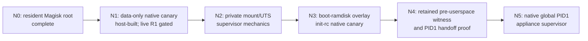

# S20+ G986N Native-Init Phased Design

Date: 2026-08-15

Selected target: operator-owned Samsung Galaxy S20+ 5G only,
`SM-G986N` / `y2q` / `y2qksx` / `G986NKSS8IYC2`

Tier: H0 architecture, evidence map, and next-unit selection

Status: **SELECTED DESIGN; N1 H0 PASS_GO; R1 BASE CAPABILITY ACTIVE; ONE GUARDED POST-INSTALL RUN; EXACT NO-INSTALL CONTINUATION ACTIVE**

## Decision

The long-term objective remains a native global `/init` PID 1. The next live
experiment will not replace PID 1. It will first prove the smallest native
execution surface that can be installed and recovered without another boot
partition transfer: one data-only Magisk module whose non-blocking
`late_start` service runs one fixed static AArch64 canary once, writes bounded
private evidence, and exits.

The selected progression is:



N1 through N3 deliberately retain the current Magisk `/init`, stock Android
init as the eventual global PID 1, the stock kernel, the stock DTB, Android
health, ADB recovery, and the exact known-good resident boot. Each rung reuses
the same small native canary or supervisor core and changes one boundary at a
time. N4 and N5 remain blocked until an observer can distinguish kernel entry,
PID-1 entry, handoff failure, and observer failure before Android userspace is
available.

This document selects an architecture and a next bounded unit. It does not
amend `AGENTS.md`, the target contract, a runner, an artifact manifest, a
device state, or an approval. The current repository has no active authority
for arbitrary `su` execution, writes under `/data/adb`, Magisk module install,
or a new native-init boot candidate.

## Why direct PID 1 is deferred

Persistent Magisk root proves that the current boot image and root control
plane survive an ordinary reboot. It does not prove that a replacement `/init`
can recreate the first-stage responsibilities that Android and Samsung
userspace currently perform.

Four independent facts make a direct replacement premature:

1. The current kernel has no PID namespace or user namespace. A child cannot
   become namespace PID 1, so the A90 isolated-Debian topology cannot be copied.
2. The current kernel has no devtmpfs. A global native PID 1 would have to
   construct and label its required `/dev` surface and account for uevent and
   firmware handling explicitly.
3. Pstore support is compiled, but a live ramoops backend, reserved-memory
   binding, retained record, and reader are not yet proved on this target.
   `CONFIG_PSTORE=y` alone is not an early witness.
4. The S22+ direct-PID1 experiment already demonstrated the failure mode to
   avoid: transfer and physical rollback succeeded, but absence of the retained
   marker could not distinguish kernel non-entry, PID-1 non-entry, pre-marker
   failure, marker failure, or observer failure. Repeating that shape on S20+
   would consume a custom boot without producing a classifying result.

Linux executes an initramfs `/init` as PID 1, so replacing it is the actual
global boundary, not a cosmetic service change. Android's first-stage stack
then supplies partition setup, SELinux transition, device coldplug, firmware,
and service startup. Those obligations must be mapped before they are replaced.

## Local evidence baseline

### Completed S20+ chain

| Commit | Evidence contributed |
|---|---|
| `d0239da593` | exact IYC2 stock boot, Magisk v30.7, boot-header, AVB, DTB, ramdisk, and embedded-configuration feasibility map |
| `04c365eff0` | deterministic boot-only candidate and stock rollback AP construction, each with exactly `boot.img.lz4` |
| `5d7cf99665` and `424bf823f4` | exact-target bootstrap F1 and live-transition binding |
| `993655afb8` | guarded resident-root capability, recovery, factory-reset finalization, and terminal root proof |
| `dc81262cad` | ordinary-reboot persistence: exact target healthy, Magisk root retained, SELinux enforcing, stock `/system/bin/init` still PID 1 |

The known-good resident candidate remains private at the canonical S20+
output tree. Offline inspection on 2026-08-15 reconfirmed:

| Component | Current value |
|---|---|
| padded boot image | 64 MiB, SHA-256 `d67d0af219d40d29f9e4d34da873e7aa33577d56fab68e2beccfe707418f7efc` |
| format | Android boot header v2, gzip ramdisk, raw AArch64 kernel, embedded DTB, Samsung marker, AVB footer |
| kernel | SHA-256 `f760f09e98eea9038b1fb0e62832e09daa5e5705530e36b1cf6d458d68a176a1` |
| ramdisk CPIO | SHA-256 `66c23f424b88fbf7a9b09a28eaea339f453ac49a3393ba76673fe61a9c9ed2d2` |
| DTB set | SHA-256 `09ce85eab63208c985486bba8b450d17fd5907839361b53bf1971e0eeaceb883` |
| ramdisk `/init` | Magisk init, SHA-256 `383670a7ba3a6a4b79e5f3467e1da4b66a5df66a9b356ab9f70916854dd6b468` |
| root overlay | existing empty `overlay.d` plus Magisk's `overlay.d/sbin` payloads |
| command line | includes `console=null`; no usable early console is inferred |

The hashes describe offline private artifacts and do not publish firmware or a
live device identifier. Future builders must revalidate the exact base bytes;
this table is not standing transfer authority.

### Exact running-kernel constraints

Samsung's `extract-ikconfig` recovered the final configuration embedded in the
unchanged resident kernel. The relevant surface is:

| Available | Unavailable or constrained | Design consequence |
|---|---|---|
| `CONFIG_NAMESPACES=y`, `CONFIG_UTS_NS=y`, `CONFIG_NET_NS=y` | `CONFIG_PID_NS=n`, `CONFIG_USER_NS=n` | N2 may isolate mount/UTS and mechanically test net namespaces, but cannot create a namespace PID 1 |
| `CONFIG_SECCOMP=y`, `CONFIG_SECCOMP_FILTER=y` | `CONFIG_CGROUP_PIDS=n`, `CONFIG_CGROUP_DEVICE=n` | a fixed child can be syscall-filtered, but cgroup PID/device containment cannot be claimed |
| `CONFIG_BLK_DEV_LOOP=y`, `CONFIG_EXT4_FS=y`, `CONFIG_F2FS_FS=y`, `CONFIG_OVERLAY_FS=y` | `CONFIG_DEVTMPFS=n` | private-root mechanics are feasible; device nodes must be explicitly created or allowlisted |
| `CONFIG_NET_NS=y` | `CONFIG_VETH=n` | A90's veth topology is not portable; N1/N2 perform no network work |
| `CONFIG_MODULES=y` | `CONFIG_MODULE_SIG_FORCE=y` | stock signed modules may be usable, but arbitrary external modules are not a valid shortcut |
| `CONFIG_USB_F_ACM=y`, `CONFIG_USB_CONFIGFS=y`, `CONFIG_USB_CONFIGFS_ACM=y` | no S20+ native gadget bring-up proof | a future native control plane is plausible, not yet selected or live-ready |
| `CONFIG_PSTORE=y`, `CONFIG_PSTORE_CONSOLE=y`, `CONFIG_PSTORE_PMSG=y`, `CONFIG_PSTORE_RAM=y` | backend/DT/runtime retention unproved | N4 must prove an actual retained channel before direct PID 1 |
| `CONFIG_WATCHDOG=y`, `CONFIG_WATCHDOG_CORE=y`, `CONFIG_WATCHDOG_HANDLE_BOOT_ENABLED=y` | takeover path and device-specific timeout unclassified | N4 must map the watchdog before replacing first-stage userspace |

### Cross-target lessons, not transferred authority

The S22+ O1/O1.1 sequence is the closest packaging precedent. It preserved a
known-booting Magisk `/init` and kernel, added only one `overlay.d` rc, one
bounded service wrapper, and one static daemon, and produced a boot-only AP.
The first live candidate failed because Android init found no valid SELinux
transition. The single-delta successor added `seclabel u:r:magisk:s0` and
passed. Therefore N3 must bind an explicit execution context and prove the
exact ramdisk delta; it may reuse no S22+ artifact, target identity, approval,
or recovery receipt.

The S22+ V3433 direct-PID1 result is a negative architectural precedent. A
successful candidate transfer and healthy rollback still produced
`NO_PROOF_PID1_VS_OBSERVER_UNRESOLVED_STOP`. V3434 consequently retained stock
Android init as global PID 1 and selected a private mount namespace plus child
subreaper. S20+ adopts that evidence order while accounting for its stricter
`CONFIG_VETH=n` kernel.

The A90 isolated-Debian design contributes two general rules: keep a native
recovery supervisor alive until the child is classified, and prove mount,
proc, device, FD, capability, and cleanup boundaries before calling a root
handoff isolated. Its PID-namespace and veth implementation is not portable to
S20+ and grants no S20+ action.

The reusable precedent commits are deliberately cited as evidence rather than
ancestry: `27431eaf22` recorded the O1 SELinux failure, `9321970b79` proved the
single-delta O1.1 fix, `e102ca0bde` recorded the direct-PID1 no-proof result,
`1cd81c0d49` corrected the stock-first-stage handoff architecture, and
`071366da5c` froze the A90 isolated-Debian boundary.

Local source anchors:

- [S20+ Magisk boot-only feasibility](../reports/S20PLUS_G986N_MAGISK_BOOT_ONLY_FEASIBILITY_H0_2026-08-13.md)
- [S20+ resident-root result](../reports/S20PLUS_G986N_MAGISK_RESIDENT_F1_H0_2026-08-15.md)
- [S20+ policy-friction audit](../reports/S20PLUS_G986N_POLICY_FRICTION_AUDIT_2026-08-14.md)
- [S22+ O1 SELinux failure](../reports/NATIVE_INIT_V3406_S22PLUS_O1_LIVE_RESULT_2026-07-10.md)
- [S22+ O1.1 pass](../reports/NATIVE_INIT_V3409_S22PLUS_O11_LIVE_PASS_2026-07-10.md)
- [S22+ direct-PID1 no-proof](../reports/NATIVE_INIT_V3433_S22PLUS_V3432_PID1_KEYSTONE_LIVE_NO_PROOF_2026-07-11.md)
- [S22+ corrected boot-boundary map](../reports/NATIVE_INIT_V3434_S22PLUS_BOOT_BOUNDARY_STATIC_MAP_HOST_PASS_2026-07-11.md)
- [A90 isolated-Debian design](A90_HEADLESS_NATIVE_WIFI_ISOLATED_DEBIAN_DESIGN_2026-08-14.md)

## External-source map

The design uses primary or official material only:

- The [Magisk developer guide](https://topjohnwu.github.io/Magisk/guides.html)
  defines module layout, the `skip_mount` and `disable` flags, non-blocking
  `service.sh`, `MODDIR`, boot-completion waiting, `overlay.d`, and
  `sepolicy.rule` behavior. It supports choosing a late-start module before a
  boot-ramdisk overlay.
- [Magisk internal details](https://topjohnwu.github.io/Magisk/details.html)
  show that `magiskinit` first replaces init, prepares mounts and SELinux,
  injects services, and then executes the original init. They also warn that
  mounted module files are not safe to modify. N1 keeps runtime state outside
  the module directory; N3 preserves the current Magisk `/init`.
- The official [Magisk tool reference](https://topjohnwu.github.io/Magisk/tools.html)
  exposes `magisk --install-module ZIP` and module removal. These are possible
  mechanisms, not current repository authority.
- The official [Magisk module bootloop recovery FAQ](https://topjohnwu.github.io/Magisk/faq.html)
  documents ADB module removal and the physical Magisk Safe Mode key path.
  N1 uses only the exact rooted-Android disable path. Safe Mode is excluded
  because v30.7 also mutates persistent Magisk database/configuration state
  outside the finite module surface reviewed here.
- [AOSP init's service contract](https://android.googlesource.com/platform/system/core/+/master/init/README.md)
  defines triggers, one-shot services, execution context, and `seclabel`.
- [AOSP ueventd](https://android.googlesource.com/platform/system/core/+/refs/heads/android12-qpr3-s2-release/init/ueventd.cpp)
  documents the device-node, permissions, SELinux-label, firmware, symlink, and
  coldplug work a direct PID 1 must eventually replace or deliberately retain.
- [Android SELinux](https://source.android.com/docs/security/features/selinux)
  confirms that enforcing policy applies even to UID 0 and that only init
  should run in the init domain. Root alone does not remove the SELinux design
  problem.
- The [Linux initramfs documentation](https://docs.kernel.org/filesystems/ramfs-rootfs-initramfs.html)
  defines the kernel's execution of initramfs `/init` as PID 1.
- The [AOSP boot-image header reference](https://source.android.com/docs/core/architecture/bootloader/boot-image-header)
  matches the observed Android 10-era header-v2 structure and embedded-DTB
  fields.
- Samsung's [Open Source Release Center result](https://opensource.samsung.com/uploadSearch?searchValue=G98)
  lists exact row `SM-G986N` / `G986NKSS8IYC2` /
  `SM-G986N_KOR_13_Opensource.zip`, matching the acquired private source.

## Phase ladder

| Phase | Change surface | Required proof | Explicit non-claim | Recovery |
|---|---|---|---|---|
| N0 - resident baseline | known Magisk boot only | persistent exact-target root, enforcing SELinux, stock Android PID 1 | no native-init result | complete |
| N1 - data canary | exact Magisk module under `/data/adb`; no partition transfer | one static native binary executes once after boot completion and writes bound private evidence | not early init, not PID 1, not isolation | exact rooted disable; stock boot remains available |
| N2 - supervisor mechanics | N1 binary only | private mount/UTS namespace, recursive-private mounts, exact child supervision, bounded teardown, optional private `pivot_root` | no PID namespace; no container security; no network | same data-only disable path |
| N3 - ramdisk canary | current resident boot plus one rc and one static binary | exact overlay injection, explicit SELinux context, init-launched execution, mandatory resident-boot rollback | first trigger is after boot completion; Magisk remains first program; Android init remains PID 1 | same-run known resident Magisk boot rollback |
| N4 - PID1 witness/handoff | boot-only research candidate | retained pre-userspace witness, watchdog/device/module map, classified PID-1 entry, safe handoff or bounded park | no production native appliance | immediate boot-only rollback; candidate never replayed |
| N5 - native appliance | global native `/init` | native PID 1, retained recovery/control, minimal devices, storage/root handoff, child reaping, terminal health | no Android compatibility or networking until separately proved | attended physical Download and exact boot rollback |

No phase automatically activates the next. A phase result, even `PASS`, grants
neither a new artifact nor a new live action.

## N1 - selected next bounded unit

### Objective

Prove that one repository-built static AArch64 executable can be installed
through the already-running Magisk environment, execute once in late-start
context after normal Android health, record a bounded result, and leave the
phone healthy after another ordinary reboot. This is the smallest useful
bridge from “root works” to “our native executable runs.”

### Proposed module manifest

Proposed module ID: `s20plus_native_canary`.

The installer ZIP contains exactly four regular files and no explicit
directory, symlink, hardlink, device, duplicate, traversal, or extra entry:

```text
module.prop
skip_mount
service.sh
bin/s20plus_native_canary
```

The following are forbidden in N1:

- `post-fs-data.sh`, `customize.sh`, `action.sh`, `uninstall.sh`, or recovery
  installer scripts;
- `system/`, `system.prop`, `sepolicy.rule`, `zygisk/`, an update URL, or a
  network fetch;
- a packaged interactive/general-purpose shell, debugger, package manager,
  user-controlled command dispatcher, module-provided daemon, or long-lived
  process;
- mounts, namespace creation, device nodes, network access, module insertion,
  properties, service control, reboot, or block access by the canary;
- writes anywhere except the one exact private state directory.

`service.sh` is a non-blocking Magisk late-start script. It derives the module
directory as `MODDIR=${0%/*}`, bounds its wait for `sys.boot_completed`, and
executes only the fixed binary with a fixed state directory. It accepts no
host, property, file, environment, or user-supplied command argument. An
unbounded wait is a failure; it must exit without affecting Android.

Runtime state lives at a fixed root-owned location outside the mounted module,
for example `/data/adb/s20plus-native-init/n1/`. The official Magisk source
warns against modifying mounted module files, so neither a latch nor evidence
is written under `$MODDIR`.

### One-shot evidence contract

Before install, a reviewed runner would create a no-clobber binding containing
only the exact target tuple, module ZIP SHA-256 and size, native binary SHA-256
and size, schema version, random public run nonce, and the private hash of the
pre-reboot boot ID. No serial, raw topology, boot ID, command output, or
firmware enters tracked text.

The native binary owns the state transaction:

1. Open the fixed state directory without following a symlink and validate
   ownership, mode, link count, and the exact binding.
2. Create one `intent.json` with `O_CREAT|O_EXCL`, flush it, and exit no-op on
   every later invocation. The existence of intent consumes the single run.
3. Collect only fixed scalar observations: PID/PPID, UID/GID, SELinux process
   context, selected capability fields, monotonic time, executable identity,
   namespace identities, binding SHA-256, and post-reboot boot-ID SHA-256.
4. Write at most 8 KiB to a temporary regular file, flush, publish no-clobber
   as `result.json`, and flush the containing directory.
5. Exit. It starts no child, daemon, thread, listener, shell, or retry loop.

Success requires all of the following:

- exact S20+ Android identity and health before install;
- healthy persistent Magisk `30.7` root, zero pre-existing modules, and an
  absent `modules_update` tree;
- exact ZIP and binary readback after install;
- three separately journaled ordinary reboots and three contiguous changed boot
  IDs: first execution, replay-proof observation, and final disabled-state boot;
  each source is freshly rebound before intent and all four prepared/returned
  boot IDs are pairwise distinct;
- exact result schema and binding, one intent, one result, no extra node, and
  a native `uid=0` execution in the expected Magisk context;
- exact Android identity, boot completion, enforcing SELinux, working Magisk
  root, stable health samples, and module count/state after observation;
- a second ordinary reboot that does not execute the consumed canary again;
- a third ordinary reboot after the exact disable marker, proving the module
  remains inactive on the terminal rooted boot.

N1 `PASS` proves only one native late-start execution and its one-shot
behavior. It does not prove init-rc injection, early boot, first-stage mounts,
device management, namespace isolation, PID 1, native USB, Wi-Fi, SSH, display,
or a native root filesystem.

Recovery order is fixed before activation:

1. If exact Android/ADB returns after promotion on a changed boot, create the
   exact module `disable` flag through the reviewed recovery branch, reboot
   once, and prove healthy Android/root without new canary execution.
   Binding-only, intent-only, and completed on-device state are distinct.
   Canonical completed bytes not durably tied to an observed source boot use a
   separate `completed-source-unobserved` recovery terminal and never count as
   N1 PASS; only the ordinary completed state is bound to the observed source
   boot. Monotonic in-flight advancement is accepted and regression is not. A
   prepared-boot/pre-promotion uncertainty proceeds only to stock recovery
   instead of an inferred root-data normalization.
2. If exact rooted Android recovery is unavailable, use attended physical Download
   and the exact known stock boot-only rollback. Candidate install/reboot is
   not replayed. Because both prior S20+ boot-image transitions required a
   factory reset, this branch must again assume complete data loss. Physical
   Magisk Safe Mode is not authorized because its v30.7 implementation also
   changes persistent Magisk database/configuration state outside N1's bound
   surface.

Module removal follows only after a healthy disabled boot and an exact state
readback; removal is not the first response to an ambiguous boot.

### Policy work required before N1 can run

The current common and S20+ contracts do not authorize arbitrary `su`, a write
under `/data/adb`, or Magisk module installation. Treating N1 as an existing
routine D1 would be an unauthorized widening. A separate policy change and
independent review must define one exact root-data transaction, provisionally
named `S20PLUS_NATIVE_CANARY_ROOT_DATA_V1`:

- one prepared target, one exact module ZIP, one exact module ID;
- one separately journaled stage, one `magisk --install-module` dispatch, three
  separately journaled ordinary reboots, one bounded observation, and no generic
  root command surface;
- distinct durable intents before stage and install; a pre-install cut permits
  a zero-write prepared-only decline or exact staged cleanup and records zero
  install attempts; install/reboot is never blindly replayed;
- privileged Magisk consumes only an exact re-hashed direct shell-owned `0600`
  file in one exclusively claimed non-shared shell-owned `0700` stage, never a
  normal shared-storage pathname; ordinary, stock/root-absent, and abrupt-cut
  cleanup prove that bounded private stage absent without replaying install;
  host preflight binds the source ZIP mode `0600` and generated binding mode
  `0400`, so interrupted ADB-sync cleanup admits only their source-derived
  `0666`/`0444` modes or normalized `0600`;
- the expected Android USB disconnect/re-enumeration is internal to the same
  transaction and needs no second confirmation;
- one preauthorized exact disable recovery branch if promoted Android returns,
  without depending on candidate build inputs after the install intent, and
  with every recovery CLI able to start when the candidate builder is absent;
- no physical Magisk Safe Mode authority because v30.7 also changes persistent
  Magisk database/configuration state; when rooted Android recovery is
  unavailable, only the separately reviewed exact stock handoff may proceed;
- strict typed/duplicate-free durable JSON, recovery-only partial receipts, a
  branch-specific terminal input before cleanup, and cut-point finalization
  without effect replay; and
- canonical canary result bytes equivalent to the C writer rather than merely
  semantically equivalent JSON, with the same integer bounds; and
- fresh prepared Magisk/helper closure validation before persistent rooted
  recovery effects, while completed stock-transfer health finalization no
  longer depends on reopening the AP; and
- stock attribution through an empty baseline, durable physical intent, a
  bounded initial arrival wait, and exact same-session arrival; an intent-only
  cut may only observe the current endpoint and never refresh the physical
  action; after rollback intent,
  missing/partial transfer results allow only observation and never Odin
  replay; and
- terminal exact Android/root/module state and accessible shell-private stage
  absence before guard release.

The proposed gate blocks the hazard class “arbitrary persistent root-data
configuration.” Its scope ends when the one module is proved consumed and
disabled or removed. Review expires on any change to target build, Magisk
version, module ID, ZIP/binary bytes, state schema, install/disable argv,
recovery behavior, another installed module, or the root/SELinux health model.

One exact approval should bind the whole prepared install/reboot/observe/
recover transaction. Expected re-enumeration and ordinary bounded observation
must not produce extra magic tokens. Only target ambiguity, changed bytes,
malformed state, effect uncertainty, or failed recovery should park the run.

### N1 host acceptance suite

Before any policy activation or device action, host tests must prove:

1. deterministic source and ZIP output from a pinned AArch64 toolchain;
2. static `ELF64 AArch64`, no `PT_INTERP`, no `DT_NEEDED`, no undefined
   symbols, no writable-executable segment, and exact entry point/size/hash;
3. exact four-file ZIP grammar, modes, bytes, and module metadata;
4. source-level prohibition of generic exec, shell input, networking, mount,
   ptrace, module, property, service, reboot, and block-device operations;
5. native state parser rejection of symlink, hardlink, special, duplicate,
   extra, oversized, malformed, stale-binding, replay, and partial-result
   fixtures;
6. a host process-model test that runs twice and proves exactly one intent and
   one immutable result;
7. install-runner fixtures for wrong target, unhealthy Android, missing root,
   wrong Magisk version, existing module, ZIP drift, install uncertainty,
   reconnect ambiguity, result ambiguity, and disable failure; and
8. exact separation from S22+ and A90 files, profiles, artifacts, approvals,
   endpoints, and commands.

## N2 - stock-PID1 supervisor mechanics

N2 extends only the N1 native binary and remains a data-only module. It first
proves mechanics without a new root filesystem:

- the supervisor calls `PR_SET_CHILD_SUBREAPER` and launches exactly one fixed
  child through a closed executable/FD contract;
- that child calls `unshare(CLONE_NEWNS|CLONE_NEWUTS)`, makes `/` recursively
  private before any mount, and proves both namespace identities differ from
  the still-native parent;
- the parent waits through a pidfd or exact PID ownership path available on
  this kernel, reaps every owned descendant, and bounds termination;
- perform no `CLONE_NEWPID`, `CLONE_NEWUSER`, or cgroup isolation claim;
- perform no network operation despite `CONFIG_NET_NS=y`, because no veth data
  plane exists; and
- unwind every private mount and child before recording success.

A later N2b may build a private tmpfs root, create an exact minimal `/dev`, and
perform `pivot_root` inside the private mount namespace. It must use a static
child, preserve no old-root directory FD, expose no block device, and remember
that a procfs mounted without a distinct PID namespace still exposes the
global PID namespace. N2 is a mechanical handoff proof, not an Android
security boundary or a container.

## N3 - stock-first-stage boot overlay

N3 moves the already-proved canary from `/data` into the boot ramdisk while
retaining Magisk and Android first-stage behavior. A new S20+-specific builder
should adapt the method of
`workspace/public/src/scripts/revalidation/build_s22plus_o1_magisk_overlay.py`,
not its target data or authority.

The candidate starts from the exact known-good resident S20+ Magisk boot and
must:

1. prove a no-change unpack/repack is byte-identical;
2. preserve the kernel, DTB set, command line, Magisk `/init`, Magisk backup,
   and every existing ramdisk entry;
3. add exactly one `overlay.d/*.rc` and one static binary under
   `overlay.d/sbin`, with no wrapper or extra file;
4. trigger once after `sys.boot_completed=1` for the first candidate;
5. specify `disabled`, `oneshot`, and explicit `seclabel u:r:magisk:s0`;
6. prove the before/after CPIO listing delta and extracted entry hashes;
7. produce an Odin AP whose sole regular member is `boot.img.lz4`; and
8. use the current resident Magisk boot as the exact same-run rollback.

The first N3 live candidate is temporary even if it passes. It must return to
the current resident boot and end in exact healthy rooted Android. Resident
promotion, an earlier trigger, a second service, a policy delta, or an N2
supervisor payload is a separate candidate.

## N4 - prerequisites for a global-PID1 canary

No direct `/init` candidate should be built until H0/D0 evidence closes all of
these gates:

1. Parse every DTB in the current boot, bind the selected live DTB, and prove
   whether a compatible enabled ramoops node and reserved memory exist.
2. Perform a bounded rooted read of runtime pstore mounts, backend/device
   state, prior records, and retained-read behavior. Compiled support without
   a retained positive control is `NO_GO`.
3. Map the exact watchdog driver, boot handling, userspace takeover, timeout,
   and recovery behavior.
4. Map the stock first-stage module order, required signed modules, firmware,
   mounts, fstab, uevent coldplug, SELinux load/re-exec, and minimum device
   nodes needed before a handoff.
5. Select a pre-Android observer that can classify at least kernel entry,
   PID-1 entry, marker persistence, handoff, timeout/reset, and observer
   integrity. `console=null` and an unproved USB gadget are not observers.
6. Prove a freestanding static `/init` state machine in a synthetic initramfs,
   including PID-1 signal semantics, orphan reaping, emergency sync, bounded
   park, and exact result encoding.
7. Audit Magisk v30.7 source before considering a wrapper. The current
   `magiskinit` removes/restores `/init` and then executes the original init;
   launching it from an invented alternate path is not assumed compatible.

The first possible N4 candidate should do only: emit a retained PID-1 witness,
then execute a separately proved handoff back to the unchanged Magisk/Android
path or park for physical Download. It should not mount a distro, start
networking, configure display, or become resident. Any standalone DTBO payload
remains forbidden; a future change to an embedded DTB inside the boot image is
still a distinct boot-only candidate and needs its own review.

## N5 - feasible stock-kernel end state

With `CONFIG_PID_NS=n`, the feasible stock-kernel product is not A90's native
supervisor plus Debian namespace PID 1. It is one global native PID-1 appliance
supervisor that remains alive, owns recovery/control and child reaping, and
launches a fixed service set. A private mount namespace may give a child a
different root, but that child is not namespace PID 1 and its procfs cannot
provide PID-namespace exclusion of native tasks.

The proof order is:

1. global native PID 1 and retained witness;
2. watchdog and physical recovery/control;
3. minimal proc/sys/dev and signed-module/firmware bring-up;
4. exact storage/rootfs identity and private mount handoff;
5. fixed child supervision and cleanup;
6. only then SSH or another authenticated service;
7. native network and display as later independent axes.

Enabling PID namespaces, user namespaces, veth, or a different watchdog/
observer contract requires a reproducible custom-kernel track. The exact
Samsung source row and embedded `.config` reduce that research gap, but no
matching toolchain build or stock-kernel byte identity has been proved.

## Operational simplification

The policy-friction audit remains applicable. This design keeps exact target,
artifact, boot-only, rollback, no-replay, private-evidence, and final-health
boundaries, but it should avoid repeating incident-specific control machinery:

- host builds and tests may repeat freely because they are H0;
- one unchanged independently reviewed capability is reusable until its named
  bytes or hazard model changes;
- one prepared live transaction receives one approval, not one token for each
  expected reboot or USB re-enumeration;
- expected Android disconnect/reconnect is observed inside that transaction;
- pre-effect failures close cleanly and may be freshly prepared;
- after install or transfer intent, no blind replay occurs;
- reporting cuts resume from strict durable state, each reboot is bound to the
  preceding durable boot, and a prior health receipt is not a standing lease;
- the current guard owner may execute only its predeclared observation or
  recovery path; and
- reports record new capabilities, incidents, or changed hazards rather than
  every ordinary healthy read.

This is the proportional boundary: native-init experimentation should become
faster at the data-canary and host-build layers without weakening the exact
boot transfer and recovery rules that protect the only physical target.

## Immediate next work

The deterministic module, static canary, native one-shot evidence writer,
hostile host tests, and inactive root-data transaction draft are now
implemented and recorded in
`../reports/S20PLUS_G986N_NATIVE_CANARY_N1_H0_2026-08-15.md`. That H0 result
creates no install runner or live authority.

The initial independent H0 review found strict-result, intent-durability,
canonical-ZIP, cleanup-authority, and artifact-fsync gaps. Those findings are
now remediated in the host-only closure. The same reviewer re-reviewed the
fixed builder, toolchain closure, module grammar, state parser, hostile corpus,
policy interaction, and recovery model. That first re-review additionally
exposed a NUL escape, a missing namespace fixture,
and a nonexistent standalone stock-recovery assumption; all three were
remediated, and the final re-review returned `PASS_GO` for the exact H0 closure.
The operator selected that optional unit. A common R1 boundary, an exact-target
specialization, a fixed-command root-data runner, a separate stock-boot
recovery owner, and hostile tests are implemented and mechanically activated.
Both runner activation constants are true, but activation created no
preparation, approval, `su`, staging, install,
reboot, Download transition, or transfer authority. Stop before every device
command. Independent changed-closure review returned `PASS_GO` for the exact
frozen dormant R1 closure; activation then changed only the constants, reviewed
identities, status wording, and assertions. Independent post-activation H0
review returned `PASS_GO` for the exact active identities and unchanged command
surface. Fresh connected preparation is a separate attended decision. N2
through N5 remain designs, not a queue of implicitly approved actions.

One later attended N1/R1 run consumed its single install attempt before a host
grammar defect rejected Magisk v30.7's legitimate leading system-as-root line.
Its guard remains held and install replay is forbidden. The bounded candidate
continuation is restricted to that exact binding and predecessor runner,
publishes a zero-effect predecessor/current receipt, rebinds the same prepared
boot, and starts only at the existing read-only post-install audit. It remains
independently reviewed and identity-activated; N2 through N5
gain no authority from this incident.
