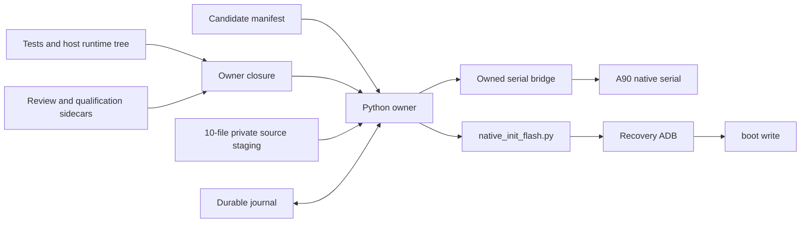
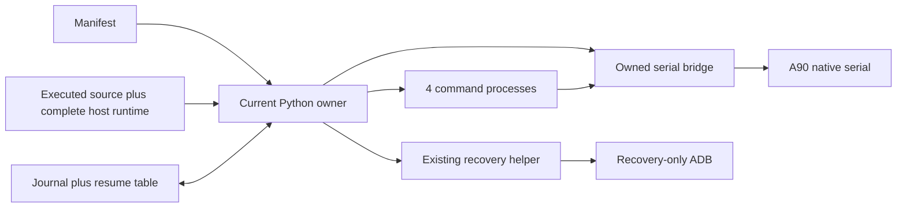
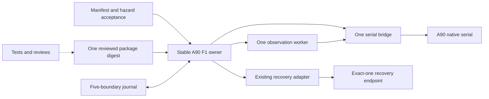
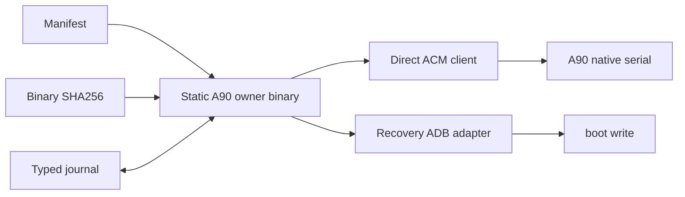

# Security Hardening Proposal: Stable A90 boot-only F1 owner boundary

## Decision

We need to decide what must remain invariant across repeated A90 kernel builds
without turning every host package update, test edit, or evidence refresh into a
new F1 capability. This proposal is design-only. It grants no device authority
and does not claim that any option has been implemented.

## Executive Recommendation

The complete option set is:

- **Option 1: Correct the current strong closure.** Keep the existing staged
  multi-file owner and broad runtime qualification, but remove known false
  couplings and scope ADB to recovery.
- **Option 2: Stable A90 owner package.** Review one A90-specific owner package,
  keep tests and evidence outside its execution digest, reuse the existing
  serial and recovery flash adapters, and implement only the small no-replay
  state table required by F1.
- **Option 3: Static owner binary.** Replace the Python host stack with one
  compiled binary and direct serial/recovery adapters.

I recommend Option 2 under the current constraints. It preserves the safety
controls that protect the device while removing controls that mainly protect
against excluded same-UID or trusted-host-package drift. Option 1 becomes
preferable if exact reproduction of the entire Python host environment is more
important than experiment speed. Option 3 becomes preferable only after the
A90 kernel campaign demonstrates enough remaining lifetime to repay a new
implementation and recovery review.

## Evidence

I inspected the binding policy, current owner/contract/observer, focused tests,
and the existing flash helper at revision `2a5ec435dc3203fd78a55b3ab33440bedd785590`.
The following evidence most influenced the diagnosis.

| Evidence | Finding or document | What it establishes |
| --- | --- | --- |
| `E01` | Repository F1 invariants | F1 requires exact target/artifacts, intent before effect, candidate no-replay, rollback, and final health; it does not require tests or reports in the execution digest. |
| `E05` | Current reusable owner | The owner closure includes a test file and implements a persistent ten-source staging tree plus four observation subprocesses. |
| `E06` | Owner contract | Resident, recovery, runtime, and hazard qualifications are coupled to the owner closure. |
| `E13` | Owner runtime qualification drift fixture | A host Python runtime-tree change produced a real 75/76 result while the owner source closure itself still matched. |
| `E12` | Existing native flash helper | The required A90 path already exists: native serial recovery request, recovery ADB flash/readback, reboot, then serial verification. |

These observations support an inference, not a device result: control identity is
broader than execution authority. As a result, changes that cannot alter the F1
effect still invalidate capability data, while the genuinely important crash
reconciliation code remains absent.

## Current Design And Failure Mode

The current design correctly separated candidate data from owner code, but then
expanded the owner identity to include tests, a generated Python runtime tree,
multiple evidence sidecars, ten separately staged sources, and four command
processes. Each mechanism is individually defensible. Together they create a
high-churn capability in which ordinary host drift consumes the same review
budget as a change to the boot-write state machine.

The structural failure is not “too much security.” It is that controls are
attached to the wrong lifetime. Candidate bytes and hazard acceptance change per
experiment. The A90 owner and recovery adapter change rarely. Tests and review
artifacts change whenever we improve validation. Host libraries change with the
workstation. Only the first two categories can select or repeat a device effect,
so only they belong in the live execution and run bindings.

The current pre-bridge ADB idea illustrates the cost. Native and Debian do not
run `adbd`; recovery does. A permanent or preflight ADB owner adds lifecycle
machinery without protecting the actual native observation path. What we need
is an exact-one recovery endpoint during the already reviewed recovery flash
window, not a second observation architecture.

## Desired Invariants

1. A manifest can vary candidate SHA256, version/build, and reviewed hazards,
   but cannot vary target, partition, commands, retry counts, or recovery path.
2. Only the A90 `boot` partition may be written.
3. Fresh serial facts prove the exact A90, healthy starting resident, current
   boot, and final resident health.
4. Candidate and rollback regular files are rehashed immediately before use and
   revalidated after the helper returns.
5. `CANDIDATE_INTENT` is durable before candidate release; a consumed candidate
   is never released again.
6. Rollback has a separate durable intent and at most one release.
7. Recovery ADB exists only as the transport observed during the recovery
   window; exact-one endpoint selection and `--serial` prevent cross-target use.
8. Every host interruption resumes from the journal without repeating a device
   effect.
9. Tests, reviews, reports, and historical resident evidence may validate the
   owner but cannot change its execution digest.
10. Changing only candidate data does not reopen the owner capability review.

## Constraints And Non-Goals

- A90 only; this is not a multi-device F1 framework.
- Existing Native serial protocol, TWRP recovery, `a90ctl`, bridge, and
  `native_init_flash.py` remain the compatibility boundary.
- The operator is present for F1.
- Root and a malicious concurrent process under the invoking UID are outside
  this lane. We still reject accidental drift and unexpected writers, but we do
  not claim same-UID process isolation from more same-UID Python files.
- No UFS, Debian handoff, display, SSH, or Option C behavior enters this owner.
- No measured performance budget is available. Experiment preparation latency,
  process count, and qualification churn must be measured during H0 rollout.

## Before Architecture

The current architecture makes several review and host-runtime artifacts feed
the same closure that authorizes the owner. That is the edge we need to change;
the device flow itself is already compact.

The important point is not the number of boxes. Tests and workstation runtime
state can invalidate `C` even though neither can select `W`. Meanwhile journal
reconciliation, which does control whether `W` can repeat, is unfinished.

## Options

### Option 1: Correct the current strong closure

This option keeps the staged source tree, complete Python/ADB runtime inventory,
owned bridge, and four isolated command processes. We would remove the test file
from the execution closure, make resident/recovery/hazard evidence independent
of the owner hash, delete pre-bridge ADB ownership, and add the no-replay resume
table. Its strongest case is reproducibility: a capability review names nearly
every host byte that can influence Python execution.

That strength also drives its cost. Python package updates and benign library
drift keep expiring the runtime receipt. Ten staged files and four command
processes create more partial-state and cleanup cases than the device flow
requires. The option is still viable if we accept slower experimentation in
exchange for a tightly frozen workstation. Rollback is straightforward because
it preserves the current architecture and changes only bindings and ADB scope.

| Change | Before | After | Security consequence | Cost |
| --- | --- | --- | --- | --- |
| Closure membership | Tests and evidence mixed with execution | Only executed source/runtime | Removes false invalidation without relaxing device controls | Moderate refactor |
| ADB lifetime | Proposed preflight owner | Recovery-only | Aligns authority with actual `adbd` lifetime | Low |
| Resume | Incomplete | Exact state table | Closes replay risk | Required implementation |

### Option 2: Stable A90 owner package

This option treats the owner as a small A90 product rather than a reconstruction
of the entire workstation. One reviewed package digest covers the owner,
contract, serial observation worker, and recovery adapter. Tests and review
reports sign that package externally. Candidate, rollback, and hazard values
remain data. Python and ADB are pinned by canonical executable path, executable
SHA256, and qualified version; trusted host package drift outside those selected
executables is a host-maintenance event, not automatically an F1 capability
change.

We would keep one owned bridge because the existing protocol already uses it,
but one observation worker would issue all four read-only commands in fixed
order and emit one bounded receipt. We would reuse the existing default host ADB
machinery only inside recovery, require exactly one `recovery` endpoint, bind
its serial into the run, and pass that serial to every helper invocation. We do
not need a permanent private server to make that endpoint exact.

The security gain comes from clearer ownership rather than more isolation. The
package controls commands and journal transitions; the manifest controls only
candidate data; recovery ADB controls only transport during recovery. Tests can
evolve without changing executable identity. Residual risk is host package
drift below the pinned executable boundary. Under the current threat model that
is proportionate, but a hostile host or same-UID attacker would invalidate this
assumption and make Option 1 or 3 preferable.

| Change | Before | After | Security consequence | Cost |
| --- | --- | --- | --- | --- |
| Deployment | Ten persistent staged sources | One reviewed package | Fewer mutable names and partial states | Package generator and migration |
| Observation | Four Python children | One fixed worker | Smaller process/lifetime surface | Small adapter change |
| Qualification | Owner-bound historical sidecars | Independent evidence plus live run binding | Prevents review loops while preserving proof | Schema migration |
| Recovery ADB | Proposed general owner | Exact-one recovery endpoint | Prevents cross-target use without a new daemon boundary | Must validate serial behavior |
| Resume | Broad future reconciler | Five-boundary table | Makes replay decisions auditable | Focused implementation |

### Option 3: Static owner binary

The most durable closure is one compiled A90 owner that speaks ACM serial
directly, maintains the journal, and invokes a narrowly reviewed recovery ADB
adapter. A binary SHA256 then becomes the principal executable identity. This
removes Python import, staging, interpreter, and subprocess ambiguity and gives
us the cleanest process model.

The attractive part is long-term stability. The concern is delivery risk: we
would rewrite mature serial parsing, recovery sequencing, logging, and error
classification before the next kernel experiment. That creates a second F1
implementation requiring its own recovery validation. It also does not remove
ADB or TWRP compatibility obligations. We can roll it out beside Option 2 and
fall back to the Python owner, but maintaining two effect owners during migration
would itself require namespace and journal isolation.

| Change | Before | After | Security consequence | Cost |
| --- | --- | --- | --- | --- |
| Runtime | Python and staged modules | One compiled binary | Smallest executable closure | Full rewrite and new review |
| Serial | Existing bridge/a90ctl | Direct client | Removes bridge lifetime | Reimplement protocol |
| Deployment | Host runtime qualification | Binary release | Less host drift | Build/toolchain qualification |

## Comparison

| Dimension | Option 1: Strong closure | Option 2: Stable package | Option 3: Static binary |
| --- | --- | --- | --- |
| Security | Strongest trusted-host byte coverage; same device invariants | Preserves device invariants, accepts trusted host packages | Smallest runtime closure, new implementation risk |
| Performance | Four workers and repeated loading; unmeasured | One worker and one package; expected improvement, unmeasured | Likely lowest overhead, unmeasured |
| Memory | Highest transient process/module use | Lower transient use | Lowest expected use |
| Reliability | More partial staging and runtime-drift stops | Fewer states; reuses mature helpers | New parser/recovery defects possible |
| Operability | Frequent runtime receipt refresh | Candidate data changes independently | New release/toolchain operation |
| Migration | Lowest code change, continued churn | Moderate focused reduction | Highest rewrite cost |

Option 2 has the best balance because our scarce resource is attended experiment
cycles and review attention, not CPU or memory. The focused test already showed
that Option 1's host-runtime precision can stop a clean owner. Option 3 offers a
better theoretical endpoint but delays the experiments the owner exists to
enable.

## Recommendation

I recommend Option 2, with two tactical protections preserved until migration
finishes: keep `LIVE_EXECUTION_ENABLED=False`, and retain the current strict
artifact hashes and bridge teardown tests. We should first change identity and
qualification semantics, then introduce the single package/observer, and only
then implement resume. We should not delete the old checks before the new
package digest and state table have equivalent negative coverage.

If live host compromise or untrusted same-UID concurrency becomes in scope,
Option 2 is no longer sufficient; choose Option 1 with a locked workstation or
Option 3 with stronger process isolation. If the campaign ends after only one
more candidate, Option 1 with local corrections may be cheaper than migration.

## Evidence Coverage And Residual Risk

| Evidence | Option 1 | Option 2 | Option 3 | Residual risk |
| --- | --- | --- | --- | --- |
| `E01` — F1 invariants | Addresses | Addresses | Addresses | Recovery hardware and operator action remain external |
| `E05` — test/source overbinding | Mitigates | Addresses | Addresses | Review must verify true executed membership |
| `E06` — owner-bound qualifications | Addresses | Addresses | Addresses | Evidence freshness still needs explicit expiry |
| `E13` — runtime drift stop | Unaffected by design intent | Addresses | Addresses | Executable/package drift still stops |
| `E12` — existing recovery helper | Preserves | Preserves | Replaces partially | TWRP and recovery ADB behavior remain dependencies |

No option makes F1 safe without the direct tactical controls: exact-one target,
candidate and rollback rehash, boot-only allowlist, intent-before-effect,
candidate no-replay, bounded rollback, and serial final health.

## Migration And Rollout

We can migrate without touching a device. First freeze the current owner as a
reference and keep it disabled. Next produce the package closure and translate
current manifest/qualification fixtures. Then run the existing hostile corpus
against both implementations, adding equivalence assertions for every journal
boundary. The old source stager remains available only as rollback evidence;
it must never share a live journal or approval namespace with the selected
package owner.

Rollback is simple before activation: revert the package changes and retain the
disabled current owner. After capability review but before any F1, invalidate
the new review artifact and return to H0. After an F1 intent, code rollback is
not a recovery mechanism; only the run's prebound boot rollback and journal
state may continue.

## Validation Plan

- Derive the package member list from imports and require no test, report, or
  review artifact in the execution digest.
- Mutate each manifest authority field and prove it cannot select a command,
  partition, retry, bridge, ADB endpoint, or journal namespace.
- Run the original hostile corpus for artifact swap, bridge loss, malformed
  receipt, candidate timeout, rollback timeout, and terminal mismatch.
- Add crash cuts before and after each durable boundary and prove candidate
  dispatch count never exceeds one and rollback dispatch count never exceeds
  one.
- Use a fake ADB inventory to prove zero, multiple, offline, wrong-state, and
  changed-serial endpoints stop before recovery write.
- Measure H0 preparation wall time, subprocess count, generated bytes, and
  number of artifacts requiring requalification for the current owner and
  Option 2. No performance claim becomes a gate until those measurements exist.
- Require one fresh independent full execution-closure review before any live
  activation.

## Implementation Work Packages

1. Correct closure membership and remove owner hashes from independent evidence
   schemas while preserving manifest/run binding.
2. Replace multi-file runtime staging with one generated A90 owner package and
   one package digest.
3. Collapse four observation subprocesses into one fixed-order worker and
   remove pre-bridge ADB logic.
4. Bind exact-one recovery ADB arrival/serial to the existing flash helper.
5. Implement the minimal journal resume table and crash-cut fixtures.
6. Freeze, independently review, and only then prepare candidate-specific data.

These are design work packages, not authorization or an implementation claim.

## Open Questions

- Does TWRP expose a stable ADB serial across the exact recovery version, or
  must USB topology plus exact-one arrival supply the binding?
- Can the existing helper be packaged without changing `__file__`-relative
  behavior, or should the package retain one private extraction directory?
- Which host package changes are operationally acceptable without capability
  re-review: patch-level Python updates, ADB library updates, or neither?
- How many additional A90 kernel candidates are expected? A very short campaign
  may favor Option 1; a long campaign strengthens Option 2.
