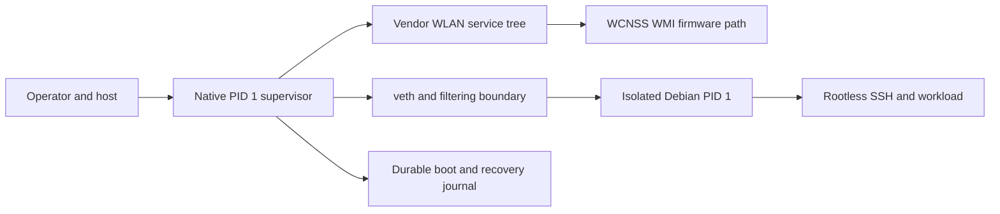
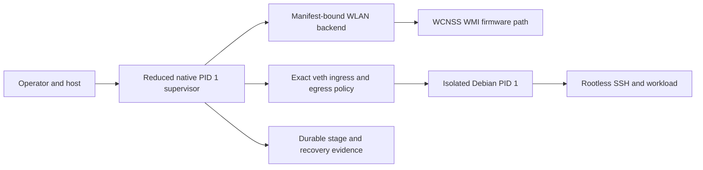
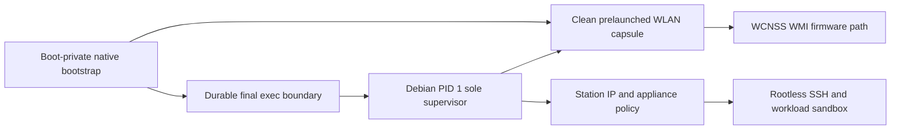
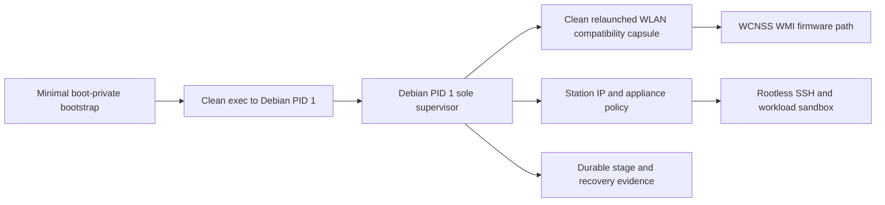

# Security Hardening Proposal: Debian-Supervised A90 WLAN Control Plane

## Decision

The current selected architecture remains the only candidate direction supported
by live evidence: native PID 1 owns the vendor WLAN backend and supervises an
isolated Debian child. This proposal does not change that selection.

We will nevertheless keep one alternative open at H0: Debian PID 1 may become
the sole steady-state lifecycle and policy owner if it can cleanly launch a
finite vendor compatibility capsule that recreates the WCNSS/WMI control plane.
The capsule may contain multiple vendor processes. “Single owner” means one PID 1 owns their lifecycle, evidence, network policy, and recovery; it does not mean
one binary or the absence of a hardware-specific trusted backend.

## Executive Recommendation

There are three serious options.

- **Option 1: Reduced native supervisor and isolated Debian** preserves the
  selected design and trims native duties to WLAN backend, supervision,
  evidence, cleanup, power, and recovery.
- **Option 2: Clean prelaunch and Debian adoption** starts a manifest-bound WLAN
  capsule before the final root transition, preserves control-plane continuity,
  and transfers steady-state supervision to Debian PID 1.
- **Option 3: Clean Debian relaunch** execs Debian PID 1 first and has it launch
  the vendor capsule from a read-only compatibility root before opening any
  external service.

I recommend Option 1 under the current evidence. It is the only route whose
WLAN outcome has a live lineage. I recommend Option 3 as the next H0 research
target because it best answers the single-responsibility concern. Option 2 is a
useful continuity fallback, but its adoption and retained-lifetime proof make it
less attractive as a final architecture.

The recommendation flips to Option 3 only if we prove a clean-exec minimum
service set, no SD or old-root dependency, a contained remote workload, and
recovery/performance within a predeclared budget. If the result needs H24's full
Binder/property/peripheral-manager environment, Option 1 remains the smaller
security boundary even though it has two PID 1 roles.

## Evidence

I inspected the exact public reports and current source rather than treating
the new ownership summary as proof. The evidence map below separates live
observations from source-derived structure and from our inference.

| Evidence | Finding or document | What it establishes |
| --- | --- | --- |
| `E01` | [WSTA14 link-state scan blocked](../../../../reports/SERVER_DISTRO_WIFI_STA_UPSTREAM_WSTA14_LINKSTATE_SCAN_BLOCKED_2026-07-04.md) | Native materialized WLAN before handoff; Debian saw an interface but did not obtain a usable scan path. |
| `E02` | [WSTA18 control-plane blocked](../../../../reports/SERVER_DISTRO_WIFI_STA_UPSTREAM_WSTA18_CONTROL_PLANE_BLOCKED_2026-07-04.md) | After full handoff, netdev/phy/rfkill survived while firmware, Root PD, and WMI stopped and the vendor service set was absent. |
| `E03` | [WSTA19 native-owned chroot pass](../../../../reports/SERVER_DISTRO_WIFI_STA_UPSTREAM_WSTA19_NATIVE_OWNED_CHROOT_WIFI_PASS_2026-07-04.md) | Native scan remained healthy while Debian Dropbear ran, proving a persistent backend is sufficient. |
| `E04` | [WSTA20 service boundary](../../../../reports/SERVER_DISTRO_WIFI_STA_UPSTREAM_WSTA20_NATIVE_SERVICE_BOUNDARY_PASS_2026-07-04.md) and WSTA22-WSTA24 | Debian consumed bounded native status, scan, and uplink controls without owning the vendor backend. |
| `E05` | [WSTA40 association and DHCP](../../../../reports/SERVER_DISTRO_WIFI_STA_UPSTREAM_WSTA40_WSTA41_MATERIALIZATION_CONFIRMED_AUTOCONNECT_PASS_2026-07-04.md), [WSTA42 tunnel](../../../../reports/SERVER_DISTRO_WIFI_STA_UPSTREAM_WSTA42_NATIVE_UPLINK_DPUBLIC_TUNNEL_PASS_2026-07-04.md), and WSTA43 | The native path reached scan, WPA, DHCP, route, and a gated Debian service tunnel. |
| `E06` | H24 manifest plus `a90_android_execns_probe.c` and `v724/90_main.inc.c` | The current known-sufficient path is an accumulated Android/vendor compatibility environment, not one daemon. |
| `E07` | [`/proc` sidecar incident](../../../../reports/A90_NATIVE_WIFI_SIDECAR_PROC_ROOT_EXPOSURE_HOST_INCIDENT_2026-08-13.md) | Preserving sidecars in a shared PID/proc view leaves old-root, FD, and mount-namespace capabilities nameable. |
| `E08` | [Selected isolated-Debian design](../../../../plans/A90_HEADLESS_NATIVE_WIFI_ISOLATED_DEBIAN_DESIGN_2026-08-14.md) | The current answer is full containment around Debian plus a veth/IP boundary. |
| `E09` | [Retired atomic diagnostic](../../../../plans/A90_ATOMIC_WIFI_OWNERSHIP_DIAGNOSTIC_RESIDENT_DESIGN_2026-08-14.md) | H24-equivalent reproduction needs distinct Android identities and Binder/property/AF_UNIX support; it does not disprove a smaller service set. |
| `E10` | [Current security derivation](../../../../reports/A90_ISOLATED_DEBIAN_SECURITY_DERIVATION_H0_2026-08-15.md) | The selected Debian workload has trace-derived syscall evidence; no corresponding vendor-capsule derivation exists. |
| `E11` | A90 contract, goal, and campaign ledger | H24 is installed, its D1 is consumed, and this design exercise has no live or candidate authority. |

### What the record settles

Observed: WSTA18 settles that a netdev surviving `switch_root` is not a working
WLAN control plane. Neither a rootfs key nor a supplicant config alone can
repair firmware and protection-domain services that have already gone down.

Observed: WSTA19 and the later native-uplink chain settle that keeping the
vendor backend alive works. They also demonstrate a bounded native API, but
they do not prove that API is the only safe architecture.

Observed in current source: H24 chooses
`wifi-companion-wlan-pd-service-object-visible-trigger-start-only`. Its
published branch names eleven children:
`servicemanager`, `hwservicemanager`, `vndservicemanager`, `qrtr-ns`,
`pd-mapper`, `rmt_storage`, `tftp_server`, `pm_proxy_helper`, `pm-service`,
`cnss_diag`, and `cnss-daemon`. The persistent helper also requires a property
service shim and a `/dev/subsys_modem` holder. Native autoconnect is dispatched
separately after that backend reports ready.

Inferred: that list is known-sufficient, not known-minimal. The history contains
many diagnostic modes and trigger windows. We should not turn every component
that accumulated on the successful route into a permanent production
requirement without ablation.

### Responsibility is multi-dimensional

The word “owner” hid several responsibilities. Splitting them makes the design
question tractable.

| Plane | Current live-supported owner | Debian-supervised target | Evidence status |
| --- | --- | --- | --- |
| WCNSS firmware, Root PD, WMI backend | Native/vendor service tree | Vendor compatibility capsule supervised by Debian | Capsule relaunch unproved |
| `wlan0` station policy and supplicant | Native autoconnect path | Debian network manager or a bounded capsule client | Debian path unproved while backend survives |
| DHCP, route, resolver | Native uplink service | Debian | Native path live-supported; transfer unproved |
| SSH and appliance workload | Debian chroot/isolated child | Debian rootless service sandbox | Live-supported in earlier chroot path |
| Lifecycle, journal, cleanup, recovery | Native PID 1 | Debian PID 1 after a durable exec boundary | Proposed |

This lets us pursue single responsibility without pretending the SoC has no
vendor userspace dependency. Debian can be the administrative owner while the
capsule acts like a privileged device backend. What gives me pause is the
remote trust boundary: if SSH or the workload is UID 0 in the same proc/mount
view, it can attack the capsule and its device capabilities. A credible
Debian-owner design therefore still needs a rootless service identity and a
separate workload sandbox.

### Current H24 dependency classification

| Component or surface | Current evidence | Classification before ablation |
| --- | --- | --- |
| `cnss-daemon`, `cnss_diag` | Absent in WSTA18 when WMI/firmware failed; present in H24 route | likely core, not individually proved |
| `qrtr-ns` | Required child in the H24 branch; Qualcomm IPC/name routing | likely core, not individually proved |
| `pd-mapper` | Absent in WSTA18 with Root PD shutdown; required child in H24 | likely core, not individually proved |
| `rmt_storage`, `tftp_server` | Required H24 children with firmware/RFS path construction | likely core for firmware/RFS, not individually proved |
| three service managers and Binder nodes | Present in service-object-visible H24 branch | sufficiency evidence only; necessity unknown |
| `pm_proxy_helper`, `pm-service` | Present in H24 branch around service-object visibility | sufficiency evidence only; necessity unknown |
| property-service shim | Mandatory in current helper when the property root is supplied; narrow setprop allowlist | current-route dependency; production need unknown |
| `/dev/subsys_modem` holder | Persistent health requires it to remain open | current-route dependency; minimum need unknown |
| native autoconnect/supplicant | Started after persistent backend readiness | known station-policy implementation; Debian replacement unproved |
| debugfs, light tracing, readiness files | Enabled or retained by H24 manifest | diagnostic/observability until proved otherwise |
| `/mnt/sdext` property snapshot | Compiled H24 input | forbidden dependency for the SD-free successor; must be replaced, not inherited |

The table is intentionally conservative. “Likely core” is not an
authorization to ship it, and “necessity unknown” is not an authorization to
remove it.

## Current Design And Failure Mode

The selected design surrounds an isolated Debian PID 1 with a persistent native
supervisor. That arrangement makes the trust boundary explicit, but it pays for
two administrative worlds: two PID 1 roles, separate PID/mount/IPC/UTS/network
namespaces, veth and netfilter state, cross-boundary health, aggregate resource
reservation, and cleanup of both sides. The 1,227-line design is long because
each shared-kernel capability and crash prefix has to be closed.

The strongest reason to consider a different shape is not aesthetics. With two
administrative owners, evidence and failure attribution split: native decides
whether the radio backend is healthy while Debian decides whether the service
is healthy. Recovery must determine which side failed and restore both without
replaying the boot-only handoff.

The strongest reason not to move immediately is equally concrete. H24's helper
does not merely keep a file descriptor open. It constructs an Android-like root,
mounts system/vendor inputs, materializes device and Binder nodes, applies
multiple UID/GID/capability contracts, loads or applies SELinux context
expectations, serves a property socket, maintains QRTR/protection-domain/RFS
services, and holds a subsystem device. We have not demonstrated that Debian
can cold-start that environment after full handoff.

WSTA18's failure mode also warns about sequencing. If the last vendor backend
dies before a replacement is accepted, firmware and Root PD can fall. A later
relaunch might recover them, or it might require a reboot/materialization path;
the record is silent. We must say `unproved`, not infer recovery.

## Desired Invariants

Any option that claims Debian supervision must satisfy all of these before a
candidate identity is allocated:

1. exactly one steady-state lifecycle and policy authority, Debian PID 1;
2. an exact, finite vendor service/dependency manifest whose members are proved
   necessary by fail-closed ablation or a documented dependency proof;
3. every capsule process starts from a clean exec and has no inherited native
   root, cwd, directory FD, file/device mapping, secret mapping, namespace
   handle, or unbounded environment;
4. exact UID, GID, supplemental groups, capabilities, SELinux behavior,
   scheduler state, cgroup, rlimit, FD, device, socket-family, path, and IPC
   allowlists for every member;
5. Binder, property, QRTR, AF_UNIX, shared memory, keyring, and device surfaces
   are capsule-private or explicitly proven global requirements; remote service
   code cannot name or duplicate them;
6. no SD, generic Android root, mutable vendor partition, native devtmpfs,
   userdata block, or unmanifested firmware/RFS input is reachable;
7. station policy ownership is explicit: either Debian manages
   scan/association/DHCP after backend readiness, or the capsule owns an exact
   bounded client and exports only IP;
8. durable boot intent precedes every effect, capsule launch is never replayed
   after an uncertain accept, and failure evidence preserves original stage,
   rc, errno, and cleanup status separately;
9. before external SSH ingress, the same run proves WCNSS/WMI readiness, a
   bounded scan, final network policy, authenticated rootless SSH, workload
   health, and exact service/capsule process sets;
10. rollback, physical recovery, native fallback before final exec, and
    attended return after a persistent run remain exact and boot-only;
11. performance and resource budgets are measured against the reduced native
    baseline with identical workloads and evidence anchors;
12. no A90 authority or evidence transfers to S22+ or S20+.

## Constraints And Non-Goals

- This is a design analysis, not a contract change or implementation plan.
- H24 remains the installed healthy resident. Its consumed D1 is never replayed.
- We do not reimplement WCNSS firmware, WMI, the kernel driver, QRTR, or QMI.
- We do not claim that a new Debian rootfs, observer key, or supplicant config
  is sufficient.
- We do not treat H24's full service tree as the minimum.
- We do not allow the remote workload to become the privileged platform owner.
- We do not use a shared `/proc`, `hidepid`, chroot alone, or pathname checks as
  a substitute for process/capability containment.
- No public performance number is presented as measured.

## Before Architecture

The before view is the selected architecture, not a claim that its unbuilt
successor already exists.

Source: [`debian-supervised-wlan-before.mmd`](../diagrams/debian-supervised-wlan-before.mmd).
The security-relevant edge is the veth boundary: it keeps the privileged vendor
backend out of Debian's proc, mount, device, and IPC views, at the cost of a
second supervisor and a cross-boundary network/control lifecycle.

## Options

### Option 1: Reduced native supervisor and isolated Debian

Option 1 keeps the selected topology but makes reduction an explicit product
requirement. Native PID 1 owns only the manifest-bound WLAN backend,
boot/recovery journal, Debian lifecycle, exact veth policy, cleanup, and power
return. HUD, general shell, display, diagnostic trigger modes, unrelated Android
services, and SD inputs are not production duties.

Its strongest case is evidentiary. WSTA19 through WSTA43 support the ownership
shape, and the current isolation design has already received extensive static
attack review. The remote Debian workload never gains a path to Binder,
property, QRTR, native procfs, `wlan0`, or the old root. Failure attribution can
be split cleanly between `WLAN_BACKEND_HEALTHY`, `DEBIAN_LOCAL_PERSISTENT`, and
external authenticated service health.

The cost is continuing two administrative domains. Veth, network filtering,
resource reserves, namespace teardown, and cross-domain evidence are permanent
machinery. It also leaves open whether native has accumulated more vendor and
diagnostic components than production needs. We should still perform service
ablation, but reduction can happen without first solving cold relaunch.

Source: [`debian-supervised-wlan-native-baseline-after.mmd`](../diagrams/debian-supervised-wlan-native-baseline-after.mmd).

| Change | Before | After | Security consequence | Cost |
| --- | --- | --- | --- | --- |
| Native responsibility | Broad historical native surface | Exact WLAN/supervision/recovery set | Narrows native TCB and review closure | Requires reachability and build reduction |
| Debian boundary | Full isolated design | Same | Preserves strongest proc/device/IPC separation | Keeps namespace/veth complexity |
| Service set | H24 accumulated branch | Manifest plus ablation evidence | Removes unneeded privileged processes | May expose hidden dependencies |
| SD property input | H24 path references SD | Boot-private or UFS-manifest input only | Removes removable-media dependency | New exact content derivation |

Rollout would preserve the current selected architecture and remove one
reachable feature at a time behind an unarmed self-check. Rollback is the exact
previous boot image; no rootfs or partition content mutation is permitted.

### Option 2: Clean prelaunch and Debian adoption

Option 2 starts the compatibility capsule before the final Debian exec, but it
does not preserve arbitrary H24 processes. A boot-private bootstrap constructs
the final read-only compatibility root and final capsule namespaces, clean-execs
the exact service set, proves WLAN backend health, and durably records the
handoff. Debian then becomes PID 1 and adopts the already-running capsule as its
sole steady-state supervisor.

The attractive part is continuity. WSTA18 tells us that a gap can take the
firmware/PD path down; prelaunch avoids betting the first prototype on cold
recovery. It also reaches the user's single-owner steady state once Debian has
accepted the exact capsule identity.

What gives me pause is lifecycle transfer. Ordinary orphan reparenting is not a
security protocol. The design would need a pidfd-bound adoption receipt,
unchanged process/namespace/FD/maps identity across the exec, no alternate
reaper, an exact parent-death model, and a way for Debian PID 1 to inherit only
control handles rather than the capsule's privileged FDs. A shared PID/proc view
reopens E07; a nested capsule hides less from its parent, so the remote service
must still be isolated from Debian's platform PID 1.

Source: [`debian-supervised-wlan-prelaunch-adoption-after.mmd`](../diagrams/debian-supervised-wlan-prelaunch-adoption-after.mmd).

| Change | Before | After | Security consequence | Cost |
| --- | --- | --- | --- | --- |
| WLAN launch | Native owns service tree permanently | Clean capsule launches before handoff | Preserves firmware continuity without permanent native PID 1 | Complex adoption and crash-prefix proof |
| Supervisor | Native plus Debian | Debian after accepted exec | One steady-state lifecycle authority | Requires exact pidfd/parent/reaper transfer |
| Old-root state | H24 sidecars may retain it | Capsule starts in final clean root | Closes old-root inheritance if proven | Must rebuild all runtime inputs before launch |
| Remote workload | Debian service surface | Separate rootless sandbox | Prevents SSH compromise from owning capsule | Additional internal Debian containment |

I would use this option only if cold relaunch is shown to be impossible but a
clean prelaunch can be proved. A rollback must terminate the exact capsule,
close all ingress, and return to the current native resident without attempting
the adoption twice.

### Option 3: Clean Debian relaunch

Option 3 makes the ownership model simplest to explain. A minimal boot-private
bootstrap performs only target binding, UFS verification, durable intent, and a
clean exec. Debian PID 1 then launches a manifest-pinned compatibility capsule
from a read-only root before network or SSH ingress. Debian owns service
lifecycle, station/IP policy, evidence, and cleanup. The capsule owns only the
hardware backend it cannot safely replace.

This is the best fit for single responsibility. There is one steady-state PID 1
and one operational journal. Network policy no longer crosses a veth boundary
unless we retain one solely for the remote workload. A service failure and an
application failure are attributed in one process supervisor, and ordinary
system administration can reason about one boot graph.

The security benefit is conditional, not automatic. We must not mount Android
`/system` and `/vendor` wholesale into a root-equivalent Debian service. The
capsule needs its own mount/IPC view, exact device nodes, private Binder/property
surfaces if those remain necessary, distinct Android identities, resource
limits, and a positive syscall policy. SSH and the workload run as a different
non-root identity with no capsule proc, FD, device, socket, namespace, keyring,
or cgroup control. Otherwise we would replace a clearly isolated two-owner
system with one owner that has a much larger blast radius.

Reliability is the principal unknown. WSTA18 does not show that Root PD and WMI
can be restarted after they fall. The first proof must therefore distinguish
`cold relaunch works`, `only uninterrupted prelaunch works`, and `backend cannot
be reconstructed outside the current native lifecycle`. We do not allocate a
candidate merely to discover that distinction; static closure and an unarmed
boot capability must precede any D1 handoff design.

Source: [`debian-supervised-wlan-clean-relaunch-after.mmd`](../diagrams/debian-supervised-wlan-clean-relaunch-after.mmd).

| Change | Before | After | Security consequence | Cost |
| --- | --- | --- | --- | --- |
| Steady-state authority | Native plus Debian | Debian PID 1 only | Simplifies lifecycle and failure authority | Debian platform PID 1 becomes highly trusted |
| Vendor backend | Native root and helper | Clean compatibility capsule | Can eliminate native old-root/proc exposure | Must reconstruct exact Android runtime contracts |
| Network policy | Native station/IP plus veth | Debian station/IP if backend permits | Removes an ownership hop | Debian supplicant path is unproved |
| Workload | Isolated Debian tree | Rootless service sandbox inside Debian | Keeps remote code away from capsule | Requires internal service containment |
| Launch | Backend survives from native boot | Cold relaunch after Debian exec | Cleanest ownership boundary | Highest firmware/PD recovery risk |

Migration must begin as an H0 dependency program, then an unarmed resident
capability. The first candidate, if one is ever justified, must leave external
ingress closed and prove only backend reconstruction plus native fallback. A
later separately approved unit can add Debian station/IP policy, and only after
that passes can authenticated SSH become part of the same terminal claim.

## Comparison

| Dimension | Option 1: reduced native baseline | Option 2: prelaunch/adopt | Option 3: clean Debian relaunch |
| --- | --- | --- | --- |
| Security | Strongest current isolation; two trusted supervisors | One steady-state owner, but transfer and retained-lifetime hazards | Best authority model if capsule and workload are truly separated; otherwise largest blast radius |
| Performance | veth/filter hop; no measured delta | No cold-start gap; transfer bookkeeping | Potentially fewer hops; cold launch may dominate boot |
| Memory | Two namespace roots and supervisor state | Capsule plus Debian; native bootstrap exits | One supervisor, but private capsule runtime still loads Android libraries/services |
| Reliability | Only live-supported ownership shape | Preserves WLAN continuity; adoption adds failure modes | Clean recovery model; cold reconstruction unproved |
| Operability | Two health planes and journals to correlate | One final owner with complicated transition telemetry | One service manager/journal after exec |
| Migration | Closest to selected design | New clean capsule and adoption protocol | New capsule, Debian platform manager, workload sandbox, and staged proof ladder |
| Current readiness | Design under review, no candidate | Concept only | Concept only; preferred H0 research target |

No composite score is useful here. Option 1 wins current confidence. Option 3
wins architectural clarity if its dependency and restart assumptions pass.
Option 2 wins only when continuity is mandatory and clean cold relaunch fails.

## Recommendation

I recommend that we **do not replace the current selected direction now**. We
should freeze Option 1 as the production baseline and open Option 3 as a
separate H0 feasibility unit. That respects both parts of the record: the
vendor backend must persist, and native PID 1 is not proved to be its only
possible supervisor.

The H0 unit should answer three questions in order:

- What is the smallest service/binary/library/device/property/IPC set that
  keeps WCNSS/WMI and scan healthy?
- Can that set start from a clean final root and clean address space without SD,
  old-root, or global Android IPC?
- Once the backend is healthy, can Debian own station policy and IP without the
  native autoconnect stack?

If any answer is `unproved`, the next candidate stays on Option 1. If the first
two pass but cold launch fails, Option 2 may be reconsidered. If all three pass
and the measured budget is acceptable, Option 3 becomes the better long-term
architecture and should receive a new target-contract review before any
identity is allocated.

## Evidence Coverage And Residual Risk

| Evidence | Option 1 | Option 2 | Option 3 | Residual risk |
| --- | --- | --- | --- | --- |
| `E01/E02` — backend dies after full handoff | addresses by preserving backend | mitigates by uninterrupted clean prelaunch | unknown until cold relaunch proof | A restart may require reboot/materialization |
| `E03/E05` — native-owned path succeeds | preserves | uses as prelaunch oracle | uses only as comparison oracle | Live result does not transfer to new owner |
| `E04` — bounded service API | preserves or narrows | may retire after adoption | likely retires after Debian owns policy | API removal must not remove evidence/recovery control |
| `E06` — accumulated H24 service tree | reduces by ablation | must rebuild cleanly | must rebuild cleanly | Minimum set remains unknown |
| `E07` — shared proc old-root capability | addresses with nested isolation | addresses only with clean root and workload separation | addresses only with clean capsule and workload separation | Debian platform PID 1 still legitimately controls capsule |
| `E09` — identity/Binder/property complexity | avoids exposing to Debian | inherits capsule complexity | inherits capsule complexity | Whole Android runtime may prove unavoidable |
| `E10` — syscall evidence gap | selected workload derivation exists | new capsule derivation required | new capsule and platform derivations required | Dynamic behavior may exceed static candidates |
| `E11` — no authority | unaffected; remains H0 | unaffected; remains H0 | unaffected; remains H0 | None of these options is executable today |

Common residual risks include undocumented firmware/RFS writes, global QRTR or
Binder state, same-UID keyrings, scheduler/resource inheritance, stale service
objects, non-restartable Root PD, and a hidden dependency on the current SD
property snapshot. Each is a blocker, not a runtime fallback.

## Migration And Rollout

The migration is evidence-first and does not begin with a candidate.

**H0 dependency closure.** Build a machine-readable service graph from exact
ELF dependencies, interpreter/linker config, config/property reads, device
opens, socket families, Binder/QRTR endpoints, firmware/RFS paths, UID/GID/cap
contracts, SELinux expectations, scheduler state, and writable outputs. Mark
each edge observed, source-derived, or inferred.

**H0 ablation matrix.** Starting from the H24 known-sufficient list, define one
component removal per row with a predicted failure stage. No row may infer
success from process survival; its future oracle is exact firmware/PD/WMI,
bounded scan, and cleanup. Static review must decide which rows are safe enough
for a later unarmed capability.

**Host-built compatibility root.** Produce a deterministic read-only manifest,
never a UFS mutation. It contains only exact binaries/libraries/config and
boot-private public metadata. Credentials and private property bytes remain
private inputs and never enter the repository.

**Unarmed resident capability.** Only after independent review, a fresh
boot-only resident may prove that the capsule constructs and cleans up with no
handoff, no association, no packet probe, and no external ingress. Failure
returns to exact native health; no candidate replay.

**Ownership proofs.** A later unit tests backend relaunch, then Debian station
policy, then authenticated rootless SSH. These are separate authorities and
separate terminals. We do not compress them into one risky first attempt.

Rollback for every stage is the exact prior boot image and a native healthy
terminal. There is no direct UFS filesystem-content mutation and no reuse of
H24's enable/latch or consumed approval.

## Validation Plan

### Static and host-only gates

- Recompute the evidence collection and stop on drift.
- Generate the exact transitive ELF and data dependency graph for every
  proposed capsule member.
- Reject unresolved `dlopen`, executable dispatch, config path, device node,
  IPC endpoint, property, or writable output.
- Derive exact identities and capabilities from source and binary behavior;
  reject a common-root shortcut.
- Produce a positive syscall/socket-family policy for capsule and Debian
  platform manager, including compat ABI handling.
- Prove no SD path, generic `/system` or `/vendor` bind, old-root mapping,
  native devtmpfs, userdata block, or unbounded Binder/property namespace.
- Add negative fixtures for extra process, library, FD, mapping, device, QRTR
  service, Binder context, property key, keyring, mount, and namespace handle.

### Future unarmed capability gates

- Verify exact process tree, pidfds, maps/map_files, FDs, namespaces, cgroups,
  scheduler state, identities, caps, sockets, devices, and paths at every stage.
- Prove `WLAN_BACKEND_READY` without association or external packets.
- Remove one service at a time and classify a failure by exact stage/rc/errno;
  never retry or add a dependency dynamically.
- Terminate and reap the complete capsule, remove its private IPC/device/mount
  state, and return to exact native health.

### Performance and resource benchmarks

No current number is measured for this comparison. Before a device proof, freeze
identical workloads and provisional budgets:

| Metric | Baseline and candidate | Provisional decision threshold |
| --- | --- | --- |
| boot to backend ready, p50/p95 | Option 1 vs selected alternative over at least 20 clean boots | candidate p95 no more than baseline p95 plus 2 seconds |
| intent to Debian exec, p50/p95 | same boot image class and evidence load | no more than 15% regression |
| Debian exec to authenticated SSH, p50/p95 | exact key and local probe | no more than 15% regression |
| first bounded scan latency and success | same RF environment, results redacted | zero additional failures; p95 no more than 20% regression |
| steady process count and RSS/PSS | five-minute idle, exact service tree | no more than 10% memory regression; every process explained |
| CPU time and wakeups | five-minute idle and one scan | no more than 10% regression |
| association/DHCP and recovery latency | gated later unit | no reliability regression; recovery returns within baseline plus 2 seconds |
| direct vs veth data plane | local bounded throughput/latency only | measured result informs choice; no predeclared security exception |

The numerical thresholds are proposed design budgets, not observations. They
must be accepted or changed before a live benchmark so the result cannot move
the goalposts.

## Implementation Work Packages

No implementation plan is created because no option has been selected for
implementation. The design-level work packages are:

- `WP-H0-1`: exact H24 service/dependency inventory and ownership-plane map;
- `WP-H0-2`: static necessity arguments and fail-closed ablation matrix;
- `WP-H0-3`: deterministic SD-free compatibility-root manifest;
- `WP-H0-4`: capsule security envelope and remote-workload separation;
- `WP-H0-5`: clean-launch feasibility and crash-prefix state machine;
- `WP-H0-6`: benchmark specification and acceptance budgets;
- `WP-H0-7`: independent review and option decision.

Completion of these packages creates only a reviewed design decision. A fresh
candidate still requires a new identity, manifest, artifacts, qualification,
approvals, and all target-contract gates.

## Open Questions

1. Which of the eleven H24 children are necessary for WCNSS/WMI readiness, and
   which only expose service objects or diagnostics?
2. Is `/dev/subsys_modem` hold a permanent WLAN dependency, or a route-specific
   materialization aid?
3. Can Root PD recover after the last backend exits without reboot?
4. Can private binderfs replace H24's materialized global Binder devices for
   the minimum service set?
5. Can the narrow property shim and property snapshot be regenerated from
   boot-private, non-SD inputs with no writable global property service?
6. Which firmware/RFS paths are read-only, and is any persistent write
   structurally required?
7. Once the backend is healthy, can Debian `wpa_supplicant` own scan,
   association, and DHCP, or is the native autoconnect path still required?
8. What is the smallest trusted Debian platform manager that can supervise the
   capsule while keeping SSH/workload code non-root and unable to name it?
9. Does Option 3 meet the accepted boot, memory, wakeup, and recovery budgets?
10. If cold relaunch fails, is Option 2's clean prelaunch/adoption protocol
    simpler than retaining Option 1's native supervisor? That comparison remains
    unproved.
