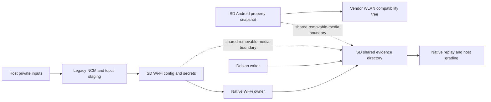
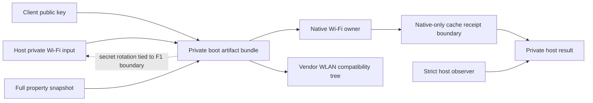
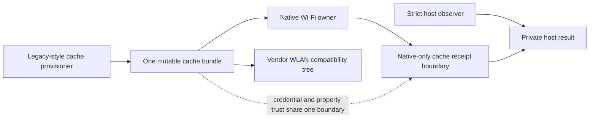
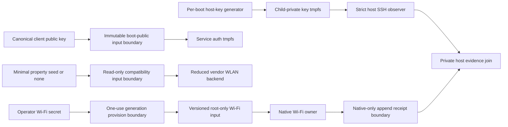

# Security Hardening Proposal: Typed SD-Free Inputs And Evidence For A90

## Decision

Do not replace `/mnt/sdext` with one generic `/cache` bundle.

Select a typed-channel architecture for the next A90 H0 implementation unit:

- one immutable boot-public channel for the SSH client public key;
- one separately provisioned, generation-based persistent-private channel for
  Wi-Fi station policy and credentials;
- no Android property snapshot if service ablation permits it, otherwise one
  minimal deterministic compatibility seed under its own read-only manifest;
- one native-only cache receipt channel, joined only on the host with strict
  SSH and workload observations.

The per-boot SSH server private key is generated in child-private tmpfs and is
not a persistent input. The existing cache profile stager is not selected as
the production provisioner. This is an H0 design decision only and changes no
current contract or device state.

## Executive Recommendation

Three options are credible enough to compare.

- **Option 1: private boot bundle** puts the Wi-Fi secret and compatibility
  data into the candidate boot artifact along with the public key. It removes
  a separate provisioning effect but makes credential rotation an F1 and
  retains private bytes in candidate and rollback artifacts. Reject it.
- **Option 2: wholesale cache transplant** moves the current SD trees to one
  cache namespace and adapts the existing staging helper. It is the shortest
  code path but preserves shared trust, overwrite semantics, a full unproved
  property snapshot, and a legacy generic command surface. Reject it for
  production; at most it is bounded H0 migration evidence.
- **Option 3: typed minimal channels** gives each data class its own writer,
  reader, lifetime, schema, digest, and authority. It also makes property
  minimization a pre-candidate gate. Select it.

Option 3 serves both architecture directions already under consideration. A
reduced native supervisor can consume the same Wi-Fi generation and property
seed. A Debian-supervised vendor capsule can consume them after clean exec.
Neither option gets a successor identity until this gate is implemented and
independently reviewed.

## Evidence

| ID | Claim type | Evidence | Result |
| --- | --- | --- | --- |
| `E01` | observed | H24 `a90_auto_handoff.c` and `a90_server_distro.c` | SD carries the run identity and Debian-writable evidence directory; the bind is mandatory before handoff continues. |
| `E02` | observed | `a90_ondevice_evidence_v1.py` and H24 D1 runner | Debian appends phase records to SD and H24 later binds the SD run file to enable/latch. |
| `E03` | observed | H24 manifest and Android helper | The selected property root is under SD. A cache prefix is accepted, but only as an already-existing input tree. |
| `E04` | observed | `a90_wificfg.c` | Wi-Fi configuration reads SD first and cache second; cache is a real consumer path. |
| `E05` | observed | `a90_wifi_profile_stage.py` and its V2174 dependency | Public code can stage cache profiles over NCM/tcpctl, including secrets, but it performs a live persistent mutation and replace operation. |
| `E06` | observed authority | `AGENTS.md` and A90 target contract | Current routine setup does not allow credential/configuration mutation or arbitrary cache writes. H24 commands require separately reviewed D1/F1 authority. |
| `E07` | observed | flat builder | The existing H17 path safely accepts one canonical public Ed25519 key from a private host path, binds its hash, and copies it into the ramdisk as mode 0400. |
| `E08` | selected design | isolated-Debian design | Native-only cache evidence, independent host SSH observation, and per-boot server-key generation are already the selected trust split. |
| `E09` | negative evidence | H14 firstboot audit | The immutable UFS firstboot is neither the new minimal service contract nor a post-exec receipt writer. |
| `E10` | sequencing | GOAL and reduction plan | SD dependencies must be closed before candidate identity; physical removal follows healthy resident installation and no-SD D0. |
| `E11` | derived | Debian-supervised WLAN review | Property/service minimization is shared work for both the native-supervisor and Debian-supervisor options. |

### Current data-flow inventory

| Data class | Current producer | Current storage | Current consumer | Problem |
| --- | --- | --- | --- | --- |
| SSH client public key | Flat builder from private host input | Boot ramdisk, then auth tmpfs | Debian Dropbear | Good public-input pattern, but historical target/account is not the new rootless service contract. |
| Wi-Fi SSID/PSK and policy | Legacy host profile stager | SD primary or cache fallback | Native Wi-Fi config module | Cache consumer exists; current live producer is not an authorized production transaction. |
| Vendor property area | Unproved historical snapshot process | SD binary property tree | H24 vendor compatibility helper | Full contents/minimum/confidentiality unproved; cache prefix alone supplies no producer. |
| Run identity and Debian phases | Native plus Debian writer | Shared SD evidence directory | Native replay and host runner | SD is mandatory and Debian writes into the grading plane. |
| SSH server host key | Historical firstboot/Dropbear behavior | Writable `/etc/dropbear` tmpfs | Dropbear | Selected design replaces this with a bounded trusted generator and separate key-daemon identity. |

### What the existing cache stager does and does not prove

The legacy public helper is useful evidence. It demonstrates a secret-free
manifest, owner-only local staging files, hash verification, temporary remote
files, and a cache profile grammar. It does not establish the new production
boundary:

- it establishes NCM and tcpctl, fetches a resident token, and dispatches
  generic device commands;
- its preparation and transfer paths remove or force-replace fixed targets;
- it has no immutable generation selector, prior-generation rollback, durable
  one-use journal, crash-prefix reconciliation, or current A90 authority;
- its verification calls resident shell commands which are not H24 D0;
- its unit test creates files beneath `workspace/private`, so it was read but
  deliberately not executed in this host-only review.

The right conclusion is “a consumer and prototype producer exist,” not “Gate 3
is already implemented.”

## Current Design And Failure Mode

The current data flow is shown in
[`sd-free-input-evidence-before.mmd`](../diagrams/sd-free-input-evidence-before.mmd).



The security failure is not only removable-media availability. Three trust
roles converge on the same medium:

1. configuration and credentials influence a privileged radio backend;
2. a binary Android property snapshot influences vendor service behavior;
3. Debian writes records later used to grade the handoff.

Moving all three directories to `/cache` changes the block device but not that
trust structure. A corrupt or stale cache generation could select the wrong
network, change vendor compatibility behavior, and influence the evidence used
to explain the result.

The evidence direction is particularly important. The selected architecture
keeps native PID 1 alive, so native can observe its own process, namespace,
network, mount, rule, and cleanup facts. It cannot authenticate its own SSH
server from the outside and must not claim that it did. Conversely, Debian does
not need a writable native evidence mount to be observable. The host can prove
strict host-key and client-key authentication and a forced workload probe.

## Desired Invariants

1. Every input belongs to exactly one typed root and one schema; no generic
   “A90 input bundle” is accepted.
2. The boot artifact contains public client authorization only. It contains no
   Wi-Fi SSID/PSK, SSH client private key, server private key, full property
   snapshot, raw evidence, or device identifier.
3. Wi-Fi configuration is one canonical bounded profile plus separate owner-
   only secret files. Inline secrets and extra members fail closed.
4. Wi-Fi provisioning is a separate attended one-use transaction with an exact
   target/resident, generation, local input hashes, remote root, file set,
   metadata, durable intent, publication result, and readback. It grants no
   arbitrary path, shell, command, or network authority.
5. A new generation is published no-clobber and selected atomically. The prior
   healthy generation remains recoverable until the new resident and no-SD
   proof close. An uncertain publication is never resent.
6. Runtime copies the selected Wi-Fi generation into a private root-owned
   tmpfs or opens exact FDs before privileged service launch; it exposes no
   credential file or control socket to Debian.
7. The property input is absent unless static dependency and ablation evidence
   proves it necessary. If present, it is a minimal deterministic manifest-
   bound seed, read-only, no-symlink, no-hardlink, finite, and contains no
   unknown property/file/context.
8. A full historical/private property snapshot is never accepted merely
   because its path has an allowed prefix. Its current contents are unproved.
9. The server host private key is generated exactly once per boot inside the
   child-private tmpfs by the selected trusted generator. Only public material
   and fingerprint enter the native receipt or host evidence.
10. Native PID 1 is the only device-side writer of the cache receipt. Debian
    has no path, mount, directory FD, inherited FD, rename target, or IPC verb
    that can alter it.
11. Native receipts claim only native-observable stages. Authenticated SSH,
    accepted client fingerprint, account, forced dispatcher, and workload
    result exist only in host-private evidence and are joined by exact target,
    resident, boot, run, pidfd, input-generation, and receipt digests.
12. Every record is bounded, canonical, append-only/no-clobber, hash-linked,
    fsynced, and crash-reconcilable. Missing/torn/duplicate/out-of-order records
    produce `NO_PROOF` or `RECOVERY_PARKED`, never effect replay.
13. No reachable successor source, manifest, archive, runtime binding, or
    evidence predicate requires `/mnt/sdext`.
14. UFS root content remains read-only; this channel design grants no UFS
    population or filesystem mutation.
15. H24 approvals/effects are never reused. A90 inputs, evidence, recovery, and
    authority never transfer to S20+ or S22+.

## Constraints And Non-Goals

- This is not a device provisioning implementation.
- It does not authorize the existing cache stager or generic tcpctl commands.
- It does not inspect, sanitize, copy, or bless the private property snapshot.
- It does not choose a WLAN service minimum. Property ablation is a prerequisite
  work package, and “unproved” remains the result until it completes.
- It does not provide at-rest hardware encryption for the Wi-Fi PSK. If that is
  required, a separately proven hardware-backed design is necessary. Root-only
  cache DAC is an integrity/access boundary, not a hardware-sealing claim.
- It does not make Debian the evidence authority or expose native cache to the
  remote workload.
- It does not change the current boot-only payload boundary, UFS policy,
  rollback, recovery, or attendance rules.
- It does not allocate a successor or make the SD safe to remove now.

## Before Architecture

The before diagram above is the exact trust-shape problem. H24 stopped before
the evidence bind and property input were live-proved in that ordinal, so this
document calls the dependencies implemented/reachable rather than claiming a
complete H24 runtime observation.

## Options

### Option 1: Private boot bundle

Put the public client key, Wi-Fi profile/secret, and property compatibility
tree into a private candidate ramdisk, then expose each to the boot runtime.



Source: [`sd-free-input-evidence-boot-bundle-after.mmd`](../diagrams/sd-free-input-evidence-boot-bundle-after.mmd).

This removes a pre-F1 credential write and makes the candidate self-contained.
It also duplicates private credentials into candidate, rollback, build output,
and operator archives; a normal Wi-Fi rotation becomes a new boot artifact and
F1. It conflicts with repository/evidence discipline unless every artifact
stays private, and it expands the blast radius of any artifact handling error.

| Dimension | Assessment | Evidence/confidence | Validation if retained |
| --- | --- | --- | --- |
| Security | Regresses: persistent secrets enter boot artifacts and rollback sets. | Source-derived, high | Prove private artifact custody and zero public/log leakage. |
| Performance | Likely improves boot input locality; unmeasured. | Hypothetical, low | Measure ramdisk size, decompression, and boot-read delta. |
| Memory | Likely regresses during unpack/copy. | Hypothetical, low | Measure peak bootstrap RSS and tmpfs bytes. |
| Reliability | Mixed: no separate provisioner, but rotation requires F1. | Source-derived, medium | Exercise key/profile rotation and rollback over crash prefixes. |
| Operability | Regresses: credential change becomes artifact lifecycle. | Source-derived, high | Time an attended credential rotation and recovery. |
| Migration | Appears simple but violates the preferred secret boundary. | Source-derived, medium | Build a secret-leak negative corpus before any selection. |

**Decision:** reject. A public key may use this pattern; Wi-Fi and server
private keys may not.

### Option 2: Wholesale cache transplant

Move the SD config, secret, property, and evidence trees to cache. Adapt the
legacy stager and change H24-style path constants.



Source: [`sd-free-input-evidence-cache-transplant-after.mmd`](../diagrams/sd-free-input-evidence-cache-transplant-after.mmd).

This option maximizes reuse. The Wi-Fi parser and helper already recognize
cache prefixes, and the legacy host code already transfers profile files. The
apparent simplicity is misleading. A cache prefix is not a producer contract,
the full property tree remains unbounded, and current staging replaces live
files through generic tcpctl. Putting evidence beside those inputs lets one
mutable area affect both operation and grading even if directory names differ.

| Dimension | Assessment | Evidence/confidence | Validation if retained |
| --- | --- | --- | --- |
| Security | Slightly improves media removal but preserves broad mutable trust and command surface. | Source-derived, high | Prove separate roots, writers, generations, and zero full-snapshot exposure. |
| Performance | Likely avoids SD latency; exact cache cost unknown. | Hypothetical, low | Compare bytes, fsync latency, WLAN readiness, and write amplification. |
| Memory | Neutral to low regression from full property materialization. | Source-derived, low | Measure property-tree pages and mount/setup cost. |
| Reliability | Improves SD availability but keeps overwrite/crash ambiguity. | Source-derived, high | Power-cut every prepare/transfer/publish prefix. |
| Operability | Familiar tooling but current authority and rollback are absent. | Source-derived, high | Demonstrate generation rollback without shell or path expansion. |
| Migration | Smallest code delta, largest inherited debt. | Source-derived, high | Require independent review of every retained legacy command. |

**Decision:** reject for production. It may be used only as host-side evidence
for parsers and formats; no device run is authorized here.

### Option 3: Typed minimal channels

Create four independent channels and minimize the compatibility input before
implementation.



Source: [`sd-free-input-evidence-typed-after.mmd`](../diagrams/sd-free-input-evidence-typed-after.mmd).

#### Boot-public client key

Reuse the exact builder discipline: one regular non-symlink canonical Ed25519
public line, bounded size/link count, hashed in the manifest, copied to an exact
ramdisk member. The new bootstrap installs it in the fixed nonzero service
account's read-only auth tmpfs, not historical `/root/.ssh`. The client private
counterpart never enters the repo, boot artifact, device log, or receipt.

#### Persistent-private Wi-Fi generation

Define a new namespace, not the legacy mixed runtime root. A conceptual layout
is:

```text
/cache/a90-input/wifi-v1/
  generations/<sha256>/manifest
  generations/<sha256>/autoconnect.conf
  generations/<sha256>/profiles/<name>.conf
  generations/<sha256>/secrets/<name>.ssid
  generations/<sha256>/secrets/<name>.psk
  selected
```

The exact path is not authority and may change during implementation review.
The security properties do not: every file is regular, single-link,
no-symlink, root-owned, owner-only where secret, bounded, schema-exact, and
hash-bound. `selected` names a fully durable immutable generation. Publication
uses a new absent generation, fsyncs files and directories, and performs one
atomic no-replace selection transaction after durable intent. It never edits
an active generation in place.

The provisioner is a separate capability. It binds exact target/resident,
input file descriptors/hashes, one generation, one fixed remote root, an exact
file grammar, rollback generation, one intent, and one terminal result. Crash
reconciliation reads state and never resends publication. Secret bytes are
accepted only from the private host input, transferred only over the reviewed
attended channel, and absent from command lines, stdout/stderr, JSON, hashes
shown to users, and public artifacts. Only lengths, algorithms, and digests may
be recorded privately where needed.

The candidate consumes a selected generation read-only, copies only the exact
selected secret into private native runtime, closes input FDs before vendor
service release, and never binds that tree into Debian. A stale, partial,
extra-member, wrong-owner, wrong-mode, symlink, hardlink, selector drift, or
unexpected generation is `NO_GO`.

#### Compatibility seed

First try to delete this channel. Static dependency tracing and service
ablation should determine whether the reduced backend needs Android property
areas and the property-service shim. If not, the production manifest asserts
that the property root and shim are absent.

If property state is required, build a deterministic seed from an exact public
key/value/context manifest and the bound Android property-area format. It has a
separate immutable version and digest, contains only proven-required entries,
is never writable by vendor descendants, and is mounted read-only only inside
the compatibility capsule. A binary directory copied from the current private
snapshot is not accepted. If a required value cannot be derived without a
private full snapshot, the result is `NO_GO`, not permission to transplant it.

#### Native receipt and host join

Native creates a root-owned receipt directory before child release and never
gives Debian a mount, path, directory FD, file FD, rename target, or IPC writer.
A production schema should use bounded canonical records with sequence,
previous-record digest, target/resident/candidate, boot/run nonce, input
generation digests, stage, `CLOCK_BOOTTIME`, result/errno, bound object
identities, and cleanup state. Publication is no-clobber and durable. Original
failure and cleanup result are separate records.

The dedicated read-only resident retrieval exports only the bounded native
record set/digest plus public server-key material. The host stores that under
private evidence and adds strict SSH handshake, server fingerprint comparison,
client public-key method/fingerprint, fixed account, forced dispatcher, and
workload result. It does not send “service ready” back to native. A missing or
mismatched half is `NO_PROOF`.

#### Per-boot server key

The server private key is outside all persistent input channels. Trusted clean
bootstrap generates it once in child-private tmpfs, proves the bounded
generator exit/reap and no private output, binds the file locally, then gives
only the key daemon access. Retrieval exposes algorithm, public key, and
fingerprint. A later boot must generate a different receipt. This avoids both a
boot-embedded long-lived private key and an untrusted first-seen network key.

| Dimension | Assessment | Evidence/confidence | Validation |
| --- | --- | --- | --- |
| Security | Improves by separating secrets, compatibility state, public auth, and evidence writers. | Source-derived, high | Threat-model each root and run cross-channel write/read negatives. |
| Performance | Adds bounded provisioning and receipt fsync cost; removes SD and full snapshot if ablation succeeds. | Hypothetical, medium | Measure bytes/fsyncs, boot/WLAN/SSH latency, CPU and property setup. |
| Memory | Improves if the property snapshot shrinks; otherwise neutral. | Hypothetical, low | Measure property seed pages, runtime secret copy, receipt buffers, peak RSS. |
| Reliability | Improves through immutable generations and native-only evidence, but requires a new provisioner. | Source-derived, medium | Power-cut every generation/selector/record prefix and recover without replay. |
| Operability | Initially more explicit steps; later rotation and diagnosis become attributable. | Source-derived, medium | Time provision, rotate, rollback, no-SD proof, and recovery drills. |
| Migration | Larger initial design delta but reusable by both ownership architectures. | Source-derived, high | Implement schemas/validators before either candidate branch. |

**Decision:** selected.

## Comparison

| Property | Private boot bundle | Wholesale cache transplant | Typed minimal channels |
| --- | --- | --- | --- |
| SD runtime dependency | Removed | Removed | Removed |
| Wi-Fi secret in boot artifact | Yes | No | No |
| Credential rotation without F1 | No | Yes, unsafe overwrite model | Yes, separately reviewed generation transaction |
| Full property snapshot retained | Yes | Yes | No by default; minimal seed only if proved necessary |
| Debian-writable evidence | Can be removed | Risk of recreating shared cache plane | Explicitly absent |
| Current live authority | None | None | None |
| No-replay/crash design | Candidate F1 only | Missing | Required for provision and receipt publication |
| Supports both WLAN-owner options | Technically | Technically | Yes, with shared schemas and clear ownership |
| Production recommendation | Reject | Reject | Select |

### Security delta

| Boundary | Before | Selected after | Result |
| --- | --- | --- | --- |
| Public authentication | Historical `/root/.ssh` overlay | Canonical boot-public key into fixed service auth tmpfs | Preserves useful pattern while removing root/account ambiguity |
| Wi-Fi credentials | SD primary or mutable cache prototype | Immutable selected cache generation, native-private runtime copy | Removes SD and in-place active-secret edits |
| Vendor properties | Full SD snapshot | None or exact minimal deterministic seed | Shrinks privileged compatibility input |
| Evidence writer | Native plus Debian on shared SD | Native-only cache writer; host-only SSH facts | Removes cross-boundary grading write |
| Server host key | Historical service generation | Per-boot trusted child-private generation | Gives strict pre-SSH identity without persistent key input |

## Recommendation

Implement Option 3 as a host-only design/validator unit next, not as a
candidate. The first deliverable is the schema and negative corpus, followed by
property/service ablation. The credential provisioner and any target-contract
authority are a separate reviewed change. That separation matters: otherwise
the implementation could quietly turn an architectural input decision into a
live persistent credential mutation.

Do not delay Gate 3 until after choosing native versus Debian supervision.
Both options need it, and property ablation directly tells us whether a clean
Debian-supervised capsule is smaller than the current native backend.

## Evidence Coverage And Residual Risk

| Evidence | Selected option effect | Remaining risk |
| --- | --- | --- |
| `E01`/`E02` SD evidence | Replaces shared bind with native-only receipt and host join | Exact record codec and retrieval implementation are unbuilt. |
| `E03` property snapshot | Requires absence or minimal deterministic seed | Minimum property/service set is unproved. |
| `E04` cache reader | Reuses parser concepts under a new immutable generation | Current reader is SD-first and must be narrowed for the successor. |
| `E05` legacy producer | Reuses grammar/redaction lessons only | New one-use provision transport and authority are unbuilt. |
| `E06` authority | Preserved: no current live use | Future provision capability needs independent review and explicit activation. |
| `E07` public key | Reuses validated public-input pattern | New service account/path and exact rootfs build still need review. |
| `E08` selected design | Implements its native-only receipt/key split | The 1,228-line isolated architecture remains H0 and unimplemented. |
| `E09` old firstboot | Does not rely on it | Minimal UFS content and its separate install authority remain prerequisites. |
| `E10` sequence | Preserves pre-identity/no-SD ordering | No-SD live proof cannot occur until after a healthy resident install. |
| `E11` owner alternatives | Supplies shared prerequisite | Cold Debian relaunch and minimum capsule remain separate H0 questions. |

Residual risks that cannot be closed by documentation alone:

- `/cache` persistence, wear, corruption behavior, free-space reserve, and
  recovery under the exact kernel/filesystem are unmeasured;
- PSK at-rest confidentiality is limited to the selected storage and DAC model;
- property-area deterministic construction and minimum keys are unproved;
- current H24 may lack a suitably narrow live provisioning surface;
- exact native receipt format, retrieval, and crash reconciliation are unbuilt;
- the SD-free resident, minimal UFS content, and both ownership architectures
  remain unimplemented and unproved on device.

## Migration And Rollout

### Phase 0: H0 freeze

1. Freeze the four data classes and forbid a generic bundle.
2. Derive the exact Wi-Fi profile grammar from the existing parser without
   carrying SD-first precedence into the successor.
3. Trace and ablate the property/service dependency. Select `absent` or a
   finite property seed; no third outcome is candidate-eligible.
4. Define canonical record and input-generation schemas, bounds, modes, owners,
   link counts, digests, and crash prefixes.

### Phase 1: host validators and simulated transactions

1. Build private-input validators that expose no value.
2. Build a local filesystem model for generation prepare/publish/select/rollback
   and crash reconciliation.
3. Build property-seed and receipt codecs with adversarial fixtures.
4. Prove the successor source closure has no reachable `/mnt/sdext` path and no
   private value in generated artifact/log fixtures.

### Phase 2: separately reviewed provision capability

1. Decide whether H24 can support a narrow exact transaction without generic
   shell authority. If not, stop; do not widen tcpctl.
2. Amend the higher-precedence boundary and A90 target contract only through a
   separate independent review.
3. Require exact attended approval, target/resident binding, a new journal,
   no-clobber generation publication, readback, and no replay.
4. Keep the prior selected generation until successor resident health and no-SD
   proof close.

### Phase 3: successor implementation and qualification

1. Implement typed consumers and native-only receipt with no identity yet.
2. Static-test archive membership, secret absence, property minimum, reader/
   writer separation, and record crash prefixes.
3. Independently review the complete execution-critical closure.
4. Only then allocate a fresh successor and build deterministic boot-only
   candidate/rollback artifacts.

### Phase 4: attended install and SD independence

1. Use only fresh D0/F1 authority under the future approved process.
2. Prove exact resident health before touching the SD card.
3. Remove the card while attended and run the exact no-SD D0 inventory.
4. Request a separate D1 only after input generations, property state, receipt
   path, rollback, and physical recovery remain exact without SD.
5. While Debian is live, report `HEALTH_PENDING_PERSISTENT_DEBIAN`; final
   resident health requires attended return/recovery.

## Validation Plan

### Static and packaging

- reject every reachable `/mnt/sdext` string in the successor execution
  closure, archive, manifest, input schema, and health predicate;
- assert the boot artifact includes the public key and excludes SSID, PSK,
  private client/server keys, property snapshot, raw evidence, and identifiers;
- require exact archive membership and no unexpected input/evidence utility;
- prove the property channel is exactly absent or exactly the reviewed seed;
- prove Debian/rootfs source cannot open the native receipt root.

### Credential generation and rotation

- wrong mode/owner/link count, symlink, hardlink, directory substitution,
  duplicate/extra member, malformed profile, inline secret, stale generation,
  partial generation, selector drift, low space, fsync failure, and hash mismatch;
- crash before intent, after intent, during each file, after directory fsync,
  before/after selector publication, lost response, and reconciliation restart;
- prove no uncertain state resends publish or overwrites active/prior generation;
- prove public and private logs contain no raw SSID/PSK and no command line does;
- rotate to a new generation, fail the successor, restore selection to the exact
  prior generation, and verify old/new evidence attribution.

### Property compatibility

- service ablation matrix with exact outcome and dependency reason;
- reject unknown key/value/context/file, duplicate property, binary-format
  drift, writable mount, full snapshot, stale seed, and alternate prefix;
- if `absent`, prove helper argv, mount graph, property shim, and health
  predicates contain no property dependency;
- if `minimal`, prove every retained entry is read by an exact required service
  and every omitted entry remains unnecessary across repeated cold boots.

### Evidence and keys

- torn/short/duplicate/out-of-order/oversize/extra receipt record, wrong
  previous digest, stale boot/run, wrong input-generation digest, missing fsync,
  and directory/full-space failures;
- prove no Debian process, FD, mount, namespace, IPC endpoint, or path can write
  native evidence;
- host joins only matching native and SSH halves; a missing half is `NO_PROOF`;
- wrong server fingerprint, first-seen key, stale known_hosts, wrong client key,
  alternate account/auth/command/PTY/forwarding, and within-run host-key rotation;
- prove server private bytes never enter cache, boot, UFS, logs, receipts, or
  host retrieval.

### Performance and resource budgets

Freeze budgets before implementation and compare identical boots/workloads:

- persistent input bytes, property seed bytes, boot artifact delta, cache free
  space, write amplification, fsync count and p50/p95 latency;
- boot-to-native-ready, WLAN-backend-ready, association/carrier, IP-ready,
  Debian-local-persistent, ingress-open, and authenticated-SSH latency;
- peak bootstrap RSS/PSS, steady native/capsule/Debian RSS/PSS, CPU time,
  wakeups, temperature, and power;
- receipt bytes/records and retrieval time;
- provision, rotate, rollback, failed-boot cleanup, attended return, and
  physical recovery duration;
- zero SD reads/writes/mounts/path opens during the no-SD candidate run.

Performance never overrides a safety predicate. Missing measurement is `na`,
not success.

## Implementation Work Packages

1. **WP1 — schemas and threat model:** exact data classes, trust matrix, bounds,
   canonical encodings, record state machine, and negative corpus.
2. **WP2 — property/service ablation:** prove no property channel or generate
   the smallest deterministic seed and bind its producer.
3. **WP3 — host-only generation transaction model:** simulated durable
   prepare/publish/select/rollback/reconcile with no secret output.
4. **WP4 — native typed readers:** exact generation reader and private runtime
   copy, property absent/minimal reader, boot-public authorization consumer.
5. **WP5 — native receipt/retrieval:** native-only writer, hash-linked records,
   dedicated read-only retrieval, host evidence join.
6. **WP6 — provision authority design:** separate higher-precedence and target-
   contract proposal; no implementation or device use before approval.
7. **WP7 — closure and independent review:** static tests, deterministic build,
   performance fixtures, rollback/recovery proof, fresh review.
8. **WP8 — future attended proof:** fresh identity, D0/F1 install, resident
   health, physical SD removal, no-SD D0, then separate D1.

No `implementation/` directory is created by this review because no live
option or capability has been selected for implementation.

## Open Questions

1. Which H24 vendor services read the property area on the known-sufficient
   path, and which exact keys/contexts do they read?
2. Can service ablation eliminate the property-service shim and binary property
   area entirely for both ownership options?
3. Is the existing cache filesystem and free-space reserve suitable for two
   immutable Wi-Fi generations plus bounded receipts across recovery?
4. What exact attended, target-bound transport can provision a cache generation
   without generic H24 shell/tcpctl authority? If none exists, which future
   resident must supply it?
5. Is root-only plaintext PSK storage within the accepted threat model, or is a
   hardware-backed secret store required?
6. Must SSID be treated as secret in all evidence, or only PSK? This proposal
   conservatively treats both as private.
7. Which facts can native independently observe after Debian exec, and which
   must remain host-only so the receipt never overclaims service health?
8. What maximum record count/bytes/fsync budget preserves recovery reserve and
   cache lifetime?
9. How long must the prior Wi-Fi generation remain retained after successor
   install and no-SD proof?
10. Does the Debian-supervised WLAN capsule need a different property seed than
    the reduced native-supervisor path, or can both share one exact manifest?
11. Can property minimization be proved entirely host-side, or does it require a
    separately authorized diagnostic candidate before either product candidate?
12. What exact no-SD D0 observation proves absence of runtime opens/mounts, not
    merely physical card absence?

Until these questions and the selected validation gates close, the status is
H0 design only. No device, D0, D1, F1, candidate, UFS mutation, handoff, or SD
removal is authorized.
